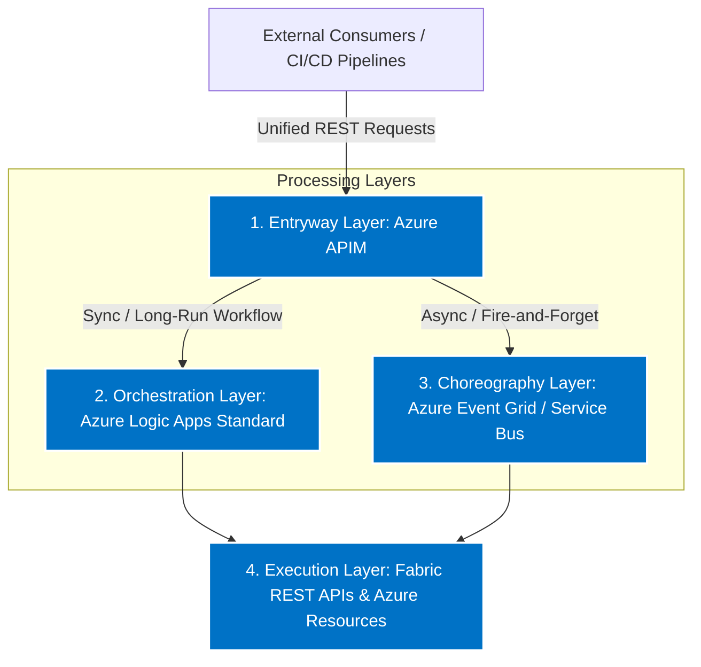
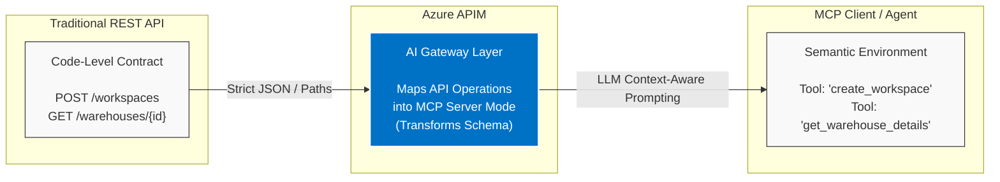
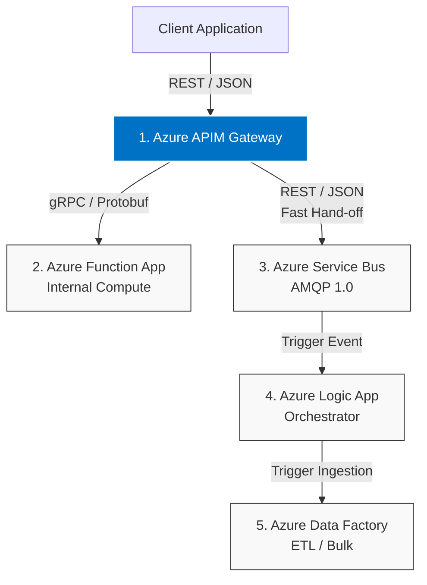
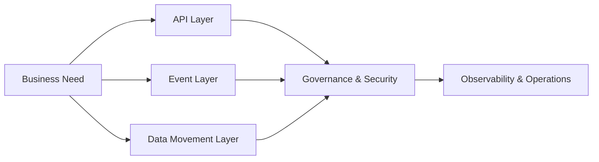
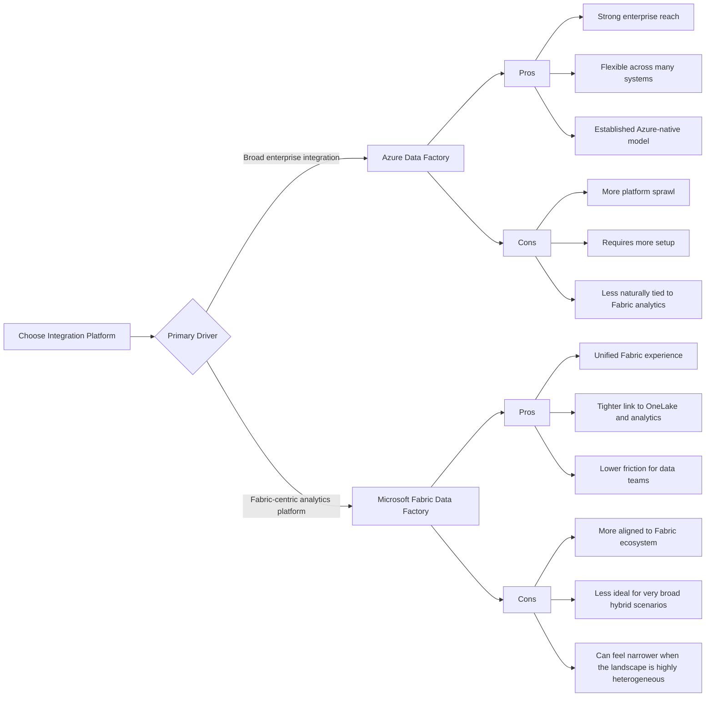

# Azure Integration Architecture

This document synthesizes the architectural designs, cross-protocol strategies, and conceptual diagrams discussed for building an Enterprise Integration on Azure including Fabric, APIM, MCP, and Integration-First Protocols.

---

## 1. Microsoft Fabric & Azure APIM Integration Lifecycle

Microsoft Fabric separates its operations into two different layers: **Control Plane** (managing the platform) and **Data Plane** (accessing the actual data inside your lakehouses or warehouses).

When bridging Azure API Management (APIM) with Microsoft Fabric, the technical approach splits cleanly across the **Data Plane** (data consumption) and the **Control Plane** (platform management).

### Protocol Mapping & Use Cases

*   **Fabric API for GraphQL (Data Plane):** Preferred for querying business data directly from Lakehouses, Warehouses, or SQL Databases. It executes via standard HTTP `POST` requests to a unified endpoint, resolving the over-fetching problems of rigid REST APIs by letting clients explicitly demand exact data structures.
*   **Fabric REST API (Control Plane):** Preferred for platform automation, environment setup, and pipeline orchestration. It uses standard HTTP methods (`GET`, `POST`, `DELETE`) mapped across explicit resource URLs to execute administrative actions.

### Symmetric Comparison Matrix

| Capability | Fabric GraphQL API | Fabric REST API |
| :--- | :--- | :--- |
| **Primary Purpose** | Fetching and updating rows of business data. | Managing, provisioning, and automating Fabric items. |
| **Target Entities** | Lakehouses, Warehouses, SQL Databases. | Workspaces, Pipelines, Capacities, Security Roles. |
| **Endpoint Structure** | A **single, unified URL** for all types of data queries. | **Multiple unique URLs** matched to specific objects. |
| **Payload Mechanics** | Client explicitly declares exactly which columns/fields it wants. | Server returns fixed, standardized JSON object responses. |

---

## 2. Distributed Control Plane Architecture

To handle dozens of concurrent control plane operations seamlessly, a hybrid architecture utilizing both **Orchestration** (centralized sequence controller) and **Choreography** (decoupled pub/sub events) is required.

### Architectural Blueprint

### Layer Implementations

1.  **Entryway (Azure APIM):** Facade for internal backends. It masks complex system endpoints, enforces rate-limiting, and utilizes the *Asynchronous Request-Reply pattern* to instantly return an HTTP `202 Accepted` along with a status tracking link for long-running infrastructure actions.
2.  **Orchestration (Azure Logic Apps Standard / Durable Functions):** Low-code state machines handle long polling loops and sequential dependencies (e.g., waiting for a Workspace creation confirmation before deploying code into it).
3.  **Choreography (Azure Event Grid & Service Bus):** Used to scale operations out without tight coupling. Completed actions emit events (e.g., `WorkspaceProvisioned`) to an Event Grid Topic so downstream logging, audit, and Git-sync tools can trigger independently.

---

## 3. Hybrid API Gateway & Model Context Protocol (MCP)

To connect Large Language Models (LLMs) to corporate infrastructure, Azure APIM functions as an **AI Gateway** translating deterministic, code-level APIs into declarative, context-aware MCP tool definitions.

### The Semantic Translation Layer

### Execution Lifecycle

1.  **Ingress:** APIM parses your standard OpenAPI specifications (Swagger).
2.  **Transformation:** It maps traditional endpoints directly to **Remote MCP Servers** hosted natively in APIM. Endpoints like `/environments/provision` materialize as an MCP tool (`provision_environment`), converting standard JSON validation properties into semantic descriptions readable by LLM tools.
3.  **Governance:** Standard gateway policies (Throttling, Managed Identities, Content Validation) are preserved to keep autonomous AI loops safely within system constraints.

---

## 4. Multi-Protocol Landscape (Integration-First Approach)

When selecting an integration-first approach via an Azure-native stack, you must match protocols and serialization types directly to system boundaries:

### Protocol-to-Component Mapping

| Layer / Scenario | Protocol | Data Format | Azure Component Involved |
| :--- | :--- | :--- | :--- |
| **Public API Ingress & SaaS** | **REST** | JSON | APIM → Logic Apps / Functions |
| **Internal Microservices** | **gRPC** | Protobuf | Function Apps / APIM (gRPC Pass-through) |
| **Async Decoupling & Queueing**| **AMQP 1.0** / **SBMP** | Binary / JSON | Service Bus → Functions / Logic Apps |
| **Heavy ETL & Batch File Ingestion** | **HTTPS / ADLS Gen2** | Parquet, Delta, CSV | Data Factory → Fabric / OneLake |

### End-to-End Flow Blueprint

*   **Public Interfaces:** Rely on **REST/JSON** inside APIM for compatibility with consumer apps, web hooks, and standard integrations.
*   **High-Performance Compute Blocks:** Utilize **gRPC over HTTP/2 (Protobuf)** inside Azure Functions (Isolated Worker Model) to lower serialization overhead and decrease latency during internal service communication. APIM acts as a gRPC pass-through proxy.
*   **Message Queues:** Leverage the **AMQP 1.0** standard wire protocol natively on Azure Service Bus. Messages encapsulate internal event details in JSON text, enabling low-code components like Logic Apps to easily digest and react to them without custom code.

---

## 5. Fundamental Integration Concepts

At a high level, Azure integration architectures are usually shaped by a small set of foundational concepts that apply across APIs, events, and data movement.

### Core Concepts

1.  **API-led integration:** Expose capabilities through governed APIs so consumers can interact with business functions without depending on internal implementation details.
2.  **Event-driven integration:** Use asynchronous messaging to decouple producers and consumers, improving resilience and scale.
3.  **Data movement and transformation:** Move data between operational systems, analytics platforms, and storage layers while applying required transformations.
4.  **Orchestration and workflow automation:** Coordinate multi-step business processes that span systems, services, and human approvals.
5.  **Governance and security:** Ensure consistent policies, identity management, compliance, and auditability across the integration landscape.
6.  **Observability:** Track health, latency, failures, and business outcomes so operations teams can respond quickly.
7.  **Hybrid and boundary-aware integration:** Design differently for public-facing APIs, internal services, SaaS platforms, and on-premises systems.

### Simple Mental Model

This model shows that integration is not only about connecting endpoints, but also about making those connections secure, observable, and governable.

---

## 6. When to Use Azure Data Factory vs Microsoft Fabric Data Factory

Both services support data integration, but they are best suited to different platform strategies. A useful rule of thumb is:

- Use Azure Data Factory when the integration landscape is broader than analytics and needs a mature, enterprise-grade orchestration platform across many environments.
- Use Microsoft Fabric Data Factory when the organization is consolidating around Microsoft Fabric and wants a more unified experience for analytics, data engineering, and business intelligence.

### Visual Decision Guide

### High-Level Comparison

| Capability | Azure Data Factory | Microsoft Fabric Data Factory |
| :--- | :--- | :--- |
| **Best Fit** | Enterprise-wide data integration and orchestration | Fabric-led analytics and data engineering |
| **Platform Style** | Broad and flexible | Unified and analytics-centric |
| **Strength** | Connectivity and enterprise maturity | Simplicity and Fabric-native integration |
| **Trade-off** | Can be more distributed and operationally heavier | Can be less suitable for very broad hybrid scenarios |

### Practical Guidance

- Choose Azure Data Factory when the priority is a general-purpose integration backbone across multiple cloud, on-premises, and SaaS environments.
- Choose Microsoft Fabric Data Factory when the organization already invests heavily in Fabric and wants data integration to feel native to that environment.
- In many enterprises, both can coexist: Azure Data Factory for cross-platform integration and Microsoft Fabric Data Factory for analytics-oriented workloads inside Fabric.
