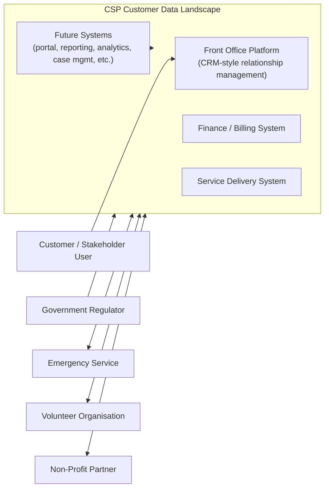
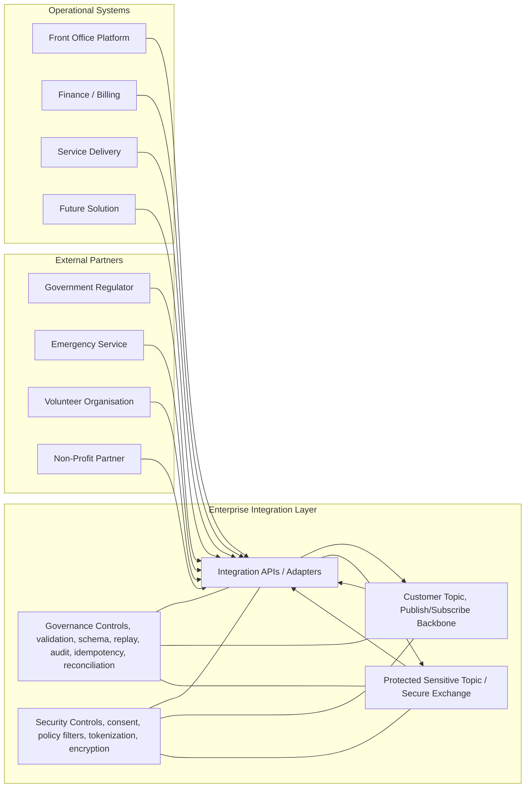
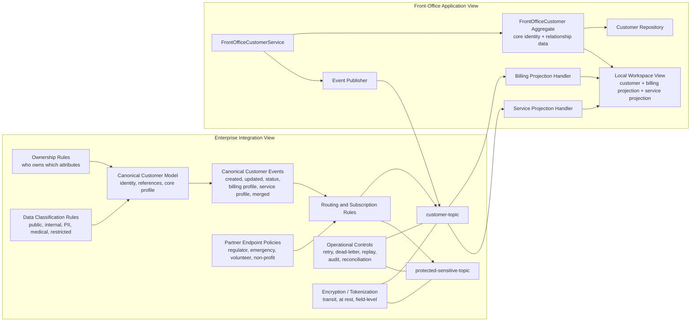

# Care Services Provider (CSP) Event-Driven Architecture (EDA)
## Brief Usecase Scenario
Abstract Care Services Provider (CSP) company has multiple operational systems that need to stay aligned on customer/stakeholder data. 
They want an integration approach that is decoupled, scalable, and allows other solutions to “plug in” over time.\
One known reference pattern used is a publish/subscribe approach via a customer topic to reduce coupling and support extensibility.\
Design the integration architecture to keep customer data consistent across:
- CRM-style front office platform (e.g. stakeholder/customer relationship management)
- Finance / billing systems
- Service delivery systems
- while also enabling future systems to connect with minimal rework.

Do not nominate specific products or vendors, focus on the overall architecture, design principles, and approach.

## Ownership Model

| Attribute Group | Authoritative System | Typical Consumers |
| --- | --- | --- |
| Core identity | FrontOffice | FinanceBilling, ServiceDelivery |
| Relationship data | FrontOffice | FinanceBilling, ServiceDelivery |
| Contact data | FrontOffice | FinanceBilling, ServiceDelivery |
| Address data | FrontOffice | FinanceBilling, ServiceDelivery |
| Billing data | FinanceBilling | FrontOffice, ServiceDelivery |
| Service data | ServiceDelivery | FrontOffice, FinanceBilling |

## Separating Concerns
Architecture View represents a system from the perspective of a related set of concerns. Architecture Viewpoint - a specification of the conventions for a particular kind of architecture view. It is a form of abstraction achieved using a selected set of architectural constructs as structuring rules, in order to focus on particular audience concerns frame within a system (ISO 42010). Viewpoint is a model (or description) of the information contained in a view.

This project captures complementary views of the same system design:
- `event-contracts.ts`: shared canonical event and topic contracts
- `data-governance.ts`: shared ownership, sensitivity, and access policy model
- `enterprise-eda-architecture.ts`: enterprise integration view
- `application-eda-domain.ts`: front-office application/domain view
- `devsecops-sdlc-architecture.ts`: DevSecOps, testing, security, and delivery view

Together these artifacts cover enterprise architecture, bounded-context
application design, and DevSecOps delivery governance without tying the
blueprint to a specific implementation platform.

## Canonical Event Catalog

All systems publish and subscribe via the shared `customer-topic`.

- `customer.created`
- `customer.updated`
- `customer.status_changed`
- `customer.billing_profile_changed`
- `customer.service_profile_changed`
- `customer.merged`

## External Partner Integration Endpoints

The same event-driven pattern can be extended to trusted external partners through controlled integration endpoints.

| Partner Type | Typical Endpoint Style | Typical Flow |
| --- | --- | --- |
| Government regulator | Subscriber or secure API | Receives compliance, status, notification, or reporting events |
| Emergency service | Bidirectional | Receives critical customer/service context and can publish incident updates |
| Volunteer organisation | Bidirectional | Receives referrals and publishes engagement or completion outcomes |
| Non-profit partner | Bidirectional | Receives approved stakeholder context and publishes case or referral outcomes |

These partner integrations should always be mediated by the integration layer rather than direct access to core operational systems.

## Core Design Principles
- Use event-driven architecture implemented through publish/subscribe on a shared customer topic.
- Avoid point-to-point integration between operational systems.
- Define clear ownership for each attribute group so consistency is governed, not assumed.
- Keep systems loosely coupled through canonical events and local projections.
- Design for eventual consistency with idempotency, replay, auditability, and reconciliation.
- Make future systems pluggable by subscribing to the same customer event contracts.
- Segregate sensitive and insensitive data so medical and high-risk PII can be handled under stronger controls.
- Encrypt data in transit and at rest, with stronger controls such as tokenization and field-level encryption for high-sensitivity domains.

## C4 Level 1: Context

This view shows the business landscape and the key external relationships.

### Context Notes

- The business problem is shared customer consistency across operational systems.
- The target state is not direct coupling between every system.
- Future systems should connect without redesigning the existing estate.
- External partners should connect through governed endpoints, not through direct system access.
- Sensitive and medical data should be shared only through protected channels and policy-controlled contracts.

## C4 Level 2: Containers

This view introduces the major runtime building blocks and the event-driven integration style.

### Container Notes

- Systems do not integrate directly with each other.
- The integration layer owns translation, routing, and operational controls.
- The customer topic is the shared contract boundary for decoupled change propagation.
- New systems plug in through the same integration layer and event contracts.
- External partners connect through secure partner endpoints managed by the same integration layer.
- Sensitive data can be routed to protected topics or secure APIs rather than the general customer topic.

## C4 Level 3: Components

This view separates the enterprise integration responsibilities from the front-office application responsibilities.

### Component Notes

- The enterprise view defines the shared contracts and governance policies.
- The enterprise view also defines partner endpoint controls and data-classification policy.
- The application view focuses on one bounded context: front office.
- Front office publishes only the attributes it owns.
- Front office consumes finance and service events to maintain local read projections.
- Billing and service systems remain authoritative for their own data even when that data is visible in front office.
- Sensitive medical and high-risk PII can be separated from the general customer topic and routed through protected exchange channels.
- Encryption applies in transit and at rest, with stronger options like tokenization and field-level encryption for the most sensitive fields.

## How TypeScript Files Relate

### Enterprise File

`enterprise-eda-architecture.ts` defines:

- bounded contexts
- canonical customer identity and profile
- ownership rules
- shared event contracts
- pub/sub abstractions
- integration-layer governance
- external partner endpoints and access policies
- data classification and protection policy
- future-system extensibility

### Shared Contracts File

`event-contracts.ts` defines:

- canonical event names
- customer event envelopes and payloads
- shared customer identity and profile structures
- neutral topic, publisher, and subscriber abstractions

### Shared Governance File

`data-governance.ts` defines:

- attribute ownership rules
- data sensitivity classifications
- encryption and segregation policy
- external partner access policy
- prevent event storming

### Application File

`application-eda-domain.ts` defines:

- the front-office-owned customer aggregate
- front-office commands and service ports
- local projections for billing and service state
- event handlers that consume peer events
- an in-memory event router for local reasoning and testing

### DevSecOps File

`devsecops-sdlc-architecture.ts` defines:

- SDLC and CI/CD stages from planning and review through release
- delivery environments across `dev`, `test`, and `prod`
- quality gates for validation, contract safety, integration, performance, and rollback readiness
- security controls for dependency scanning, secret scanning, SAST, policy validation, signing, and runtime monitoring
- promotion rules and approval boundaries between environments
- artifact and release governance aligned to the Git Flow branching model

## Summary

This design gives Care Services Provider solution:

- decoupled integration across front office, finance, and service delivery
- clear accountability for customer data ownership
- support for eventual consistency at enterprise scale
- controlled onboarding of regulators, emergency services, volunteers, and non-profit partners
- stronger privacy posture through sensitive-data segregation and policy-based sharing
- encryption strategy for data in transit and at rest
- a stable pattern for onboarding future systems with minimal rework

## Recommended Presentation Narrative

For an architecture walkthrough, present it in this order:

1. Start with the context problem: multiple operational systems must stay aligned on customer data.
2. Explain the container pattern: a shared publish/subscribe customer topic removes point-to-point coupling.
3. Explain the component responsibilities: enterprise governance defines the contract, while each application owns only its bounded context.
4. Explain privacy and security: sensitive health and PII data are segregated, policy-filtered, and encrypted in transit and at rest.
5. Finish with extensibility: future systems and external partners plug in through governed endpoints rather than changing existing integrations.

