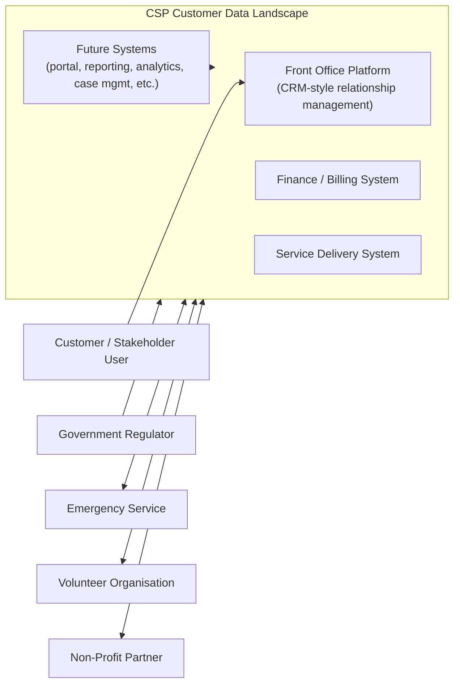
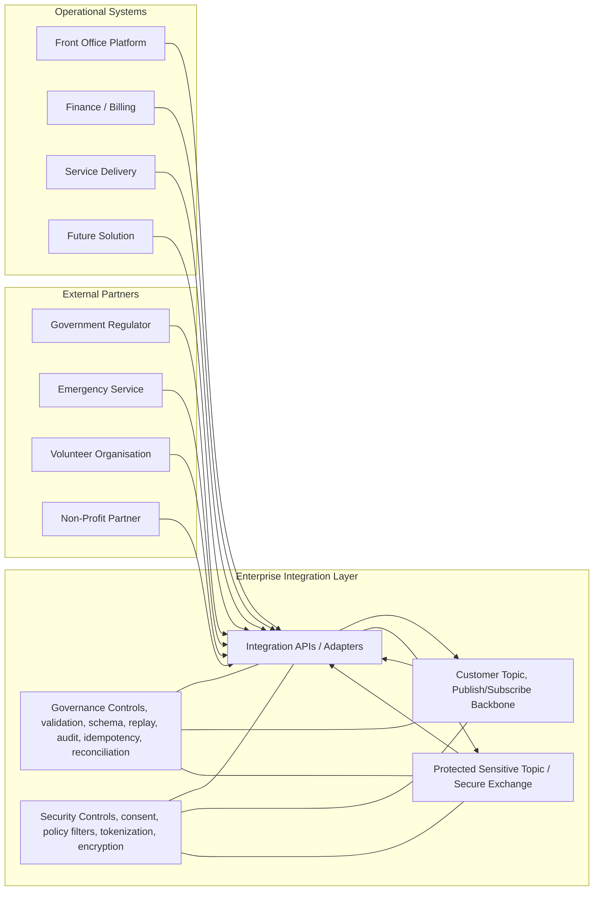
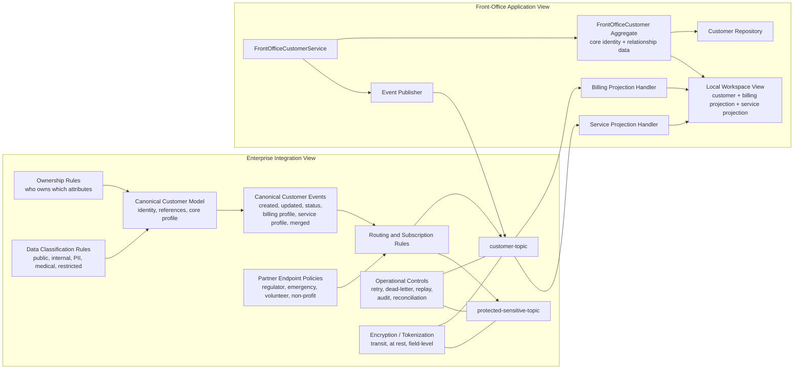

# Care Services Provider (CSP) Integration Architecture
## Brief Usecase Scenario
Abstract Care Services Provider (CSP) company has multiple operational systems that need to stay aligned on customer/stakeholder data. 
They want an integration approach that is decoupled, scalable, and allows other solutions to “plug in” over time.\
One known reference pattern used is a publish/subscribe approach via a customer topic to reduce coupling and support extensibility.\
Design the integration architecture to keep customer data consistent across:
- CRM-style front office platform (e.g. stakeholder/customer relationship management)
- Finance / billing systems
- Service delivery systems
- while also enabling future systems to connect with minimal rework.

Do not nominate specific products or vendors, focus on the overall architecture, design principles, and approach.

## Architecture Definition 
Let's define _boundaries_ beetween systems.\
**Ownership Model** provides clear reponsibilities where specific data is produced/maintained by one system (owner), and acceepted/acknoledged by other systems. At this stage, we focus on relashinships to produce directed acyclic graph (DAG) where changes are propogated without conflicts.
| Attribute Group | Authoritative System | Typical Consumers |
| --- | --- | --- |
| Core identity | FrontOffice | FinanceBilling, ServiceDelivery |
| Relationship data | FrontOffice | FinanceBilling, ServiceDelivery |
| Contact data | FrontOffice | FinanceBilling, ServiceDelivery |
| Address data | FrontOffice | FinanceBilling, ServiceDelivery |
| Billing data | FinanceBilling | FrontOffice, ServiceDelivery |
| Service data | ServiceDelivery | FrontOffice, FinanceBilling |

We do not consider any API, replication mechanisms, and data schema yet. First question to answer is - which Producer/Consumer architecture pattern to choose from: 
- **Message Driven Architecture (MDA)**. Synchroinous more structured communication with schema and coupling (awareness between producer and consumer). Guarantees of reliability and precessing ordering. Use cases: Transactional systems, workflow orchestration, integrations. Higher latency (5-50ms). 
- **Event Driven Architecture (EDA)**. Revolves around the production detection, consumption and reaction to events. Asynchroinous events, IOT, OT. Decoupling producer from consumer. Use-cases: real-time analytics, microservices, user activity tracking. Latency is lower (1-5ms), but can sufffer from event storming. Scalability is good, allowing to improive performance on demand.

The other factors to be consuidered:
- Guarantee of delivery policy: at least once, at most once, exactly once.
- Acceptable SLOs: messages per second throughput, latency, lost messages, enchryption, scalability.

### Assumptions

_Let's assume that Event-Driven Architecture (EDA) fits for our stakeholders overall._\
EDA allows us do not focus on taxonomy of messages, avoid centrelised message brocker topology, defer scalability issues.
But for some scenarios MDA also can be utilised to guarantee atomic/transaction processing of messages.
That means we do not exclude, but combine the MDA and EDA to get the best outcomes.

Let's use **TypeScript** as domain specific language allowing to develope and validate types (architecture artefacts) at high level. TypeScript strong typisation and ablility to adopt at all SDLC levels: back-end, middleware, fron-tend.

We start form shareable definitions: event contract, data governance. Then we reuse shareable definitions on enterprise, solution, and operational levels.

## Canonical Event Catalog
Each publish and subscribe event has the following attributes: **topic**, event type, payload, metadata.\
Let's define core topic*: `customer-topic` as shared between publishers and subscrubers. Customer topic can be described as the following **event types**:
- `customer.created`
- `customer.updated`
- `customer.status_changed`
- `customer.billing_profile_changed`
- `customer.service_profile_changed`
- `customer.merged`

*The solution may require other topics and event types to be defined later.

## External Partner Integration Endpoints
Events may be distributed through multiple queues (external, internal, logging, real-time analytics). Unified API Gateway can aggregate different API endpoints, hiding the complexity, and applying unified policies. 
The same event-driven pattern can be extended to trusted external partners through controlled integration endpoints.

| Partner Type | Typical Endpoint Style | Typical Flow |
| --- | --- | --- |
| Government regulator | Subscriber or secure API | Receives compliance, status, notification, or reporting events |
| Emergency service | Bidirectional | Receives critical customer/service context and can publish incident updates |
| Volunteer organisation | Bidirectional | Receives referrals and publishes engagement or completion outcomes |
| Non-profit partner | Bidirectional | Receives approved stakeholder context and publishes case or referral outcomes |

These partner integrations should always be mediated by the integration layer rather than direct access to core operational systems.

## Core Design Principles
- Use event-driven architecture implemented through publish/subscribe on a shared topics.
- Avoid point-to-point integration between operational systems.
- Define clear ownership for each attribute group so consistency is governed, not assumed.
- Keep systems loosely coupled through canonical events and local projections.
- Design for eventual consistency with idempotency, replay, auditability, and reconciliation.
- Make future systems pluggable by subscribing to the same customer event contracts.
- Segregate sensitive and insensitive data.

## C4 Level 1: Context
This view shows the business landscape and the key external relationships.

### Context Notes
- The business problem is shared customer consistency across operational systems.
- The target state is not direct coupling between every system.
- Future systems should connect without redesigning the existing estate.
- External partners should connect through governed endpoints, not through direct system access.
- Sensitive and medical data should be shared only through protected channels and policy-controlled contracts.

## C4 Level 2: Containers
This view introduces the major runtime building blocks and the event-driven integration style.

### Container Notes
- Systems do not integrate directly with each other.
- The integration layer owns translation, routing, and operational controls.
- The customer topic is the shared contract boundary for decoupled change propagation.
- New systems plug in through the same integration layer and event contracts.
- External partners connect through secure partner endpoints managed by the same integration layer.

## C4 Level 3: Components
This view separates the enterprise integration responsibilities from the front-office application responsibilities.

### Component Notes
- The enterprise view defines the shared contracts and governance policies.
- The enterprise view also defines partner endpoint controls and data-classification policy.
- The application view focuses on one bounded context: front office.
- Front office publishes only the attributes it owns.
- Front office consumes finance and service events to maintain local read projections.
- Billing and service systems remain authoritative for their own data even when that data is visible in front office.

## Summary
This design gives Care Services Provider solution:
- decoupled integration across front office, finance, and service delivery
- clear accountability for customer data ownership
- support for eventual consistency at enterprise scale
- controlled onboarding of regulators, emergency services, volunteers, and non-profit partners
- stronger privacy posture through sensitive-data segregation and policy-based sharing
- encryption strategy for data in transit and at rest
- a stable pattern for onboarding future systems with minimal rework

More details in [README_GOVERNANCE](./README_GOVERNANCE.md),  [README_OPERATION](./README_OPERATION.md)
