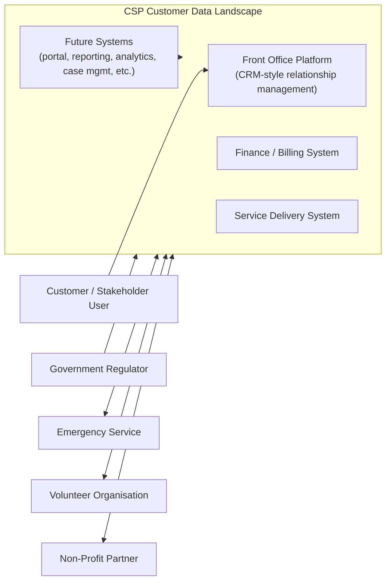
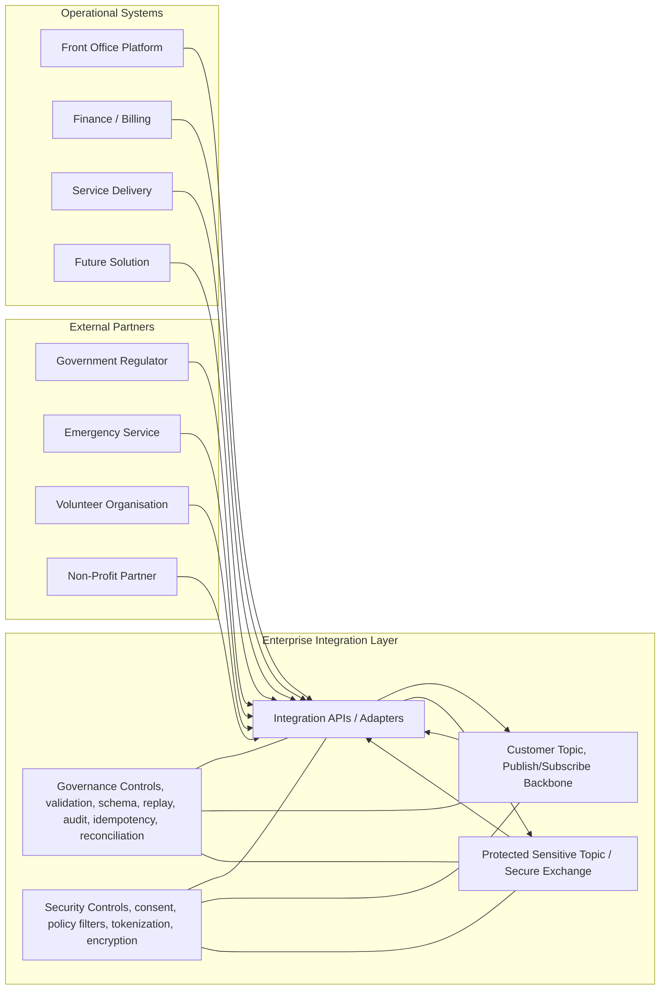
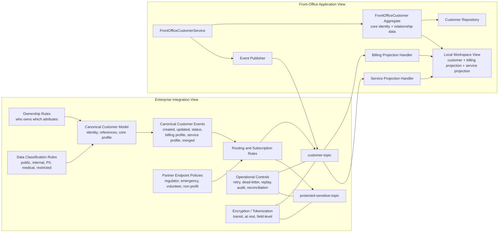

# Care Services Provider (CSP) Event-Driven Architecture (EDA)
This project captures complementary views of the same customer integration design:

- `event-contracts.ts`: shared canonical event and topic contracts
- `data-governance.ts`: shared ownership, sensitivity, and access policy model
- `enterprise-eda-architecture.ts`: enterprise integration view
- `application-eda-domain.ts`: front-office application/domain view
- `devsecops-sdlc-architecture.ts`: DevSecOps, testing, security, and delivery view

## TypeScript Validation

This folder can be validated as a lightweight TypeScript package without
depending on any root-level repository configuration.

Included project files:

- `package.json`: project metadata and a `typecheck` script
- `tsconfig.json`: strict TypeScript compiler settings for schema validation
- `eslint.config.mjs`: lightweight linting for unused imports and TypeScript hygiene
- the parent repo `.gitignore`: ignores local dependency and build artifacts

Typical validation flow:

```powershell
npm install
node --run check
```

Or run the checks individually:

```powershell
node --run typecheck
node --run lint
```

Optional consistency check for the GitHub Actions workflow YAML local files:

```powershell
py -c "import yaml, pathlib; yaml.safe_load(pathlib.Path(r'../.././github/workflows/csp-blueprint-devsecops.yml').read_text(encoding='utf-8')); yaml.safe_load(pathlib.Path(r'../.././github/workflows/csp-blueprint-deploy.yml').read_text(encoding='utf-8')); print('YAML_OK')"
```

This uses the TypeScript compiler as a consistency check across the architecture artifacts without generating runtime output.
ESLint adds lightweight static analysis for unused imports and TypeScript hygiene.
The optional YAML check extends the same consistency approach to the GitHub
Actions orchestration files without making Python a core dependency of the
blueprint itself.

The goal is to keep customer and stakeholder data aligned across front office, finance/billing, and service delivery systems while remaining decoupled, scalable, and easy to extend for future solutions.

## Why These Views

Together these artifacts cover enterprise architecture, bounded-context
application design, and DevSecOps delivery governance without tying the
blueprint to a specific implementation platform.

The repository also includes a matching GitHub Actions orchestration skeleton
at [csp-blueprint-devsecops.yml](./architecture-as-code/.github/workflows/csp-blueprint-devsecops.yml)
and a reusable deployment contract at [csp-blueprint-deploy.yml](./architecture-as-code/.github/workflows/csp-blueprint-deploy.yml)
so GitHub can coordinate quality gates, approvals, immutable artifact
promotion, and multi-cloud delivery without collapsing architecture,
development, and DevOps concerns into one platform-specific design.

The workflow is pull-request driven for modern [Git Flow](https://github.com/gittower/git-flow-next) style branching such as
`feature/*`, `development`, `release/*`, `hotfix/*`, and `main`, and it does
not auto-deploy on direct commits to `main`. Manual promotion is handled
through `workflow_dispatch` with explicit deployment contract inputs such as
target cloud, target cluster, and artifact version.

### Why Two GitHub Workflow Files

The two workflow files intentionally separate orchestration from deployment
execution.

- `csp-blueprint-devsecops.yml` is the control-plane workflow. It decides when
  automation runs, which branch policy applies, which quality and security
  gates must pass, and whether a release may be promoted to `dev`, `test`, or
  `prod`.
- `csp-blueprint-deploy.yml` is the reusable deployment contract. It accepts a
  resolved deployment target such as environment, cloud, cluster, artifact
  version, and deployment strategy, then performs the delivery step for that
  specific target.

This split is useful because:

- GitHub workflow orchestration remains focused on SDLC governance and approval
  flow.
- Deployment execution becomes reusable across environments and clouds.
- Cloud-specific delivery logic can evolve without rewriting the whole
  DevSecOps pipeline.
- Architecture, Development, and DevOps teams can each own their concern area
  with clearer boundaries.

The architecture is intentionally split into two viewpoints because they answer different questions.

- Enterprise view: How do systems stay aligned across the landscape?
- Application view: How does the front-office bounded context publish and consume those shared contracts?

Together they show both strategic architecture and local implementation responsibility without tying the design to any vendor or platform.

## Core Design Principles

- Use event-driven architecture implemented through publish/subscribe on a shared customer topic.
- Avoid point-to-point integration between operational systems.
- Define clear ownership for each attribute group so consistency is governed, not assumed.
- Keep systems loosely coupled through canonical events and local projections.
- Design for eventual consistency with idempotency, replay, auditability, and reconciliation.
- Make future systems pluggable by subscribing to the same customer event contracts.
- Segregate sensitive and insensitive data so medical and high-risk PII can be handled under stronger controls.
- Encrypt data in transit and at rest, with stronger controls such as tokenization and field-level encryption for high-sensitivity domains.

## Reliability Pattern Grounding
This blueprint aligns with several reliability patterns from Microsoft Azure's
[Well-Architected guidance](https://learn.microsoft.com/en-us/azure/well-architected/reliability/design-patterns) on architecture design patterns that support
reliability.

Patterns that are explicitly represented in this blueprint:
- `Publisher/Subscriber`: the core architecture uses the shared
  `customer-topic` to decouple front office, finance/billing, service delivery,
  and future systems.
- `Bulkhead`: the design separates bounded contexts, ownership domains, and
  sensitive-data handling paths so failures or policy constraints in one area
  do not automatically spread to others.
- `Pipes and Filters`: the integration layer is modeled as a mediated flow of
  validation, routing, schema control, audit, and policy enforcement rather
  than as direct system-to-system coupling.

Patterns that are strongly implied by the architecture controls:
- `Retry`: listed in the integration policies to tolerate transient failures in
  publication and consumption paths.
- `Competing Consumers`: compatible with the subscriber model because consumers
  are intentionally decoupled behind the shared topic and designed for
  duplicate-safe processing.
- `Health Endpoint Monitoring`: implied as an operational concern through the
  blueprint's emphasis on auditability, reconciliation, and observability,
  although no concrete endpoint contract is defined in these TypeScript files.

Patterns that are partially aligned but not fully modeled yet:
- `Queue-Based Load Leveling`: the shared topic provides asynchronous
  decoupling, but the blueprint does not yet define dedicated workload buffers,
  worker pools, or back-pressure rules.
- `Circuit Breaker` and `Throttling`: these would fit naturally in the
  integration layer or partner-facing adapters, but they are not yet described
  as explicit contracts in this blueprint.
- `Saga distributed transactions` / `Compensating Transaction`: the current
  design favors eventual consistency and authoritative ownership, but it does
  not yet define compensation workflows for multi-step cross-system business
  processes.

In short, the current solution is most clearly grounded in
publish/subscribe-based decoupling, failure isolation across bounded contexts,
and mediated integration controls that support resilient asynchronous
processing.

## Ownership Model

| Attribute Group | Authoritative System | Typical Consumers |
| --- | --- | --- |
| Core identity | FrontOffice | FinanceBilling, ServiceDelivery |
| Relationship data | FrontOffice | FinanceBilling, ServiceDelivery |
| Contact data | FrontOffice | FinanceBilling, ServiceDelivery |
| Address data | FrontOffice | FinanceBilling, ServiceDelivery |
| Billing data | FinanceBilling | FrontOffice, ServiceDelivery |
| Service data | ServiceDelivery | FrontOffice, FinanceBilling |

## Canonical Event Catalog

All systems publish and subscribe via the shared `customer-topic`.

- `customer.created`
- `customer.updated`
- `customer.status_changed`
- `customer.billing_profile_changed`
- `customer.service_profile_changed`
- `customer.merged`

## External Partner Integration Endpoints

The same event-driven pattern can be extended to trusted external partners through controlled integration endpoints.

| Partner Type | Typical Endpoint Style | Typical Flow |
| --- | --- | --- |
| Government regulator | Subscriber or secure API | Receives compliance, status, notification, or reporting events |
| Emergency service | Bidirectional | Receives critical customer/service context and can publish incident updates |
| Volunteer organisation | Bidirectional | Receives referrals and publishes engagement or completion outcomes |
| Non-profit partner | Bidirectional | Receives approved stakeholder context and publishes case or referral outcomes |

These partner integrations should always be mediated by the integration layer rather than direct access to core operational systems.

## Data Protection And Privacy Model

The architecture separates data concerns so sensitive information is not treated the same way as routine operational data.

### Recommended Segregation

- Insensitive and routine operational data can flow through the standard canonical customer topic.
- PII should be minimized in event payloads and exposed only where there is clear business need.
- Sensitive health or medical data should be segregated into protected domains, protected topics, or secure APIs with stricter access controls.
- External partners should receive the minimum necessary data for their purpose, filtered by policy.

### Recommended Security Controls

| Concern | Recommended Approach |
| --- | --- |
| Data in transit | TLS or equivalent transport encryption for all APIs, brokers, and partner endpoints |
| Data at rest | Storage-level encryption for all operational stores, event stores, and backups |
| High-risk fields | Field-level encryption for medical data, regulatory data, and restricted financial attributes |
| Identity correlation | Tokenization or pseudonymization where full identifiers are not required downstream |
| Key management | Separate key domains for sensitive datasets and tightly controlled decrypt permissions |
| Partner integration | Policy-based filtering, contract scoping, consent checks, and full audit trail |

## Service Delivery Workflow Pipelines

`ServiceDelivery` is the part of the landscape most likely to accumulate
long-running work, operational waiting states, and expensive downstream
interactions. For that reason, it should not be treated as a single linear
consumer of customer events. It should behave as a pipeline-based workflow
domain with explicit prioritization, parallelization, and concurrency control.

### Pipeline Goals

- absorb bursty event traffic without overwhelming operational workers
- prioritize urgent or customer-impacting work ahead of routine background work
- parallelize independent steps without allowing conflicting updates to race
- let multiple internal consumers use the same event payload safely
- keep long-running workflows durable, observable, and restartable

### Conceptual Pipeline Model

The recommended model is a staged workflow pipeline:

1. `Ingress`
   Accept service-related events from the shared customer topic and classify
   them into workflow intents such as provision, update, suspend, relocate,
   close, partner-notify, or reconcile.
2. `Priority and Partition`
   Assign business priority and route work to workload-specific queues using a
   stable partition key such as `serviceAccountId`, `customerId`, region, or
   service domain.
3. `Pre-Checks`
   Perform validation, policy checks, duplication checks, and dependency
   readiness checks before expensive work starts.
4. `Execution`
   Run independent workflow steps in parallel where there is no shared mutable
   state conflict.
5. `Coordination`
   Persist workflow state, waiting conditions, retries, escalation timers, and
   compensation decisions for long-running jobs.
6. `Publication`
   Emit resulting service events, projection updates, audit records, and
   operational alerts.

### Priority Queue Strategy

Not all service work should compete equally for the same workers. A practical
priority model is:

- `P1 Critical`: safety, regulatory, incident, or outage-related actions
- `P2 Customer Impacting`: activation, suspension, restoration, urgent address
  or contact changes affecting live service
- `P3 Standard Operational`: ordinary provisioning, routine updates, partner
  coordination, standard fulfillment
- `P4 Background`: reconciliation, replay, projection rebuild, enrichment, and
  bulk synchronization

Priority should influence dispatch order, but fairness controls are still
needed so background work is delayed rather than starved forever.

### Parallelization Rules

Parallelization should be allowed only for non-conflicting work. The simplest
rule is:

- steps that mutate the same service aggregate or external side effect target
  must share the same serialization key
- steps that only read data, enrich context, notify observers, or update
  independent projections may execute in parallel

Useful serialization keys include:

- `serviceAccountId` for service lifecycle changes
- `customerId` when customer-scoped changes affect multiple services together
- `partnerCaseId` or `externalReference.localId` for partner callbacks
- region or work-basket key for operational capacity controls

This gives controlled concurrency: parallel across different keys, serialized
within the same key.

### Multiple Consumers Without Data Races

The same inbound event can legitimately trigger multiple internal consumers, for
example:

- service lifecycle workflow orchestration
- SLA or case-management updates
- front-office projection refresh
- partner notification preparation
- audit and compliance recording

To avoid data races:

- treat the inbound event as immutable
- let each consumer write to its own owned store or projection
- never let multiple consumers concurrently mutate the same operational record
  without a clear owner
- use version checks or optimistic concurrency for shared workflow state
- emit follow-up events for cross-component coordination rather than sharing
  in-memory mutable objects

In other words, parallel consumers may share the same payload, but they should
not share the same writable state boundary.

### Long-Running Workflow Shape

Many `ServiceDelivery` processes are naturally long-running because they depend
on external systems, field work, approvals, or time-based waiting conditions.
These workflows should be modeled as durable state machines, not as single
request/response transactions.

A typical long-running workflow can look like:

1. `Accepted`
   The workflow instance is created from an inbound event and assigned a
   priority and partition key.
2. `Prepared`
   Validation, eligibility, policy, and dependency checks complete.
3. `Dispatched`
   Work is sent to one or more execution steps or external adapters.
4. `Waiting`
   The workflow pauses for callback, approval, field completion, retry delay,
   or scheduled revisit.
5. `Resumed`
   A callback event, timeout, or dependent completion moves the workflow
   forward.
6. `Completed` or `Compensating`
   The workflow either finishes successfully or triggers rollback/remediation
   steps when partial failure occurs.

This model avoids keeping expensive workers blocked while the business process
is waiting on real-world actions.

### Recommended Pipeline Lanes

Instead of one generic processing lane, separate `ServiceDelivery` into lanes
such as:

- `RealTime Operations`: urgent customer-affecting service state changes
- `Provisioning and Fulfillment`: longer-running activation and setup workflows
- `Partner and Field Coordination`: external callbacks, dispatch, and partner
  acknowledgements
- `Projection and Notification`: read-model refreshes and downstream event
  publication
- `Reconciliation and Replay`: repair, rebuild, and consistency checks

Each lane should have independent worker pools, retry settings, and scaling
policies.

### Operational Safeguards

To keep the pipeline from becoming a bottleneck:

- use dead-letter isolation for poison messages, monitor dead-letter queue
- keep retries bounded and policy-driven
- expose queue depth, consumer lag, workflow age, and stuck-state metrics
- reserve capacity for critical priorities
- run replay and reconciliation outside the real-time hot path
- isolate slow partner adapters with circuit breaker and timeout controls

### Architecture Principle

The main principle is: `ServiceDelivery` should scale as a coordinated set of
durable workflow pipelines, not as a single queue consumer or a single service
class. Priority controls decide what runs first, partition keys decide what can
run safely in parallel, and ownership boundaries decide where concurrent
consumers are allowed to write.

## C4 Level 1: Context

This view shows the business landscape and the key external relationships.



### Context Notes

- The business problem is shared customer consistency across operational systems.
- The target state is not direct coupling between every system.
- Future systems should connect without redesigning the existing estate.
- External partners should connect through governed endpoints, not through direct system access.
- Sensitive and medical data should be shared only through protected channels and policy-controlled contracts.

## C4 Level 2: Containers

This view introduces the major runtime building blocks and the event-driven integration style.



### Container Notes

- Systems do not integrate directly with each other.
- The integration layer owns translation, routing, and operational controls.
- The customer topic is the shared contract boundary for decoupled change propagation.
- New systems plug in through the same integration layer and event contracts.
- External partners connect through secure partner endpoints managed by the same integration layer.
- Sensitive data can be routed to protected topics or secure APIs rather than the general customer topic.

## C4 Level 3: Components

This view separates the enterprise integration responsibilities from the front-office application responsibilities.



### Component Notes

- The enterprise view defines the shared contracts and governance policies.
- The enterprise view also defines partner endpoint controls and data-classification policy.
- The application view focuses on one bounded context: front office.
- Front office publishes only the attributes it owns.
- Front office consumes finance and service events to maintain local read projections.
- Billing and service systems remain authoritative for their own data even when that data is visible in front office.
- Sensitive medical and high-risk PII can be separated from the general customer topic and routed through protected exchange channels.
- Encryption applies in transit and at rest, with stronger options like tokenization and field-level encryption for the most sensitive fields.

## How The Two TypeScript Files Relate

### Enterprise File

`enterprise-eda-architecture.ts` defines:

- bounded contexts
- canonical customer identity and profile
- ownership rules
- shared event contracts
- pub/sub abstractions
- integration-layer governance
- external partner endpoints and access policies
- data classification and protection policy
- future-system extensibility

### Shared Contracts File

`event-contracts.ts` defines:

- canonical event names
- customer event envelopes and payloads
- shared customer identity and profile structures
- neutral topic, publisher, and subscriber abstractions

### Shared Governance File

`data-governance.ts` defines:

- attribute ownership rules
- data sensitivity classifications
- encryption and segregation policy
- external partner access policy

### Application File

`application-eda-domain.ts` defines:

- the front-office-owned customer aggregate
- front-office commands and service ports
- local projections for billing and service state
- event handlers that consume peer events
- an in-memory event router for local reasoning and testing

## Recommended Presentation Narrative

For an architecture walkthrough, present it in this order:

1. Start with the context problem: multiple operational systems must stay aligned on customer data.
2. Explain the container pattern: a shared publish/subscribe customer topic removes point-to-point coupling.
3. Explain the component responsibilities: enterprise governance defines the contract, while each application owns only its bounded context.
4. Explain privacy and security: sensitive health and PII data are segregated, policy-filtered, and encrypted in transit and at rest.
5. Finish with extensibility: future systems and external partners plug in through governed endpoints rather than changing existing integrations.

## Summary

This design gives CSP:

- decoupled integration across front office, finance, and service delivery
- clear accountability for customer data ownership
- support for eventual consistency at enterprise scale
- controlled onboarding of regulators, emergency services, volunteers, and non-profit partners
- stronger privacy posture through sensitive-data segregation and policy-based sharing
- encryption strategy for data in transit and at rest
- a stable pattern for onboarding future systems with minimal rework
