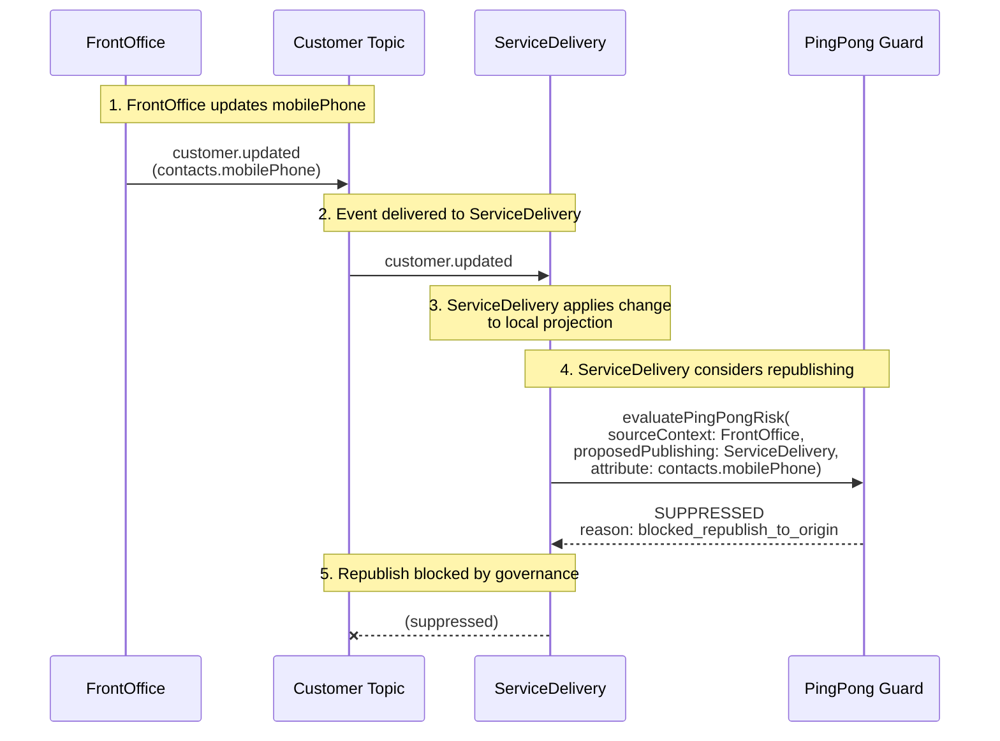

## Data Protection And Privacy Model

The architecture separates data concerns so sensitive information is not treated the same way as routine operational data.

### Recommended Segregation

- External partners should receive the minimum necessary data for their purpose, filtered by policy.
- Encrypt data in transit and at rest, with stronger controls such as tokenization and field-level encryption for high-sensitivity domains.
- Insensitive and routine operational data can flow through the standard canonical customer topic.
- Sensitive personal, medical, and high-risk PII can be separated from the general customer topic and routed through protected exchange channels. [Claim-Check](https://learn.microsoft.com/en-us/azure/architecture/patterns/claim-check) pattern allows workloads to transfer payloads without storing the payload in a messaging system. 
  - PII data should be minimized in event payloads and exposed only where there is clear business need.
  - Sensitive health or medical data should be segregated into protected domains, protected topics, or secure APIs with stricter access controls.


### Recommended Security Controls

| Concern | Recommended Approach |
| --- | --- |
| Data in transit | TLS or equivalent transport encryption for all APIs, brokers, and partner endpoints |
| Data at rest | Storage-level encryption for all operational stores, event stores, and backups |
| High-risk fields | Field-level encryption for medical data, regulatory data, and restricted financial attributes |
| Identity correlation | Tokenization or pseudonymization where full identifiers are not required downstream. Mapping to external records' IDs is acceptable |
| Key management | Separate key domains for sensitive datasets and tightly controlled decrypt permissions |
| Partner integration | Policy-based filtering, contract scoping, consent checks, and full audit trail |

## Republish Governance (Ping-Pong Prevention)

The integration layer includes governance that prevents **event ping-pong** - where systems bounce updates back and forth indefinitely.

### Why This Matters
EDA may suffer from event storming. If all systems solely own and do not share customer attributes, there is no conflict of updates. But what if some systems may change the same customer attributes? It may cause ping-pong or endless loops.

In a publish/subscribe architecture, a consumer that also publishes can cause:
- **Feedback loops**: FrontOffice → ServiceDelivery → FrontOffice → ServiceDelivery → ...
- **Data storms**: The same change circulates endlessly
- **Performance degradation**: Unnecessary reprocessing across all consumers

### How It Works

The `evaluatePingPongRisk()` function in [data-governance.ts](data-governance.ts) applies these rules:

| Rule | Description |
|------|-------------|
| Primary authority only | Only the authoritative system may republish an attribute |
| Shared-write policy | Collaborative attributes must be explicitly listed |
| Suppress to origin | Don't send updates back to the original source |
| Value fingerprint | Suppress when correlation + value are identical |
| Timestamp check | Reject stale updates that would overwrite newer data |

### Example Flow: FrontOffice → ServiceDelivery → Suppressed Rebound



**Step-by-step:**
1. FrontOffice updates `contacts.mobilePhone` → publishes `customer.updated`
2. ServiceDelivery receives the event (it's an allowed writer per shared policy)
3. ServiceDelivery applies the change to its local projection
4. ServiceDelivery wants to republish (perhaps to notify other systems)
5. **Ping-pong guard evaluates:**
   - `sourceContext = FrontOffice` (original sender)
   - `proposedPublishingContext = ServiceDelivery`
   - `suppressRepublishToOrigin = true` in policy
   - **→ Blocked: `blocked_republish_to_origin`**

### Integration Governance Service

The enterprise architecture exposes this via `assessGovernedRepublish()` in [enterprise-architecture.ts](enterprise-architecture.ts):

```typescript
import { assessGovernedRepublish, cspCustomerArchitecture } from "./enterprise-architecture.js";

const decision = assessGovernedRepublish(cspCustomerArchitecture, {
  receivingContext: "ServiceDelivery",
  proposedPublishingContext: "ServiceDelivery",
  sourceContext: "FrontOffice",
  eventId: "550e8400-e29b-41d4-a716-446655440000",
  correlationId: "corr-123",
  changedAttributes: [{
    attributePath: "contacts.mobilePhone",
    attributeGroup: "ContactData",
    value: "+61412345678",
    lastUpdatedAt: "2026-04-25T10:30:00Z",
  }],
  knownLineage: [{
    attributePath: "contacts.mobilePhone",
    lastAppliedAt: "2026-04-25T10:30:00Z",
    lastAppliedBy: "FrontOffice",
    lastCorrelationId: "corr-123",
    lastValueFingerprint: '"+61412345678"',
  }],
});

console.log(decision.shouldPublish); // false
console.log(decision.decisions[0].reason); // "blocked_republish_to_origin"
```


## Service Delivery Workflow Pipelines

`ServiceDelivery` is the part of the landscape most likely to accumulate long-running work, operational waiting states, and expensive downstream
interactions. For that reason, it should not be treated as a single linear consumer of customer events. It should behave as a pipeline-based workflow
domain with explicit prioritization, parallelization, and concurrency control.

### Pipeline Goals
Combination of proactive, reactive, and architectural strategies to manage sudden spikes in demand without degrading user experience or crashing systems, such as: 
- absorb bursty event traffic without overwhelming operational workers
- prioritize urgent or customer-impacting work ahead of routine background work
- parallelize independent steps without allowing conflicting updates to race
- let multiple internal consumers use the same event payload safely
- keep long-running workflows durable, observable, and restartable

### Conceptual Pipeline Model

The recommended model is a staged workflow pipeline:

1. `Ingress`
   Accept service-related events from the shared customer topic and classify
   them into workflow intents such as provision, update, suspend, relocate,
   close, partner-notify, or reconcile.
2. `Priority and Partition`
   Assign business priority and route work to workload-specific queues using a
   stable partition key such as `serviceAccountId`, `customerId`, region, or
   service domain.
3. `Pre-Checks`
   Perform validation, policy checks, duplication checks, and dependency
   readiness checks before expensive work starts.
4. `Execution`
   Run independent workflow steps in parallel where there is no shared mutable
   state conflict.
5. `Coordination`
   Persist workflow state, waiting conditions, retries, escalation timers, and
   compensation decisions for long-running jobs.
6. `Publication`
   Emit resulting service events, projection updates, audit records, and
   operational alerts.

### Priority Queue Strategy

Not all service work should compete equally for the same workers. A practical priority model is:

- `P1 Critical`: safety, regulatory, incident, or outage-related actions
- `P2 Customer Impacting`: activation, suspension, restoration, urgent address
  or contact changes affecting live service
- `P3 Standard Operational`: ordinary provisioning, routine updates, partner coordination, standard fulfillment
- `P4 Background`: reconciliation, replay, projection rebuild, enrichment, and bulk synchronization

Priority should influence dispatch order, but fairness controls are still needed so background work is delayed rather than starved forever.

### Parallelization Rules

Parallelization should be allowed only for non-conflicting work. The simplest rule is:

- steps that mutate the same service aggregate or external side effect target must share the same serialization key
- steps that only read data, enrich context, notify observers, or update independent projections may execute in parallel

Useful serialization keys include:
- `serviceAccountId` for service lifecycle changes
- `customerId` when customer-scoped changes affect multiple services together
- `partnerCaseId` or `externalReference.localId` for partner callbacks
- region or work-basket key for operational capacity controls

This gives controlled concurrency: parallel across different keys, serialized within the same key.

### Concurrency
The solution may have multiple queues, publishers, and consumers.
The same inbound event can legitimately trigger multiple subscribed for the topic consumers, for example:
- service delivery team with multiple workers
- front-office projection refresh
- partner notification preparation
- audit and compliance recording

It is critical to avoid data corruption caused by data loss, data race, event storming, cyber attacks, etc.:
- treat the inbound event as immutable
- let each consumer write to its own owned store or projection
- never let multiple consumers concurrently mutate the same operational record without a clear owner
- use version checks or optimistic concurrency for shared workflow state
- emit follow-up events for cross-component coordination rather than sharing in-memory mutable objects

Message queue allows to solve the problem deligating event/message to particular consumer as described in [Competing Consumers](https://learn.microsoft.com/en-us/azure/architecture/patterns/competing-consumers) pattern.\
Also, [Event Sourcing](https://learn.microsoft.com/en-us/azure/architecture/patterns/event-sourcing) pattern can help prevent concurrent updates from causing conflicts because it avoids the requirement to directly update objects in the data store. In other words, parallel consumers may read the same payload, but they should not share the same writable state boundary.

### Long-Running Workflow Shape
`ServiceDelivery` is a core busniess function should scale as a coordinated set of durable workflow pipelines, not as a single queue consumer or a single service class. Priority controls decide what runs first, partition keys decide what can run safely in parallel, and ownership boundaries decide where concurrent consumers are allowed to write.

Many `ServiceDelivery` processes are naturally long-running because they depend on external systems, field work, approvals, or time-based waiting conditions. These workflows should be modeled as durable state machines, not as single request/response transactions.

A typical long-running workflow can look like:

1. `Accepted`
   The workflow instance is created from an inbound event and assigned a priority and partition key.
2. `Prepared`
   Validation, eligibility, policy, and dependency checks complete.
3. `Dispatched`
   Work is sent to one or more execution steps or external adapters.
4. `Waiting`
   The workflow pauses for callback, approval, field completion, retry delay, or scheduled revisit.
5. `Resumed`
   A callback event, timeout, or dependent completion moves the workflow forward.
6. `Completed` or `Compensating`
   The workflow either finishes successfully or triggers rollback/remediation steps when partial failure occurs.

This model avoids keeping expensive workers blocked while the business process is waiting on real-world actions.

### Recommended Pipeline Lanes

Instead of one generic processing lane, separate `ServiceDelivery` into lanes such as:
- `RealTime Operations`: urgent customer-affecting service state changes
- `Provisioning and Fulfillment`: longer-running activation and setup workflows
- `Partner and Field Coordination`: external callbacks, dispatch, and partner acknowledgements
- `Projection and Notification`: read-model refreshes and downstream event publication
- `Reconciliation and Replay`: repair, rebuild, and consistency checks

Each lane should have independent worker pools, retry settings, and scaling policies.

### Operational Safeguards

To keep the pipeline from becoming a bottleneck:

- use dead-letter isolation for poison messages, monitor dead-letter queue
- keep retries bounded and policy-driven
- expose queue depth, consumer lag, workflow age, and stuck-state metrics
- reserve capacity for critical priorities
- run replay and reconciliation outside the real-time hot path
- isolate slow partner adapters with circuit breaker and timeout controls


## Reliability Pattern Grounding
This blueprint aligns with several reliability patterns from Microsoft Azure's
[Well-Architected guidance](https://learn.microsoft.com/en-us/azure/well-architected/reliability/design-patterns) on architecture design patterns that support
reliability.

Patterns that are explicitly represented in this blueprint:
- `Publisher/Subscriber`: the core architecture uses the shared `customer-topic` to decouple front office, finance/billing, service delivery, and future systems.
- `Bulkhead`: the design separates bounded contexts, ownership domains, and sensitive-data handling paths so failures or policy constraints in one area do not automatically spread to others.
- `Pipes and Filters`: the integration layer is modeled as a mediated flow of validation, routing, schema control, audit, and policy enforcement rather than as direct system-to-system coupling.

Patterns that are strongly implied by the architecture controls:
- `Retry`: listed in the integration policies to tolerate transient failures in publication and consumption paths.
- `Competing Consumers`: compatible with the subscriber model because consumers are intentionally decoupled behind the shared topic and designed for
  duplicate-safe processing.
- `Health Endpoint Monitoring`: implied as an operational concern through the blueprint's emphasis on auditability, reconciliation, and observability,   although no concrete endpoint contract is defined in these TypeScript files.

Patterns that are partially aligned but not fully modeled yet:
- `Queue-Based Load Leveling`: the shared topic provides asynchronous decoupling, but the blueprint does not yet define dedicated workload buffers,
  worker pools, or back-pressure rules.
- `Circuit Breaker` and `Throttling`: these would fit naturally in the integration layer or partner-facing adapters, but they are not yet described
  as explicit contracts in this blueprint.
- `Saga distributed transactions` / `Compensating Transaction`: the current design favors eventual consistency and authoritative ownership, but it does
  not yet define compensation workflows for multi-step cross-system business processes.

In short, the current solution is most clearly grounded in publish/subscribe-based decoupling, failure isolation across bounded contexts,
and mediated integration controls that support resilient asynchronous processing.