# Cloud HR System
## Solution Architecture Blueprint

**Document status:** draft reference architecture  
**Version:** 1.0  
**Date:** DD-MM-YYYY  
**Scope:** Oracle Fusion Cloud HCM, Workday HCM, SAP SuccessFactors Employee Central, Cornerstone HR Suite, and Salesforce HR Service / Salesforce-based HR applications

---

## 1. Executive Summary

The **Cloud HR System** blueprint defines a vendor-neutral enterprise architecture for selecting, implementing, integrating, and governing a cloud-based HR ecosystem.

The reviewed most popular cloud  platforms do not all play the same architectural role:

- **Oracle Fusion Cloud HCM**, **Workday HCM**, and **SAP SuccessFactors Employee Central** are credible enterprise Core HR systems of record.
- **Cornerstone HR Suite** is strongest as a talent, learning, skills, and employee-profile platform, with Core HR capabilities suitable for less complex employment models.
- **Salesforce** is strongest as an employee service, case management, portal, workflow, and extensibility layer. It should not normally be treated as equivalent to a purpose-built global Core HCM unless a complete employment model is intentionally designed and governed on the Salesforce platform.

The recommended target state is a **composable HR architecture**:

1. One authoritative Core HCM owns worker, employment, assignment, and organisation history.
2. Specialist systems provide talent, learning, recruitment, payroll, service management, and employee experience.
3. An enterprise integration layer exposes canonical APIs and publishes effective-dated HR business events.
4. Identity, finance, payroll, facilities, ITSM, and analytics consume governed workforce information.
5. An independent HR data platform supports enterprise reporting without making operational systems dependent on one vendor's internal schema.

The most important selection criterion is not the length of each product's feature list. It is:

> Which platform best represents the organisation's real employment model and can remain the authoritative source for worker, employment, assignment, organisation, and history data?

---

## 2. Architecture Drivers

The Cloud HR System should support the following business and technology drivers:

- A trusted source of worker and employment information
- Efficient hire-to-retire processes
- Employee and manager self-service
- Global and local HR operating models
- Multiple worker types, including employees and contingent workers
- Effective-dated changes and future-dated transactions
- Position, job, organisation, location, and manager history
- Integration with payroll, finance, identity, IT, facilities, learning, and analytics
- Privacy, least privilege, data minimisation, and auditability
- Event-driven automation of joiner, mover, and leaver processes
- Reduced point-to-point integration
- Controlled configuration and extension
- Vendor-independent reporting and data governance
- Support for mergers, acquisitions, and organisational restructuring
- A practical exit strategy that limits vendor lock-in

---

## 3. Scope

### 3.1 In scope

- Core worker and employment records
- Organisational structures
- Jobs, positions, assignments, and manager relationships
- Hire, transfer, promotion, location change, manager change, leave, termination, and rehire
- Employee and manager self-service
- HR service delivery
- Learning, talent, skills, and performance
- Payroll and finance integration
- Identity lifecycle integration
- HR APIs, events, files, extracts, and integration monitoring
- Security, privacy, data governance, and audit
- Workforce analytics
- Product selection criteria and target-state architecture

### 3.2 Out of scope

- Detailed payroll engine comparison by country
- Detailed pricing and commercial negotiation
- Product-specific implementation plans
- Detailed functional design for recruitment, benefits, rostering, or workforce scheduling
- Country-specific employment law assessment
- Final vendor recommendation without organisation-specific requirements and weightings

---

## 4. Architecture Principles

### P1. One authoritative employment source

One designated Core HCM must own authoritative worker, employment, assignment, organisation, and effective-dated lifecycle information.

### P2. Separate the person from employment

A human being, a worker identity, an employment relationship, and a work assignment are different concepts and must not be collapsed into a single flat employee record.

### P3. Preserve effective dates

The architecture must retain:

- transaction date
- approval date
- effective start date
- effective end date
- correction date
- source sequence or version

### P4. Publish business events, not raw database changes

Downstream systems should consume events such as `WorkerHired`, `ManagerChanged`, or `AssignmentEnded`, rather than vendor-specific table or object mutations.

### P5. Minimise sensitive-data distribution

Each downstream system receives only the fields required for its legitimate business purpose.

### P6. Prefer configuration over customisation

Extensions must be justified by a material business requirement and approved through architecture governance.

### P7. Decouple experience from the system of record

Employee portals, virtual agents, HR cases, and workflow experiences may evolve independently from the Core HCM.

### P8. Use a vendor-neutral canonical model

The enterprise integration model must represent the organisation's business concepts rather than mirror Oracle, Workday, SAP, Cornerstone, or Salesforce structures exactly.

### P9. Design for reconciliation

Every critical data flow must support monitoring, replay, control totals, exception handling, and reconciliation.

### P10. Treat identity lifecycle as a security process

Joiner, mover, and leaver automation must be driven by effective employment events and controlled through identity governance.

### P11. Design for rehire and duplicate-record realities

Rehire scenarios often create ambiguity: a former employee's record may be deliberately recreated instead of reactivated, and different downstream systems may apply different merge or no-merge rules. Integration with IT, payroll, learning, and other platforms often relies on many-to-many identity mappings rather than a single one-to-one external key. The architecture must therefore preserve identity lineage, support explicit survivorship rules, and make duplicate-record handling visible through governed matching and reconciliation processes.

---

## 5. Product Positioning

| Platform | Primary architectural role | Natural strengths | Key limitation |
|---|---|---|---|
| Oracle Fusion Cloud HCM | Enterprise Core HCM and employment system of record | Complex employment relationships, assignments, payroll, Oracle ERP alignment | High configuration and operational complexity |
| Workday HCM | Enterprise Core HCM and business-process platform | Cohesive worker lifecycle, business processes, user experience | Requires adoption of Workday's operating model and ecosystem |
| SAP SuccessFactors Employee Central | Enterprise HR master-data platform | Effective-dated Job Information, SAP ecosystem integration, global HR master data | Integration and landscape complexity in mixed SAP environments |
| Cornerstone HR Suite | Talent, learning, skills, and employee-profile platform; possible Core HR for simpler models | Learning, skills, talent, organisational units, employee profile | Less expressive than assignment-centric HCM for complex employment |
| Salesforce HR Service / custom HR apps | Employee service, case management, portal, workflow, and extension platform | Service operations, low-code workflow, portals, CRM ecosystem | No standard global employment model comparable to purpose-built HCM suites |

---

## 6. Worker and Employment Structures

### 6.1 Oracle Fusion Cloud HCM

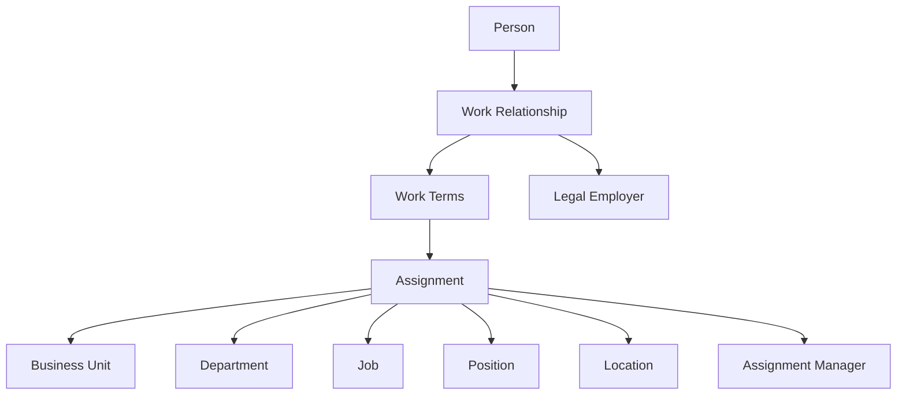

**Architectural centre:** Assignment

Oracle models a person's employment through work relationships and assignments. Assignment resources are effective-dated and can carry job, position, department, business unit, location, manager, working hours, and related employment attributes.

**Implication:** Oracle is highly expressive for concurrent assignments, transfers, legal employers, global mobility, and detailed employment history.

---

### 6.2 Workday HCM

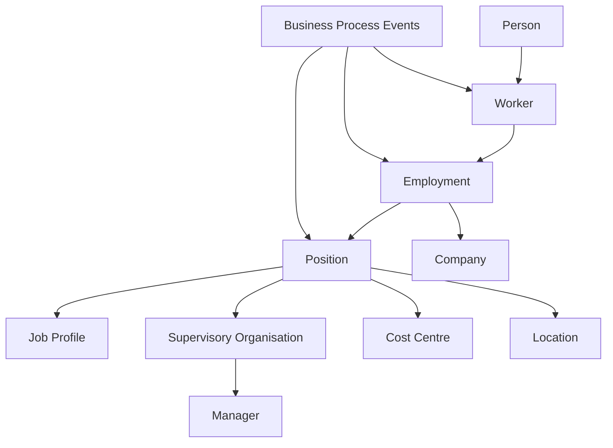

**Architectural centre:** Worker plus position and business-process events

Workday manages worker changes through delivered business processes such as hire, change job, transfer, promotion, and termination.

**Implication:** Workday is strong where the organisation is prepared to standardise lifecycle processes and use event-driven business-process governance.

---

### 6.3 SAP SuccessFactors Employee Central

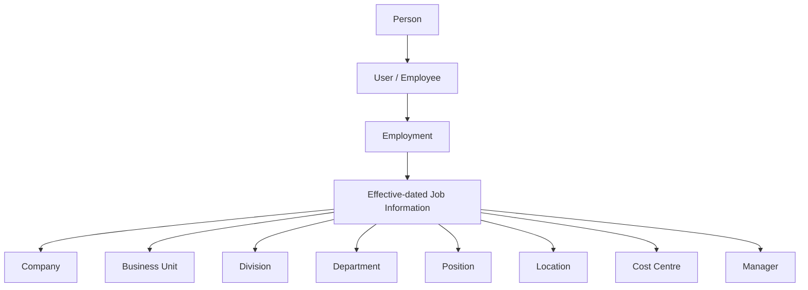

**Architectural centre:** Employment plus effective-dated Job Information

SuccessFactors Employee Central uses effective-dated entities and time slices to preserve historical, current, and future values.

**Implication:** It provides a robust global HR master-data model, particularly for SAP-centred enterprises.

---

### 6.4 Cornerstone HR Suite

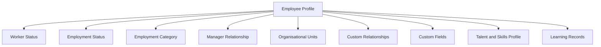

**Architectural centre:** Employee profile plus organisational-unit associations

Cornerstone Core/HR APIs expose employee and organisational-unit data. The model is naturally aligned with employee profiles, organisational memberships, learning, talent, and skills.

**Implication:** Cornerstone is a strong specialist platform but is generally less expressive than Oracle, Workday, or SuccessFactors for complex legal employment and concurrent assignment structures.

---

### 6.5 Salesforce HR Service or Salesforce-based HR application

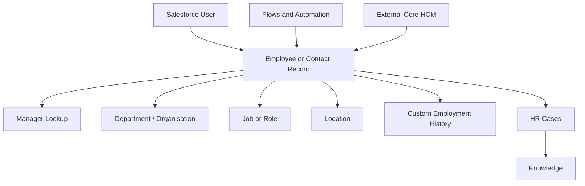

**Architectural centre:** Configurable employee, user, case, and workflow objects

Salesforce does not impose one standard enterprise employment structure. The model depends on the selected Salesforce product, package, custom objects, and external HCM integration.

**Implication:** Salesforce is highly flexible for employee service and experience, but employment semantics and effective history must come from a Core HCM or be custom-designed.

---

## 7. Employment Change Comparison

| Employment change | Oracle Fusion HCM | Workday HCM | SAP SuccessFactors EC | Cornerstone HR Suite | Salesforce |
|---|---|---|---|---|---|
| Hire | Creates person, work relationship, terms, and assignment | Hire business process creates worker/employment/position state | Creates person, employment, and Job Information records | Creates employee profile and OU/status associations | Creates or synchronises employee record; custom workflow |
| Role or job change | Effective-dated assignment update | Change Job or Promotion business process | New Job Information time slice | Employee profile or OU update | Field or custom employment-object update |
| Business-unit transfer | Assignment transfer or effective-dated assignment change | Transfer or Change Job business process | Effective-dated Job Information change | OU reassignment | Organisation lookup update |
| Location change | Effective-dated assignment change | Change Job or location-related business process | New Job Information time slice | Employee/OU update | Location field update |
| Terms change | Work Terms and/or assignment change | Employment, compensation, or change-job process | Employment, Job Information, compensation, or custom entity update | Employee attributes and custom fields | Custom fields or related objects |
| Line manager change | Effective-dated assignment-manager record | Supervisory organisation or manager business process | Effective-dated manager field in Job Information | Manager relationship update | Manager lookup update |
| Leave | Absence or assignment-related process depending on scenario | Leave-of-absence business process | Time/absence and employment-status entities | Status/profile update | Custom status and workflow |
| Termination | Ends work relationship and assignments | Termination business process | Employment termination and Job Information updates | Deactivation/status update | Employee status update and downstream workflow |
| Rehire | New or resumed work relationship and assignments | Rehire business process | Rehire employment process | Reactivation/update | Custom rehire workflow |
| Concurrent roles | Native assignment support | Native position/job support | Supported but configuration-dependent | Limited compared with enterprise HCM suites | Requires custom model |
| Future-dated change | Native | Native | Native | Product/configuration-dependent | Custom design |
| Historical reconstruction | Strong | Strong | Strong | Moderate | Depends on custom history design |

---

## 8. Career Timeline Example

The following example shows how the same employment history is conceptually represented.

### Scenario

- 1 January 2022 — Hired as Developer in Digital, Adelaide, reporting to Manager A
- 1 July 2023 — Promoted to Senior Developer
- 1 February 2024 — Transferred to Architecture business unit
- 1 September 2025 — Location changed to Melbourne
- 1 March 2026 — Line manager changed to Manager B

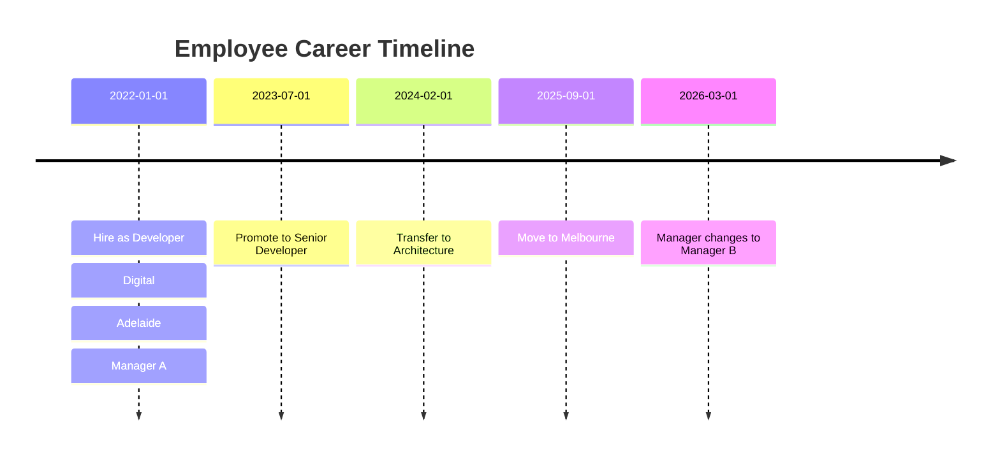

### Conceptual storage comparison

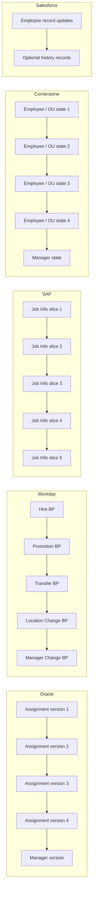

---

## 9. Enterprise Architecture Evaluation Framework

### 9.1 Business architecture

Evaluate:

- Hire-to-retire process coverage
- Global and local process harmonisation
- HR shared-service operating model
- Employee and manager self-service
- Organisational design
- Position and workforce planning
- Payroll and benefits
- Talent, learning, skills, and performance
- HR case and knowledge management
- Mobile workforce support
- Merger and acquisition support

### 9.2 Information architecture

Evaluate:

- Person, worker, employment, and assignment separation
- Effective dating
- Future-dated changes
- Concurrent assignments and employments
- Organisational hierarchies
- Position and job models
- Manager relationships
- Master-data ownership
- Historical reconstruction
- Data quality
- Data lineage
- Retention and deletion
- Canonical data-model compatibility

### 9.3 Application architecture

Evaluate:

- Functional completeness
- Modularity
- Workflow and approval capabilities
- Extension model
- Employee experience
- Mobile support
- Reporting
- Marketplace and partner ecosystem
- Environment management
- Configuration transport
- Regression-testing burden
- Dependency on third-party modules

### 9.4 Integration architecture

Evaluate:

- REST, SOAP, OData, GraphQL, and bulk APIs
- File and extract capabilities
- Webhooks and business events
- Delta and effective-dated extraction
- Integration monitoring
- Replay and idempotency
- Error queues
- Reconciliation
- Identity provisioning
- Payroll and finance connectivity
- iPaaS compatibility
- Data-platform integration
- API throttling and performance

### 9.5 Technology architecture

Evaluate:

- SaaS tenancy and environment model
- Availability and resilience
- Performance and scalability
- Data residency
- Release cadence
- Observability
- Platform extensibility
- Disaster recovery
- Support model
- Exit and data-extraction capability

### 9.6 Security architecture

Evaluate:

- Role-based and attribute-based access
- Data-domain security
- Segregation of duties
- Privileged access
- Encryption
- Audit records
- Sensitive-field controls
- Integration identities
- Data masking
- Privacy and consent
- Support access
- Data minimisation
- Joiner, mover, and leaver controls

### 9.7 Operational architecture

Evaluate:

- HR administrator effort
- Integration-support effort
- Error-correction complexity
- Release regression effort
- Batch-window dependency
- Reconciliation effort
- Skills availability
- Vendor and partner dependency
- Service-management integration
- Operational documentation
- Monitoring maturity

### 9.8 Financial architecture

Evaluate:

- Subscription cost
- Implementation cost
- Integration cost
- Extension cost
- Data migration
- Testing
- Support
- Partner dependency
- Upgrade impact
- Total cost of ownership
- Cost of exit

### 9.9 Governance

Evaluate:

- Data ownership
- Process ownership
- Configuration governance
- Integration governance
- Extension approval
- Security design authority
- Privacy impact assessment
- Release governance
- Vendor-roadmap management
- Audit readiness
- Architecture compliance

### 9.10 Strategic fit

Evaluate:

- Existing ERP landscape
- Cloud strategy
- Geographic footprint
- Workforce complexity
- Acquisition strategy
- Payroll strategy
- Data and AI strategy
- Partner ecosystem
- Internal skills
- Five-to-ten-year roadmap
- Vendor lock-in and exit strategy

---

## 10. Indicative Operational Efficiency Matrix

**Rating scale**

- **5 — Leading:** strong native capability
- **4 — Strong:** well supported with normal configuration
- **3 — Adequate:** suitable with some integration or extension
- **2 — Limited:** significant extension or complementary product required
- **1 — Poor fit:** not an appropriate primary platform for this capability

These are architecture-level indicative ratings, not product benchmarks. They must be validated against the organisation's requirements.

| Operational factor | Oracle | Workday | SAP SF | Cornerstone | Salesforce |
|---|---:|---:|---:|---:|---:|
| Core HR completeness | 5 | 5 | 5 | 3 | 2 |
| Complex employment structures | 5 | 5 | 4 | 2 | 2 |
| Effective-dated employment history | 5 | 5 | 5 | 3 | 2 |
| Payroll alignment | 5 | 3 | 5 in SAP landscape | 2 | 1 |
| Finance/ERP alignment | 5 in Oracle landscape | 4 | 5 in SAP landscape | 2 | 3 |
| Employee self-service | 4 | 5 | 4 | 4 | 5 |
| Manager self-service | 4 | 5 | 4 | 4 | 5 |
| HR service management | 3 | 4 | 3 | 3 | 5 |
| Learning and talent | 4 | 4 | 4 | 5 | 2 |
| Skills management | 4 | 4 | 4 | 5 | 3 |
| Workflow flexibility | 4 | 5 | 4 | 3 | 5 |
| Low-code extensibility | 3 | 4 | 4 | 3 | 5 |
| Global enterprise suitability | 5 | 5 | 5 | 3 | 3 |
| Administrative simplicity | 3 | 4 | 3 | 4 | 4 |
| Implementation simplicity | 2 | 3 | 2 | 4 | 3 |
| Service and case efficiency | 3 | 4 | 3 | 3 | 5 |
| Complex reporting fidelity | 5 | 5 | 5 | 3 | 3 |
| Overall profile | Comprehensive but complex | Cohesive and process-oriented | Strong in SAP ecosystem | Talent-centric and simpler | Service-centric and flexible |

---

## 11. Integration Capability Matrix

| Integration factor | Oracle | Workday | SAP SuccessFactors | Cornerstone | Salesforce |
|---|---|---|---|---|---|
| Synchronous APIs | REST and SOAP | REST, SOAP, Graph API | OData and other APIs | REST APIs | REST, SOAP, GraphQL/platform APIs |
| Bulk import/export | HDL, HCM Extracts, files | EIB, web services, batch integration | Compound Employee, Integration Center, files | Bulk APIs | Bulk API and ETL tools |
| Effective-dated semantics | Strong | Strong | Strong | Moderate | Custom |
| Business events | Available by domain | Strong business-process orientation | Intelligent Services and events | Employee webhooks and connectors | Platform Events and event-driven patterns |
| Native integration tools | Oracle Integration and HCM tools | Workday Integration Cloud / Orchestrate | SAP Integration Suite / Integration Center | APIs, bulk, connectors, webhooks | MuleSoft, Flow, Platform Events |
| External iPaaS compatibility | Strong | Strong | Strong | Strong | Strong |
| Monitoring | Strong but distributed | Strong | Strong but potentially fragmented | Moderate | Strong |
| Canonical transformation effort | High | Medium-high | Medium-high | Medium | High when used as Core HR |
| Payroll integration | Strong | Strong, product/region dependent | Strong in SAP ecosystem | Usually external | External |
| Identity lifecycle integration | Strong | Strong | Strong | Strong | Strong as consumer/orchestrator |

---

## 12. Target-State Logical Architecture

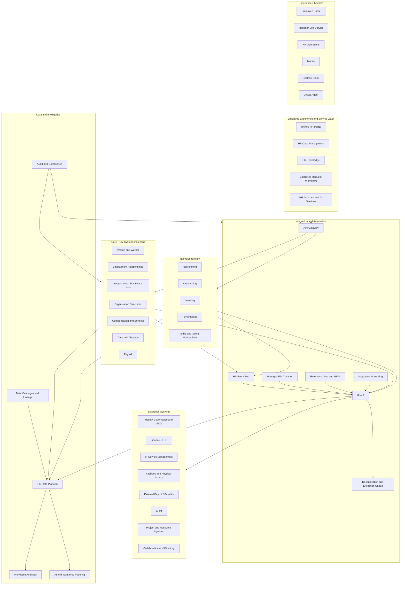

---

## 13. Product Deployment Patterns

### 13.1 Single-suite pattern

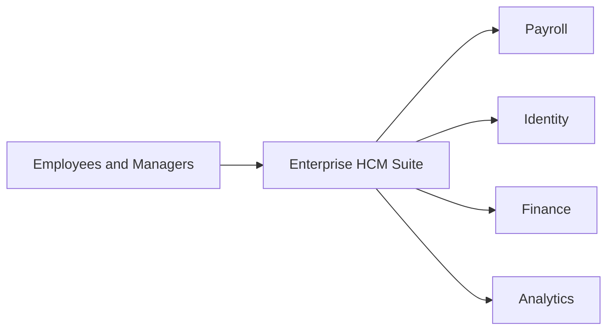

**Characteristics**

- Fewer primary platforms
- Lower conceptual integration complexity
- Strong dependency on one vendor
- Potential compromises in specialist capabilities
- Easier accountability if governance is mature

**Suitable when**

- The chosen HCM suite covers most strategic requirements
- The organisation values standardisation over best-of-breed capability
- The ERP and HCM vendor ecosystems are aligned

---

### 13.2 Composable best-of-breed pattern

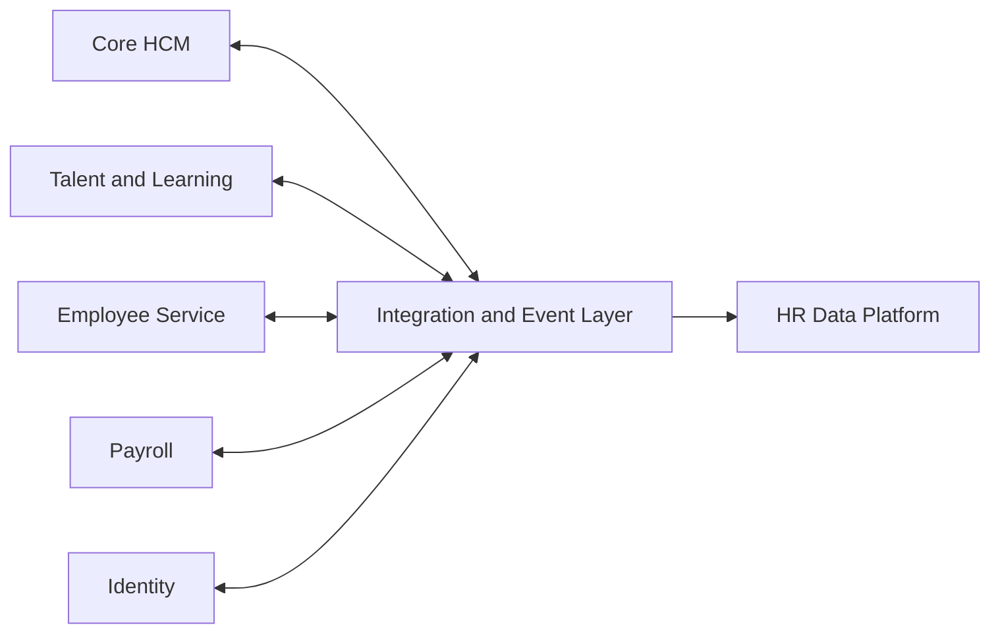

**Characteristics**

- Strong specialist capabilities
- Higher integration and governance requirements
- Reduced dependence on one application suite
- Greater need for canonical data and lifecycle ownership
- Better ability to replace individual components

**Suitable when**

- Learning, service, payroll, or talent needs justify specialist products
- Enterprise integration capability is mature
- The organisation can govern master-data ownership explicitly

---

### 13.3 Core HCM plus Salesforce employee-service pattern

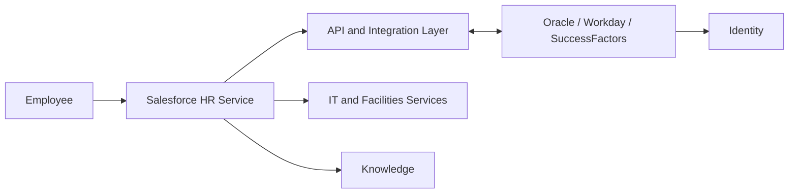

**Characteristics**

- Core HCM remains authoritative
- Salesforce provides cases, knowledge, employee requests, automation, and cross-channel service
- Employee-facing experiences can evolve independently
- Requires strong field-level privacy controls and clear write-back rules

---

### 13.4 Core HCM plus Cornerstone talent pattern

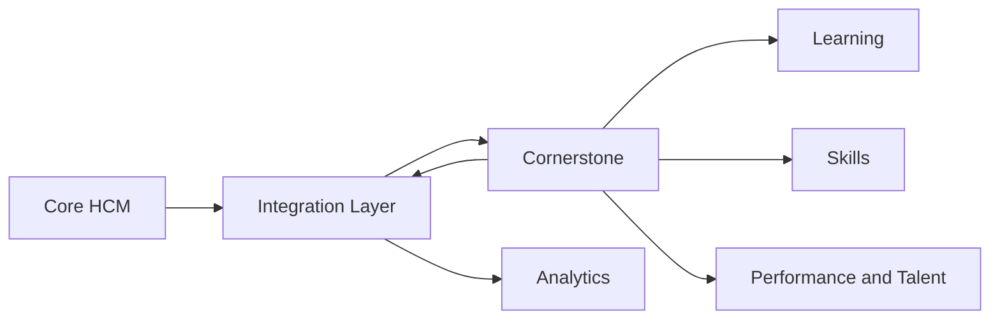

**Characteristics**

- Core HCM owns worker and employment records
- Cornerstone owns learning, skills, certification, and selected talent records
- Worker, manager, OU, and status data are synchronised
- Learning and skills outcomes may return to the enterprise data platform

---

## 14. Recommended System-of-Record Matrix

| Information domain | Recommended authoritative source |
|---|---|
| Person identity | Core HCM, with enterprise identity matching |
| Worker number and worker type | Core HCM |
| Employment relationship | Core HCM |
| Assignment, job, and position | Core HCM |
| Legal employer | Core HCM or ERP reference master, with one accountable owner |
| Business unit and department | Core HCM or enterprise reference-data owner |
| Finance cost centre | ERP |
| Line manager relationship | Core HCM |
| Payroll status and results | Payroll system |
| Identity account | Identity platform / directory |
| Access entitlements | Identity governance platform |
| Learning catalogue and completion | LMS / Cornerstone |
| Skills profile | Selected talent or skills platform |
| HR service case | HR service-management platform |
| Recruitment candidate | Applicant tracking system |
| Employee document | HCM document module or governed document platform |
| Enterprise workforce analytics | Governed HR data platform |
| Data catalogue and lineage | Enterprise data-governance platform |

---

## 15. Canonical HR Information Model

The canonical model must preserve the distinction between a person, worker, employment relationship, and assignment.

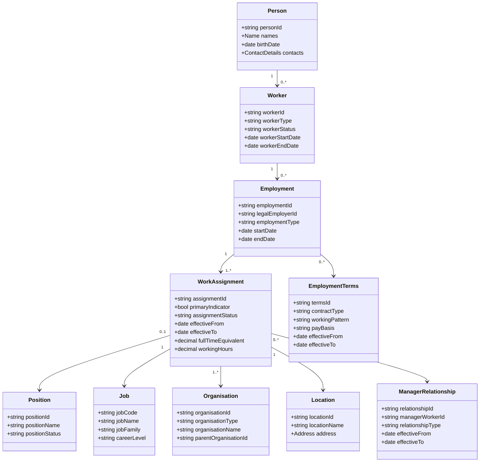

---

## 16. Canonical-to-Product Mapping

| Canonical entity | Oracle Fusion | Workday | SAP SuccessFactors | Cornerstone | Salesforce |
|---|---|---|---|---|---|
| Person | Person | Person/Worker identity | PerPerson and personal entities | Employee profile | Contact or custom person |
| Worker | Worker | Worker | User/employee | Employee | User or custom Employee |
| Employment | Work Relationship | Employment | EmpEmployment | Employee attributes | Custom Employment |
| Work assignment | Assignment | Position/job relationship | EmpJob / Job Information | OU and profile attributes | Custom Employment Role |
| Employment terms | Work Terms and assignment attributes | Employment and related processes | Employment, job, and compensation entities | Employee attributes/custom fields | Custom object or fields |
| Job | Job | Job Profile | Job Classification | OU/custom field | Custom Job |
| Position | Position | Position | Position | OU/custom field | Custom Position |
| Organisation | Legal employer, BU, department | Company and organisations | Foundation Objects | Organisational Unit | Account/custom organisation |
| Manager relationship | Assignment Manager | Supervisory organisation / manager | Job Information manager | Employee manager relationship | Manager lookup |
| Effective history | Date-effective records | Effective-dated business objects and processes | Effective-dated time slices | Product/configuration dependent | Custom history or field tracking |

---

## 17. Integration Architecture

### 17.1 Integration styles

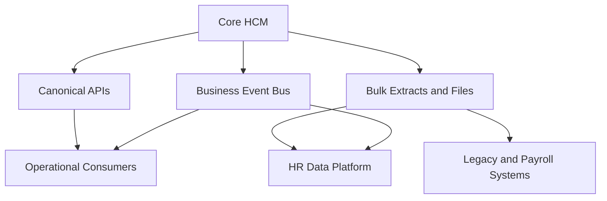

Use:

- **Synchronous APIs** for validated user-initiated transactions and current-state queries
- **Business events** for joiner, mover, leaver, and organisational changes
- **Bulk extracts** for payroll, migration, reconciliation, and high-volume data movement
- **Data pipelines** for analytics and historical modelling
- **Managed files** only where the receiving product cannot support modern APIs or events

### 17.2 Integration selection rules

| Requirement | Preferred pattern |
|---|---|
| Immediate employee self-service validation | Synchronous API |
| Worker hired or manager changed | Business event |
| Daily payroll input | Bulk extract or managed file |
| Full workforce reconciliation | Scheduled bulk snapshot |
| Historical analytics | Data pipeline |
| High-volume migration | Bulk loader |
| External system unable to process future changes | Scheduled effective-date activation |
| Regulatory extract | Controlled batch report |

---

## 18. HR Business Event Model

Recommended enterprise events:

- `PersonCreated`
- `PersonDetailsChanged`
- `WorkerHired`
- `WorkerActivated`
- `EmploymentCreated`
- `EmploymentTermsChanged`
- `AssignmentCreated`
- `AssignmentChanged`
- `JobChanged`
- `PositionChanged`
- `OrganisationChanged`
- `LocationChanged`
- `ManagerChanged`
- `LeaveStarted`
- `WorkerReturned`
- `AssignmentEnded`
- `WorkerTerminated`
- `WorkerRehired`

### 18.1 Event anatomy

```json
{
  "eventId": "739dbbdf-4656-4600-b4fb-3dccca9f256a",
  "eventType": "ManagerChanged",
  "occurredAt": "2026-07-18T09:30:00+09:30",
  "effectiveFrom": "2026-08-01",
  "workerId": "W12345",
  "employmentId": "E67890",
  "assignmentId": "A10001",
  "sourceSystem": "CoreHCM",
  "sourceVersion": 17,
  "changedFields": [
    "managerWorkerId"
  ],
  "correlationId": "HR-TXN-998812"
}
```

### 18.2 Effective-date processing

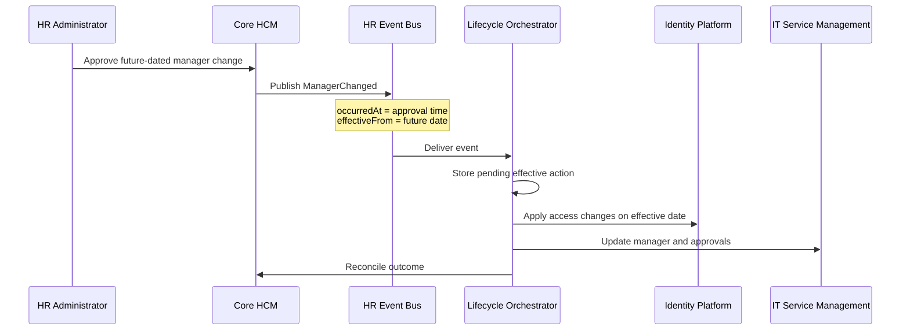

---

## 19. Joiner, Mover, and Leaver Architecture

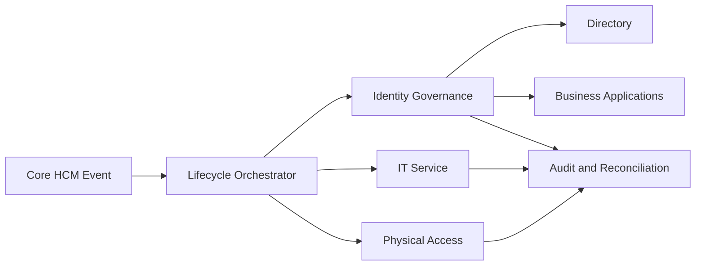

### Joiner

- Create identity at the approved pre-start time
- Assign birthright access based on effective assignment
- Provision equipment and facilities access
- Ensure no sensitive employment data is sent unnecessarily
- Reconcile completion before the start date

### Mover

- Recalculate access from job, organisation, location, and manager changes
- Remove obsolete entitlements
- Apply new approvals and delegated authority
- Handle overlapping assignments explicitly
- Preserve audit evidence

### Leaver

- Use confirmed effective termination time
- Disable access according to risk and policy
- Retain records according to legal requirements
- Reassign ownership and approvals
- Reconcile all downstream systems

---

## 20. Security and Privacy Architecture

### 20.1 Security model

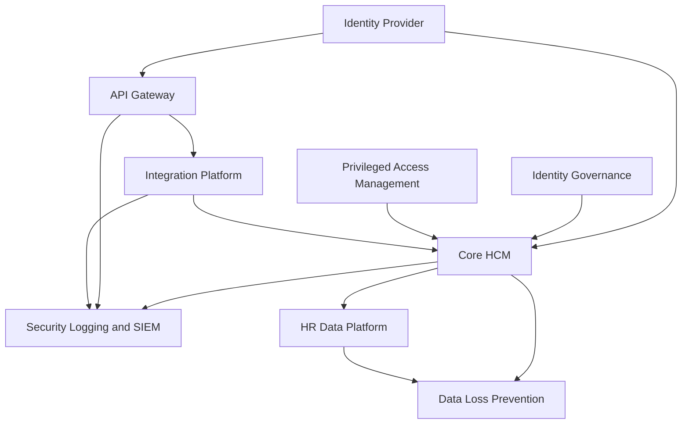

### 20.2 Mandatory controls

- Single sign-on and strong authentication
- Role-based and data-domain security
- Segregation of duties
- Privileged-access management
- Dedicated integration identities
- Short-lived credentials where supported
- Encryption in transit and at rest
- Field-level protection for sensitive information
- Purpose-based API scopes
- Data masking in non-production environments
- Audit of employment corrections and retroactive changes
- Monitoring of bulk extracts
- Retention and legal-hold policies
- Privacy impact assessments
- Data residency assessment
- Incident-response integration
- Regular access certification

### 20.3 Data minimisation example

| Consumer | Minimum worker data |
|---|---|
| Corporate directory | Preferred name, title, business contact details, organisation, manager |
| Identity system | Worker ID, start/end dates, status, organisation, job/role indicators |
| Facilities | Worker ID, name, location, access profile, effective dates |
| ITSM | Worker ID, business contact, manager, location, support eligibility |
| Payroll | Full authorised payroll dataset |
| Learning system | Worker ID, name, status, manager, organisation, learning eligibility |
| CRM | Only business relationship and access-relevant attributes |
| Analytics | Pseudonymised or controlled identifiable data according to use case |

---

## 21. Data and Analytics Architecture

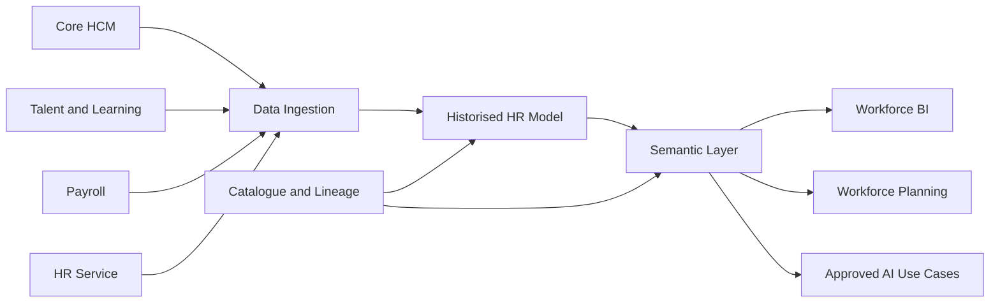

### Requirements

- Preserve source effective dates and transaction dates
- Maintain slowly changing organisational and assignment dimensions
- Distinguish headcount, worker count, employment count, and assignment count
- Define primary-assignment logic
- Control personally identifiable information
- Track source lineage
- Publish certified measures
- Separate operational reporting from enterprise analytics
- Prevent the data platform from becoming an uncontrolled operational master

---

## 22. Operational Model

### 22.1 Service ownership

| Service | Accountable owner |
|---|---|
| Core HCM product | HR Technology |
| HR processes | HR Process Owners |
| Worker data quality | HR Data Owners |
| Integration platform | Enterprise Integration Team |
| Identity lifecycle | Cybersecurity / Identity Team |
| Payroll | Payroll Function |
| Talent and learning | Talent / Learning Function |
| Employee service | HR Shared Services |
| HR analytics | People Analytics |
| Reference data | Assigned business data owners |
| Architecture governance | Enterprise Architecture |
| Privacy | Privacy / Legal |
| Platform security | Cybersecurity and SaaS owners |

### 22.2 Operational controls

- Daily interface monitoring
- Event-delivery monitoring
- Failed-message retry and dead-letter handling
- Worker and assignment reconciliation
- Payroll control totals
- Identity-provisioning reconciliation
- Data-quality dashboards
- Future-dated transaction monitoring
- Release regression tests
- Quarterly access reviews
- Vendor-release assessment
- Architecture exception register
- Capacity and API-limit monitoring

---

## 23. Architecture Risks and Mitigations

| Risk | Consequence | Mitigation |
|---|---|---|
| Salesforce treated as authoritative HCM without a complete employment model | Weak history, payroll semantics, and legal-employer modelling | Retain purpose-built Core HCM or explicitly design full canonical employment model |
| Employee assumed to equal one employment and one role | Incorrect access, payroll, analytics, and reporting | Model Person, Worker, Employment, and Assignment separately |
| Vendor schema copied into every downstream system | Tight coupling and expensive replacement | Canonical APIs and events |
| Point-to-point integration | High support cost and inconsistent behaviour | iPaaS, API gateway, event bus, and governance |
| Future-dated changes ignored | Premature or late provisioning | Preserve `occurredAt` and `effectiveFrom`; schedule activation |
| Retroactive corrections not propagated | Divergent payroll, access, and reporting | Versioned events, correction events, and reconciliation |
| Rehire and duplicate-record semantics misinterpreted | Recreated worker identities, broken access, payroll mismatches, and reporting gaps | Define rehire and identity-resolution rules, preserve person/worker lineage, and support many-to-many mapping with reconciliation |
| Duplicate organisational structures | Conflicting reporting and approvals | Define ownership by organisation type and govern mappings |
| Talent platform becomes accidental worker master | Conflicting worker records | Explicit system-of-record matrix |
| Excessive HCM customisation | Upgrade and support burden | Configuration-first policy and extension review |
| Excessive data copied to service platforms | Privacy and breach risk | Data minimisation and purpose-specific integration |
| Analytics directly queries operational APIs | Performance and coupling problems | Governed data ingestion and semantic layer |
| No reconciliation | Silent divergence | Automated snapshots, control totals, and exception workflow |
| Integration identity over-privileged | Broad data exposure | Least privilege, scoped APIs, credential rotation |
| Vendor release changes behaviour | Process or interface failure | Release assessment, automated regression tests, sandbox validation |
| Weak exit strategy | Vendor lock-in | Periodic full extracts, canonical model, interface abstraction, data-retention plan |

---

## 24. Product-Fit Scenarios

### 24.1 Oracle Fusion Cloud HCM

Best fit where:

- Oracle ERP is strategic
- Payroll, finance, projects, and HCM integration are important
- The workforce includes complex assignments and legal employers
- Global transfers and detailed employment history are common
- The organisation accepts significant implementation and configuration effort

### 24.2 Workday HCM

Best fit where:

- The organisation wants a cohesive worker-centric suite
- Standardised business processes are preferred
- User experience and lifecycle orchestration are strategic priorities
- The organisation is prepared to adopt Workday's process and operating model

### 24.3 SAP SuccessFactors Employee Central

Best fit where:

- SAP ERP or S/4HANA is strategic
- Employee Central will be the global HR master
- Effective-dated job and organisational information is important
- SAP integration capability and governance are mature

### 24.4 Cornerstone HR Suite

Best fit where:

- Learning, skills, certifications, and talent are strategic
- The employment model is relatively straightforward
- Another system may own payroll and complex employment
- The organisation wants a specialist employee-development platform

### 24.5 Salesforce

Best fit where:

- Employee service delivery and HR case management are priorities
- Salesforce or Slack is already strategic
- Flexible portals, workflow, AI-assisted support, and service operations are needed
- A separate HCM remains authoritative for employment and payroll

---

## 25. Preliminary Strategic Comparison

| Enterprise priority | Strong candidates |
|---|---|
| Complex global employment | Oracle or Workday |
| Strongest assignment model | Oracle |
| Cohesive business-process model | Workday |
| SAP-centred enterprise | SAP SuccessFactors |
| Oracle ERP-centred enterprise | Oracle Fusion HCM |
| Effective-dated Job Information | SAP SuccessFactors |
| Learning, certification, and talent specialisation | Cornerstone |
| Employee service and HR case management | Salesforce |
| Flexible employee-facing applications | Salesforce |
| Simplified employee-profile model | Cornerstone |
| Composable best-of-breed architecture | Core HCM plus Cornerstone and/or Salesforce |

---

## 26. Weighted Decision Model

A final selection should use organisation-specific weightings.

| Domain | Example weight |
|---|---:|
| Business and functional fit | 25% |
| Worker and employment model | 15% |
| Integration architecture | 15% |
| Security and privacy | 10% |
| Operational efficiency | 10% |
| Technology and extensibility | 8% |
| Data and analytics | 7% |
| Strategic ecosystem fit | 5% |
| Total cost of ownership | 5% |
| **Total** | **100%** |

### Scoring formula

```text
Weighted score =
Σ (criterion score from 1 to 5 × criterion weight)
```

### Recommended decision gates

1. **Employment-model fit:** Can the platform correctly represent all employment scenarios?
2. **Regulatory fit:** Can it satisfy legal, payroll, privacy, and data-residency obligations?
3. **Integration fit:** Can lifecycle changes reach downstream systems reliably?
4. **Operational fit:** Can internal teams support the product and release cadence?
5. **Economic fit:** Is the five-to-ten-year total cost acceptable?
6. **Strategic fit:** Does the product align with ERP, cloud, data, and AI strategies?
7. **Exit fit:** Can the organisation extract its data and replace components without excessive disruption?

---

## 27. Recommended Target State

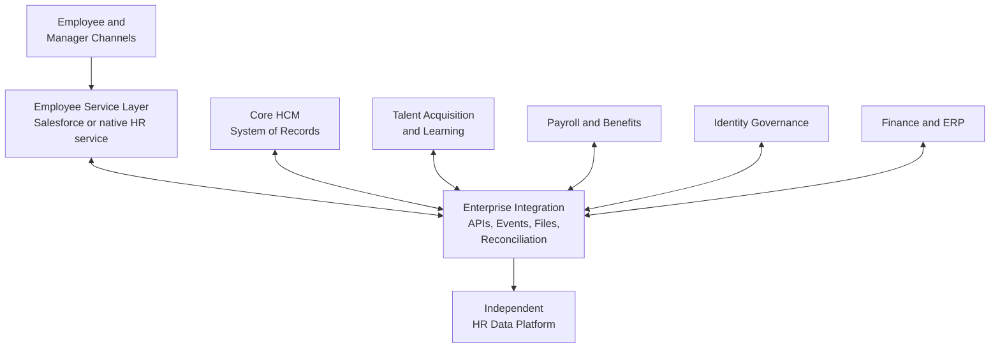

### Recommendation

Adopt a **composable architecture with one authoritative Core HCM**:

- Select **Oracle, Workday, or SuccessFactors** as the employment system of record according to workforce complexity and enterprise ecosystem.
- Use **Cornerstone** where specialist learning, skills, certification, or talent capability materially exceeds the chosen Core HCM.
- Use **Salesforce** where HR service, employee cases, knowledge, workflow, and cross-channel experience are strategic.
- Introduce a canonical HR model, API layer, HR event bus, and reconciliation capability.
- Maintain an independent historised HR data platform for enterprise analytics.
- Govern all extensions, duplicate data, and write-back paths through enterprise architecture and data ownership.

---

## 28. Implementation Roadmap

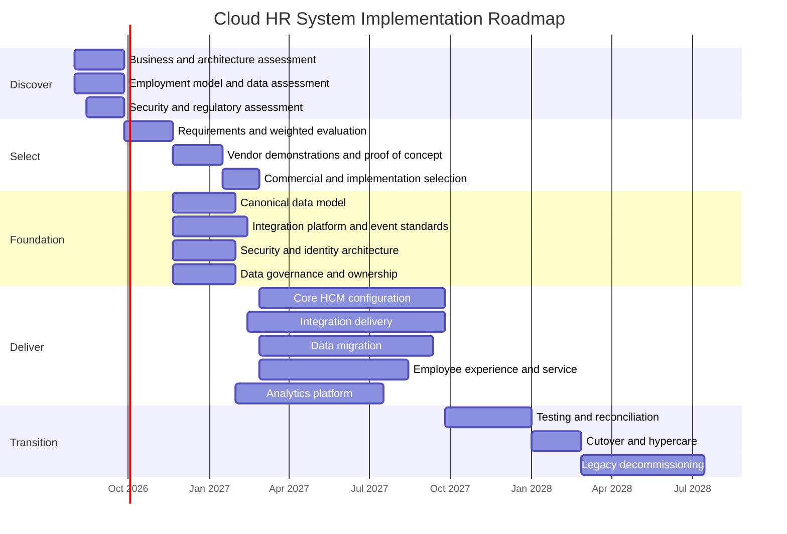

---

## 29. Architecture Deliverables

The programme should produce:

- Architecture vision
- Business-capability map
- Current-state application and integration inventory
- Worker and employment conceptual model
- Product evaluation matrix
- Target application architecture
- Integration reference architecture
- Canonical HR API and event specifications
- Security architecture
- Data and analytics architecture
- System-of-record matrix
- Data migration strategy
- Identity lifecycle design
- Operational support model
- Environment and release strategy
- Architecture decision records
- Risk register
- Transition roadmap
- Decommissioning plan

---

## 30. Key Architecture Decisions

| Decision | Recommended position |
|---|---|
| Core HCM authority | Exactly one authoritative platform for employment data |
| Employee service | May be separated from Core HCM |
| Talent and learning | May be specialist if business value justifies integration |
| Integration | Canonical APIs, business events, and governed bulk flows |
| Data platform | Independent, historised, and governed |
| Identity lifecycle | Driven by effective-dated Core HCM events |
| Product customisation | Minimise; prefer configuration and external extensions |
| Organisational structures | Assign an authoritative owner for each hierarchy |
| Reporting | Distinguish operational reporting from enterprise analytics |
| Future-dated changes | First-class integration requirement |
| Reconciliation | Mandatory for critical worker, payroll, and identity flows |
| Privacy | Purpose-based data distribution and minimisation |

---

## 31. Conclusion

The five platforms represent different architectural centres of gravity:

- **Oracle Fusion Cloud HCM:** assignment-centric enterprise employment
- **Workday HCM:** worker, position, and business-process-centric lifecycle management
- **SAP SuccessFactors Employee Central:** effective-dated employment and Job Information
- **Cornerstone HR Suite:** employee profile, organisational unit, learning, skills, and talent
- **Salesforce:** employee service, cases, workflow, portals, and extensibility

A holistic Cloud HR System should not force every function into one product. It should establish one authoritative employment system, selectively use specialist platforms, and connect them through governed canonical APIs, effective-dated business events, identity automation, and an independent data platform.

The decisive architectural requirement is the integrity of the worker lifecycle:

> The system must accurately represent who the person is, why they are engaged, where and how they work, which assignment is effective at a given time, who manages them, what access they require, and how every change is propagated and audited.

---

## 32. References

1. Oracle, **REST API for Oracle Fusion Cloud HCM — Assignments**  
   <https://docs.oracle.com/en/cloud/saas/human-resources/farws/api-public-workers-assignments.html>

2. Oracle, **REST API for Oracle Fusion Cloud HCM — Assignment resource and effective dates**  
   <https://docs.oracle.com/en/cloud/saas/human-resources/farws/op-emps-empsuniqid-child-assignments-assignmentsuniqid-get.html>

3. Oracle, **REST API for Oracle Fusion Cloud HCM — Assignment Managers**  
   <https://docs.oracle.com/en/cloud/saas/human-resources/farws/op-workers-workersuniqid-child-workrelationships-periodofserviceid-child-assignments-assignmentsuniqid-child-managers-managersuniqid-get.html>

4. Workday, **Developer API Overview**  
   <https://developer.workday.com/api-overview>

5. Workday, **Business Process REST APIs**  
   <https://developer.workday.com/documentation/GUID-e31b535f-7722-4f61-9795-a27ef9d78a86-enHYPHENus/BusinessProcessRESTAPIs>

6. SAP, **Employee Central Effective-Dated Entities**  
   <https://help.sap.com/docs/successfactors-employee-central/implementing-employee-central-core/employee-central-effective-dated-entities>

7. SAP, **Effective Dating in SuccessFactors OData APIs**  
   <https://help.sap.com/docs/successfactors-platform/sap-successfactors-api-reference-guide-odata-v2/effective-dating>

8. SAP, **Entities in Employee Central**  
   <https://help.sap.com/docs/successfactors-employee-central/implementing-employee-central-core/entities-in-employee-central>

9. Cornerstone, **Core and HR API Guide**  
   <https://csod.dev/guides/core-hr/>

10. Cornerstone, **Core and HR API Reference**  
    <https://csod.dev/reference/core-hr/>

11. Cornerstone, **Employee and Organisational Unit API**  
    <https://csod.dev/guides/core-hr/employee-ou/>

12. Cornerstone, **Employee Events Webhooks**  
    <https://csod.dev/reference/webhooks/>

---

## Appendix A — Glossary

| Term | Definition |
|---|---|
| Core HCM | Authoritative system for worker, employment, organisational, and lifecycle information |
| Person | A human identity independent of employment |
| Worker | A person engaged by the organisation |
| Employment | Legal or contractual relationship between worker and employer |
| Assignment | A specific placement of a worker into work, organisation, job, position, and manager context |
| Position | An authorised slot in the organisation |
| Job | A reusable definition of work or job classification |
| Effective dating | Recording when a value becomes and ceases to be valid |
| Transaction date | Date a change was entered or approved |
| Business event | A meaningful lifecycle occurrence published to consumers |
| iPaaS | Integration Platform as a Service |
| System of record | Authoritative source for a defined information domain |
| Canonical model | Vendor-neutral enterprise representation of shared information |
| JML | Joiner, mover, and leaver identity lifecycle |
| OU | Organisational Unit |
