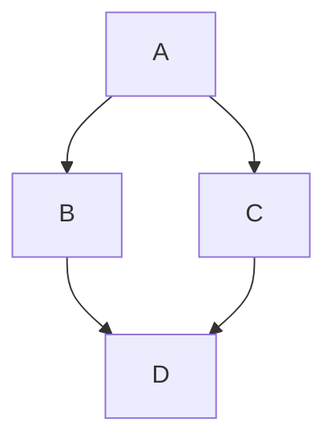

# Why using Jupiter Notebooks in Architecture as Code?
Jupyter Notebooks are utilized in software architecture primarily as a bridge between high-level design and executable implementation, serving as "executable documentation." 
Key reasons for their use in architecture include:
- Executable Documentation: Architects can combine narrative text (Markdown) with live code to explain the "why" behind an architectural decision alongside a working proof-of-concept.
- [Rapid Prototyping and Exploration](https://docs.jupyter.org/en/latest/what_is_jupyter.html): The Read-Eval-Print-Loop (REPL) nature allows architects to experiment with new APIs, libraries, or integration patterns without the overhead of setting up a full application structure.
- Interactive Design Records: Unlike static PDF diagrams, notebooks allow stakeholders to interact with data visualizations or run specific architectural components (like an auth flow or data pipeline) to verify performance or logic.
- [Modular Feedback Cycles](https://networktocode.com/blog/jupyter-notebooks-for-development/): Code is organized into cells that can be executed independently, enabling architects to test specific components of a system (e.g., a database query or an algorithm) without rerunning the entire stack.
- Literate Programming: By following Donald Knuth's concept, notebooks make complex system designs more readable for non-technical stakeholders by weaving human-readable narrative around technical implementation.
- [Architecture Decision Records](https://www.linkedin.com/pulse/jupyter-notebook-ai-hidden-superpower-architects-analysts-charlie-guo-jnhzc) (ADRs): They can serve as interactive Architecture Decision Records, documenting the evolution of a system with reproducible steps that prove why a specific path was chosen. 

In the context of Architecture as Code (AaC), Jupyter Notebooks serve as an interactive execution environment that bridges the gap between static code and visual architecture validation.

While AaC typically focuses on defining infrastructure or systems through declarative code (like YAML or Python), [Jupyter](https://jupyter.org/) enhances this by providing:
- Dynamic Diagram-as-Code: You can use libraries like diagrams to write Python code that renders cloud infrastructure visuals directly inside the notebook. This ensures your diagrams are version-controlled in Git and always reflect the current state of your code.
- Interactive Architectural Decision Records (ADRs): Standard ADRs are text files, but in Jupyter, they become executable records. You can document a decision (using Markdown) and immediately follow it with a code cell that proves its feasibility, such as a latency test or an API connectivity check.
- Live Infrastructure Prototyping: Architects can use notebooks to experiment with infrastructure APIs (e.g., AWS Boto3 or Azure SDKs) in isolated cells. This allows you to test specific architectural components-like a new security policy or a data pipeline-without running a full deployment script.
Literate Architecture Documentation: By combining narrative, diagrams, and live execution, notebooks explain both the "what" (the code) and the "why" (the architectural reasoning) in a single, shareable document.
- [Visual Validation and Unit Testing](https://networktocode.com/blog/jupyter-notebooks-for-development/): You can perform seamless unit testing on architectural logic within a cell, generating immediate feedback on whether a proposed design meets specific constraints before it is committed to the main codebase

## Setup in VS code
We use .ipynb files with Python core for notebook kernel combined with UV for dependencies management and virtual environments. Open VS Code in admin mode and run the command:
```bash
curl -LsSf https://astral.sh/uv/install.sh | sh
```
Reopen VS Code in user mode and proceed with setup
```bash
uv init
#uv venv --seed
uv add ipython pandas numpy 
uv add --dev pip ipykernel pypandoc "nbconvert[webpdf]"
uv lock --upgrade
uv sync
uv tree
```
Now, we are ready to work with Jupiter Notebooks. Every open VS code make sure you are using correct/default environment .venv:
```bash
source .venv/bin/activate
```
or
```powershell
.venv\Scripts\activate
```

## How to render Mermaid diagram?
Open or create .ipynb file and choose local kernel: .venv/Script/Python. Now you can generate diagrams, create ADRs and build MVPs.\
We can also use [Markdown Preview Mermaid Support](https://marketplace.visualstudio.com/items?itemName=bierner.markdown-mermaid) extension for rendering embedded diagrams in MD files like the following:

Check more examples here: https://mermaid.live/edit

Every notebook can also be exported in different formats:  asciidoc, custom, html, latex', markdown, notebook, pdf, python, qtpdf, qtpng, rst, script, slides, webpdf.
```bash
uv run jupyter nbconvert ./diagrams/mermaid.uv --to html --output-dir ./temp
```

PDF is generated via latex. Some dependencies to be resolved first.
```bash
uv run jupyter nbconvert ./diagrams/mermaid.ipynb --to pdf --engine webpdf --output-dir ./temp
```

You also can use other text-based diagram builders:
- https://www.yworks.com/yed-live/
- https://www.ilograph.com/
- https://www.sysmlv2lab.com/lab?
- https://structurizr.com/
- https://plantuml.com/
- https://kroki.io/
- https://www.archimatetool.com/

Happy architecture coding!