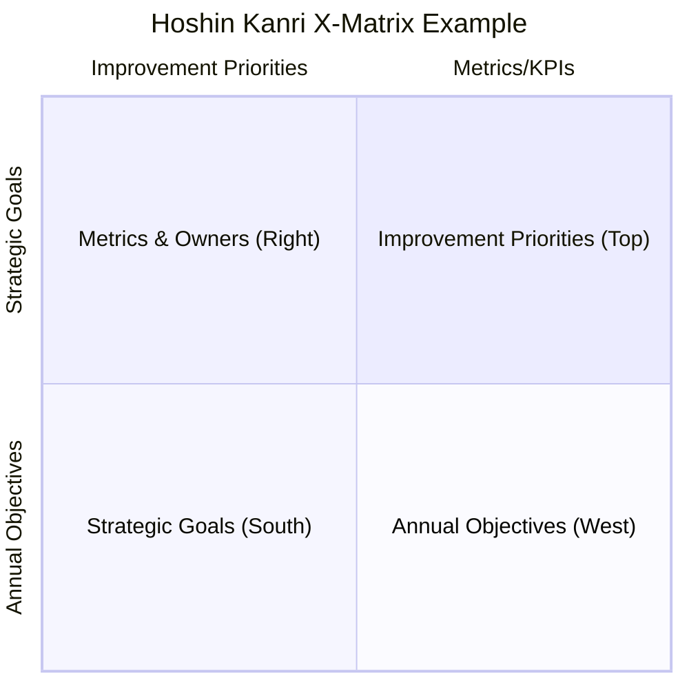

# Hoshin Kanri X-Matrix - 2026
Hoshin Kanri bridges the gap between strategy and execution.

| Quadrant | Content | Description |
| :--- | :--- | :--- |
| **South** | 1. Increase revenue by 30% 2. Expand to new market | 3-5 Year Strategic Breakthrough Goals |
| **West** | A. 10% revenue growth B. Establish 2 sales offices | Annual Objectives (1-Year Targets) |
| **North** | X. Launch new marketing campaign Y. Hire regional sales leads | Top-Level Improvements & Projects |
| **East** | - Key Metric: Monthly Revenue - Responsibility: Sales Director | Metrics & Key Performers (KPIs) |

### Correlation Map (Legend: ● High, ○ Medium, $\Delta$ Low)

*   **South $\leftrightarrow$ West:** [1] connects to [A] ●, [2] connects to [B] ●
*   **West $\leftrightarrow$ North:** [A] connects to [X] ●, [B] connects to [Y] ●
*   **North $\leftrightarrow$ East:** [X] connects to KPI: Revenue ●, [Y] connects to Resource: Sales Director ●

How to Use the X-Matrix (Step-by-Step):
- Identify Strategic Breakthrough Objectives (South Quadrant): Define 3–5 year goals. These are high-level, transformative targets.
- Set Annual Goals (West Quadrant): Break the strategic goals into actionable annual objectives.
- Create Improvement Priorities (Top/North Quadrant): Identify top-level projects, key actions, and initiatives necessary to reach the annual goals.
- Define KPIs and Metrics (East Quadrant): Identify measurements (how much) that demonstrate success for each initiative.
- Assign Accountability (Right Side): Identify the responsible person for each initiative/goal, using a Primary (full dot) or Secondary (circle) marker to show ownership.
- Conduct "Catchball" (Review & Alignment): Use the matrix to facilitate a collaborative, interactive process, moving the document back and forth to ensure goals are realistic, aligned, and understood across all levels.
- Track Progress & Review: Review the matrix regularly (typically monthly) to track the status of projects, using color-coded metrics to identify gaps and adjust plans if necessary