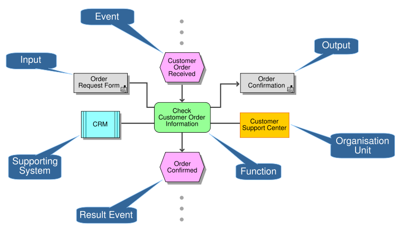

{width="2.5in"
height="0.6145833333333334in"}

Architecture Definition

Project XXXX\
Client YYYY

\<\<Note: This document provides a generic template. It may require
tailoring to suit a specific client and project situation.\>\>

\
Table of Contents

[1 Purpose of this Document
[3](#purpose-of-this-document)](#purpose-of-this-document)

[2 Scope [4](#scope)](#scope)

[3 Goals, Objectives, and Constraints
[5](#goals-objectives-and-constraints)](#goals-objectives-and-constraints)

[4 Compliance [8](#compliance)](#compliance)

[5 Risks and Issues [9](#risks-and-issues)](#risks-and-issues)

[6 Baseline Architecture
[10](#baseline-architecture)](#baseline-architecture)

[7 Rationale and Justification for Architectural Approach
[35](#rationale-and-justification-for-architectural-approach)](#rationale-and-justification-for-architectural-approach)

[8 Mapping to Architecture Repository
[36](#mapping-to-architecture-repository)](#mapping-to-architecture-repository)

[9 Target Architecture [40](#target-architecture)](#target-architecture)

[10 Gap Analysis [67](#gap-analysis)](#gap-analysis)

[11 Impact Assessment [70](#impact-assessment)](#impact-assessment)

Document Information

+------------+------------------------------+---------------------+---------------------+
| **Project  | Project XXX                                                              |
| Name:**    |                                                                          |
+------------+------------------------------+---------------------+---------------------+
| **Prepared |                              | **Document Version  |                     |
| By:**      |                              | No:**               |                     |
+------------+------------------------------+---------------------+---------------------+
| **Title:** | Architecture Definition      | **Document Version  |                     |
|            |                              | Date:**             |                     |
+------------+------------------------------+---------------------+---------------------+
| **Reviewed |                              | **Review Date:**    |                     |
| By:**      |                              |                     |                     |
+------------+------------------------------+---------------------+---------------------+

Distribution List

  -----------------------------------------------------------------------
  **From**                       **Date**   **Phone/Fax/Email**
  ------------------------------ ---------- -----------------------------
                                            

                                            
  -----------------------------------------------------------------------

  ----------------------------------------------------------------------------
  **To**               **Action\***   **Due      **Phone/Fax/Email**
                                      Date**     
  -------------------- -------------- ---------- -----------------------------
                                                 

                                                 

                                                 

                                                 
  ----------------------------------------------------------------------------

\* Action Types: Approve, Review, Inform, File, Action Required, Attend
Meeting, Other (please specify)

Document Version History

  ------------------------------------------------------------------------------------
  **Version\   **Version\   **Revised   **Description**              **Filename**
  Number**     Date**       By**                                     
  ------------ ------------ ----------- ---------------------------- -----------------
                                                                     

                                                                     
  ------------------------------------------------------------------------------------

# Purpose of this Document

\< This document packages the baseline, target, and gap analysis for
\<\<insert\>\>.

The Architecture Definition Document is the deliverable container for
the core architectural artifacts created during a project. The
Architecture Definition Document spans all architecture domains
(business, data, application, and technology) and also examines all
relevant states of the architecture (baseline, interim state(s), and
target).

The Architecture Definition Document is a companion to the Architecture
Requirements Specification, with a complementary objective:

- The Architecture Definition Document provides a qualitative view of
  the solution and aims to communicate the intent of the architects.

- The Architecture Requirements Specification provides a quantitative
  view of the solution, stating measurable criteria that must be met
  during the implementation of the architecture.

It is suggested that this document reference the various deliverables in
the container. For instance, the Architecture Principles will be
documented in an Architecture Principles document and that document
referenced here. It may be that this container is implemented using a
wiki or as an intranet rather than a text-based document. Even better
would be to use a licensed TOGAF tool that captures this output.

This template shows "typical" contents of an Architecture Definition
Document and can be adapted to align with any TOGAF adaptation being
implemented.\>\>

# Scope

\<\<The purpose of this section is to outline the scope of the
architecture for the domains as well as the scope of this document.

In terms of quality criteria, this section should make clear:

- Parts of the architecture which are in scope

- Parts of the architecture which are out of scope

- Parts of the architecture which are in scope for this document; the
  scope may be the entire architecture within a domain, or a subset of
  the architecture within a domain

- Parts of the architecture which are out of scope for this document\>\>

+-----------------+---------------------------------------------------------+
| **Description** | Scope can have many attributes, not all of which will   |
|                 | always be required and can be regarded as optional and  |
|                 | circumstance-dependent. The scope statement details the |
|                 | architecture deliverables, helps describe the major     |
|                 | objectives, and describes the boundaries of the         |
|                 | architecture.                                           |
|                 |                                                         |
|                 | As a baseline, scope statements must contain:           |
|                 |                                                         |
|                 | - The architecture sponsors, and stakeholders           |
|                 |                                                         |
|                 | - A statement of requirements                           |
|                 |                                                         |
|                 | - The architecture goals and objectives                 |
|                 |                                                         |
|                 | - The architecture non-goals (what is out of scope)     |
|                 |                                                         |
|                 | - The business processes, locations, and organizations  |
|                 |   (e.g., business areas) within scope                   |
|                 |                                                         |
|                 | - The constraints, limitations, and boundaries          |
|                 |                                                         |
|                 | Additional scope descriptions may exist in other        |
|                 | documents (e.g., the project brief and PID) and can     |
|                 | potentially be referenced here. Examples include:       |
|                 |                                                         |
|                 | - The project name                                      |
|                 |                                                         |
|                 | - The project charter                                   |
|                 |                                                         |
|                 | - Milestones                                            |
|                 |                                                         |
|                 | - Cost estimates                                        |
+=================+=========================================================+
| **Guidance**    | (Part of) the scope can be clarified with a Context     |
|                 | Diagram.                                                |
|                 |                                                         |
|                 | Many of the attributes of a baseline statement of scope |
|                 | will exist elsewhere in an architecture deliverable     |
|                 | (e.g., architecture objectives, context, constraints,   |
|                 | etc.) and can be referenced in preference to repetition |
|                 | where it is appropriate. It is not appropriate to       |
|                 | reference in such a way if it can confuse (e.g.,        |
|                 | reference to a list of 20 constraints when only 5 of    |
|                 | them help define the scope) and a separate View should  |
|                 | be created.                                             |
|                 |                                                         |
|                 | References to other documents, even documents within    |
|                 | the same project, may not be beneficial and, as above,  |
|                 | it is often better to repeat information to ensure that |
|                 | the architecture scope is clearly and completely        |
|                 | defined in one easily consumed View.                    |
+-----------------+---------------------------------------------------------+

  -------------------------------------------------------------------------------
  **Reference-ID**   **Title**              **Scope**
  ------------------ ---------------------- -------------------------------------
                                            

  -------------------------------------------------------------------------------

# Goals, Objectives, and Constraints

\<\<The purpose of this section is to outline the architectural goals,
objectives, and constraints for the architecture and this document.

In terms of quality criteria, this section should make clear:

- High-level business and technology goals that are driving this
  exercise and thus which this business architecture and document are
  meant to help achieve

- Precise objectives (derived from the goals) that are driving this
  exercise and thus which this business architecture and document are
  meant to help achieve

- Business or technology constraints that need to be taken into
  consideration as they may influence the decisions made when defining
  the business architecture

- Other constraints that need to be taken into consideration as they may
  impact the delivery (e.g., timescales) of this document and thus
  exercise\>\>

## Business and Technology Goals

\<\<The purpose of this section is to outline the business and
technology goals for the business architecture and this document.

In terms of quality criteria, this section should make clear:

- High-level business and technology goals that are driving this
  exercise and thus which this business architecture and document are
  meant to help achieve\>\>

## Objectives Derived from the Goals

\<\<The purpose of this section is to outline the objectives for the
business architecture and this document.

In terms of quality criteria, this section should make clear:

- Precise objectives (derived from the goals) that are driving this
  exercise and thus which this business architecture and document are
  meant to help achieve\>\>

+-----------------+---------------------------------------------------------+
| **Concern**     | Does the architect understand what I (sponsor) want to  |
|                 | be able to do with the architecture?                    |
+=================+=========================================================+
| **Description** | There are two classes of architecture objective. There  |
|                 | are objectives which are aligned to the project         |
|                 | delivery, for which the project manager and the sponsor |
|                 | are key owners. There are also objectives which are     |
|                 | aligned to broader strategic and enterprise goals, for  |
|                 | which the IMS strategy & architecture is a key owner.   |
|                 |                                                         |
|                 | A View of both classes enables the understanding of     |
|                 | strategic *versus* project deliverables.                |
|                 |                                                         |
|                 | In the first class are:                                 |
|                 |                                                         |
|                 | - Ensure the optimum approach to achieving the project  |
|                 |   goals                                                 |
|                 |                                                         |
|                 | - Reduce project costs through the adoption of          |
|                 |   appropriate products and services                     |
|                 |                                                         |
|                 | - Alignment with the design authority                   |
|                 |                                                         |
|                 | In the second class are:                                |
|                 |                                                         |
|                 | - Alignment with the Business Mission and Strategy      |
|                 |                                                         |
|                 | - Alignment with Business Partners and (other) business |
|                 |   areas                                                 |
|                 |                                                         |
|                 | - Ensure consistency across all delivery projects in    |
|                 |   the organization                                      |
|                 |                                                         |
|                 | - Reduce costs through the adoption of standards        |
+-----------------+---------------------------------------------------------+
| **Guidance**    | This View is a simple selection of the architecture     |
|                 | objectives or strategies as appropriate. See the        |
|                 | architecture objectives artifact template.              |
+-----------------+---------------------------------------------------------+

  ------------------------------------------------------------------------------
  **Reference-ID**   **Title**        **Class**    **Architecture
                                                   Objective/Strategy
                                                   description**
  ------------------ ---------------- ------------ -----------------------------
                                                   

  ------------------------------------------------------------------------------

\<\<May reference the business goals and drivers documentation.\>\>

## Stakeholders and their Concerns

\<\<The purpose of this section is to identify the stakeholders for the
business architecture and this document.

In terms of quality criteria, this section should make clear:

- The RACI (Responsible, Accountable, Consulted, Informed) stakeholders
  for the business architecture and this document:

  - Responsible stakeholders are those that undertake the
    exercise/action; i.e., do the work.

  - Accountable stakeholders are those that own the
    exercise/deliverable. Only one stakeholder should be accountable for
    an exercise/deliverable. They may own the budget (i.e., purse
    strings) and/or have overall management responsibility for the
    exercise/deliverable.

  - Consulted stakeholders are those from whom input is gathered in
    order to produce the deliverable. They tend to be subject matter
    experts in specific business areas or technologies.

  - Informed stakeholders are those to whom the deliverable is
    distributed as they tend to have a dependency on its content.

- Stakeholders who need to review the business architecture and this
  document

- Stakeholders who need to approve the business architecture and this
  document

- Decision-making stakeholders in terms of governance and management
  such as scope confirmation, issue escalation, and issue resolution (if
  not already defined elsewhere; for example, in a project initiation
  document (PID))

- Concerns of these stakeholders with regards to the business
  architecture or this exercise

- Issues of these stakeholders with regards to the business architecture
  or this exercise\>\>

## Constraints

+-----------------+--------------------------------------------------------+
| **Concern**     | Do the constraints represent the agreed limitations?   |
|                 |                                                        |
|                 | Are they stated clearly and in such a way that design  |
|                 | decisions can be made appropriately?                   |
+=================+========================================================+
| **Description** | A constraint is a basic rule or statement that MUST be |
|                 | followed to ensure that the organizational and IT      |
|                 | strategy/aspirations and the architectural objectives  |
|                 | can be met. Constraints are similar to principles but  |
|                 | they have no weighting. Constraints cannot be          |
|                 | violated, they must all be met, so there cannot be a   |
|                 | trade-off mechanism to evaluate conflicting            |
|                 | constraints. If the constraints conflict, then a       |
|                 | solution alternative or a design decision is not       |
|                 | possible and the constraints must be revisited to      |
|                 | identify if any can be removed.                        |
+-----------------+--------------------------------------------------------+
| **Guidance**    | Constraints must be unambiguous and have certain       |
|                 | attributes. This View is a simple selection of the     |
|                 | architecture constraints. See the architecture         |
|                 | constraints artifact template for a list of            |
|                 | attributes.                                            |
+-----------------+--------------------------------------------------------+

  ---------------------------------------------------------------------------------------
  **Reference-ID**   **Title**     **Architecture       **Priority**   **Consequences**
                                   Constraint**                        
  ------------------ ------------- -------------------- -------------- ------------------
                                                                       

  ---------------------------------------------------------------------------------------

## Capabilities

\<\<The purpose of this section is to identify the capabilities \<\<the
client\>\> needs to have to achieve their business goals. Capabilities
include both business services and application services.

In terms of quality criteria, this section should make clear:

- The capabilities and their descriptions

- The priority of the capabilities in a list\>\>

# Compliance

## Architecture Principles

\<\<May reference the architecture principles documentation.\>\>

+-----------------+--------------------------------------------------------+
| **Concern**     | Do the principles represent the agreed decision        |
|                 | criteria?                                              |
|                 |                                                        |
|                 | Are they stated clearly and in such a way that design  |
|                 | decisions can be made appropriately?                   |
+=================+========================================================+
| **Description** | A principle is a basic rule or statement that should   |
|                 | be followed to ensure that the organizational and IT   |
|                 | strategy/aspirations and the architectural objectives  |
|                 | can be met. Principles give direction to the choices   |
|                 | and solution directions that are applicable. They make |
|                 | the arguments and decisions more explicit and          |
|                 | traceable, so they are a guide in decision- making and |
|                 | an aid for structuring services. Principles may        |
|                 | contradict and priorities need to be set for them.     |
+-----------------+--------------------------------------------------------+
| **Guidance**    | Principles must be unambiguous and have certain        |
|                 | attributes. This View is a simple selection of the     |
|                 | architecture principles. See the architecture          |
|                 | principles artifact template for a list of attributes. |
+-----------------+--------------------------------------------------------+

  ------------------ ---------------------------------------------------------
  **Name**           **\<Name of Principle\>**

  **Reference**      \<Unique identifier for the principle.\>

  **Statement**      The Statement should succinctly and unambiguously
                     communicate the fundamental rule. For the most part, the
                     principles statements for managing information are
                     similar from one organization to the next. It is vital
                     that the principles statement be unambiguous.

  **Rationale**      The Rationale should highlight the business benefits of
                     adhering to the principle, using business terminology.
                     Point to the similarity of information and technology
                     principles to the principles governing business
                     operations. Also describe the relationship to other
                     principles, and the intentions regarding a balanced
                     interpretation. Describe situations where one principle
                     would be given precedence or carry more weight than
                     another for making a decision.

  **Implications**   The Implications should highlight the requirements, both
                     for the business and IT, for carrying out the principle
                     -- in terms of resources, costs, and activities/tasks. It
                     will often be apparent that current systems, standards,
                     or practices would be incongruent with the principle upon
                     adoption. The impact to the business and consequences of
                     adopting a principle should be clearly stated. The reader
                     should readily discern the answer to: "How does this
                     affect me?" It is important not to oversimplify,
                     trivialize, or judge the merit of the impact. Some of the
                     implications will be identified as potential impacts
                     only, and may be speculative rather than fully analyzed.
  ------------------ ---------------------------------------------------------

## Policies and Standards

# Risks and Issues

## Assumptions

  -------- -------------- -------------------- ---------- ------------ -----------
  **ID**   **Assumption   **Description**      **Date**   **Source**   **Owner**
           Item**                                                      

                                                                       

                                                                       
  -------- -------------- -------------------- ---------- ------------ -----------

## Risks

+-----------------+--------------------------------------------------------+
| **Concern**     | Are the risks clearly described and communicated?      |
|                 |                                                        |
|                 | Do agreed mitigations exist for all stated risks?      |
+=================+========================================================+
| **Description** | A risk is a description of an issue or problem that    |
|                 | may arise related to the architecture development.     |
|                 | Risks that are related to the architecture result are  |
|                 | mandatory here; project risks are out of scope.        |
|                 |                                                        |
|                 | A risk that has arisen or been realized must be        |
|                 | described as an issue (for the project) and/or a       |
|                 | constraint (within the architecture as an artifact).   |
+-----------------+--------------------------------------------------------+
| **Guidance**    | This View is a simple selection of the architecture    |
|                 | risks.                                                 |
|                 |                                                        |
|                 | The number of risks being documented within the        |
|                 | architecture should reduce during the lifetime of an   |
|                 | architecture project.                                  |
+-----------------+--------------------------------------------------------+

  --------------------------------------------------------------------------------------------
  **Reference\   **Title**      **Description**    **Impact**   **Measures**   **Mitigation\
  ID**                                                                         Plan**
  -------------- -------------- ------------------ ------------ -------------- ---------------
                                                                               

  --------------------------------------------------------------------------------------------

## Issues

  -------- ----------- ------------ --------- -------- ---------- ----------- --------- ------------
  **ID**   **Issue**   **Status**   **Input   **Due    **Closed   **Owner**   **Work    **Meeting
                                    Date**    Date**   Date**                 Group     Notes/\
                                                                              Owner**   Comments**

                                                                                        

                                                                                        

                                                                                        
  -------- ----------- ------------ --------- -------- ---------- ----------- --------- ------------

## Dependencies

  ----------------------------------------------------------------------------------------------
  **Reference-ID**   **Title**     **Description**     **Impact**   **Measures**   **Comment**
  ------------------ ------------- ------------------- ------------ -------------- -------------
                                                                                   

  ----------------------------------------------------------------------------------------------

# Baseline Architecture

## Business Architecture Models

\<\<The purpose of this section is to define the current business
architecture that is in scope for this exercise.

Note: This section may be refined once the business architecture team
has been set up.

Note 2: The level of granularity at which the artifacts need to be
defined is dependant on the level of detail that is required from the
business architecture, and thus is a decision for the individual
domains.

Mandatory/optional: This section is optional as the domain may only wish
to produce a target business architecture. Also, a degree of flexibility
exists when documenting each of the sub-sections within this section.
The domain only needs to produce the relevant artifacts from those
highlighted in this section as per their needs. They do not need to
produce all the artifacts, views, tables, etc. presented in this
section.

In terms of quality criteria, this section may make clear:

- Any other relevant business architecture documentation

- Context around any such relevant business architecture documentation;
  e.g., validity, ownership, purpose

- Any assumptions regarding the business architecture documentation

- Relevant views (diagrams) illustrating the business functions in scope
  for the current business architecture

- Description of the business function view(s)

- Definitions for the business functions (in table format) in scope for
  the current business architecture

- Relevant views (diagrams) illustrating the organization structure and
  units in scope for the current business architecture

- Description of the organization structure and units view(s)

- Definitions for the organization structure and units (in table format)
  in scope for the current business architecture

- Relevant views (diagrams) at the conceptual level illustrating the
  conceptual business services and their contracts (interactions) in
  scope for the current business architecture

- Description of the conceptual- level view(s) in order to understand
  the architectural decisions that have been taken and resulting key
  messages for the stakeholders

- Definitions for the conceptual business services (in table format) in
  scope for the current business architecture

- Characteristics of the conceptual business services (in table format)
  in scope for the current business architecture

- Descriptions of the contracts (interactions) between the conceptual
  business services (in table format) in scope for the current business
  architecture

- If required, characteristics of the contracts (interactions) between
  the business services (in table format) in scope for the current
  business architecture

- Relevant views (diagrams) at the logical level illustrating the
  business processes in scope for the current business architecture

- Description of the logical level view(s) in order to understand the
  architectural decisions that have been taken and resulting key
  messages for the stakeholders

- Definitions for the business processes (in table format) in scope for
  the current business architecture

- Any relationships between the business function categories, business
  functions, business service categories, and business services that are
  in scope for the current business architecture

- Any assumptions that have been used to define the current business
  architecture\>\>

### Conceptual Baseline Business Architecture

#### Baseline Business Functions

\<\<Business Architecture Function View Example: This section needs to
provide one or more business function views for the baseline business
architecture. The diagram below provides a view of the baseline business
function categories and business functions. This particular example
illustrates some of the possible business function categories and
business functions. However, the definition of business function
categories and business functions can only be confirmed during the
architectural analysis for each domain. Text describing the key concepts
and notation used within the diagram will also need to be included so
that users can easily read and understand the view.\>\>

{width="5.041666666666667in"
height="5.197916666666667in"}

\<\<Business Architecture Function View Description: This section needs
to provide a description of the business function view(s) for the
baseline business architecture in order to understand the key messages
for the stakeholders.\>\>

\<Business Architecture Function Definitions: This section needs to
provide (in table format) definitions for the business function
categories and business functions in scope for the baseline business
architecture.\>\>

  -----------------------------------------------------------------------------
  **Business   **Business   **Business      **Business Function Description**
  Function     Function     Function**      
  (Category)   Category**                   
  ID**                                      
  ------------ ------------ --------------- -----------------------------------
                                            

                                            

                                            

                                            

                                            
  -----------------------------------------------------------------------------

#### Baseline Business Services

\<\<Business Architecture Conceptual Level View Example: This section
needs to provide one or more conceptual-level views for the current
business architecture. The diagram below provides a view of the current
business architecture at the conceptual level which consists of business
services categories and business services. This particular example
illustrates some of the business services within XXXX. However, the
definition of business services can only be confirmed during the
architectural analysis for each domain. Text describing the key concepts
and notation used within the diagram will also need to be included so
that users can easily read and understand the view.\>\>

{width="4.979166666666667in"
height="3.0625in"}

\<\<Business Architecture Conceptual-Level View Description: This
section needs to provide a description of the conceptual-level view(s)
for the current business architecture in order to understand the
architectural decisions that have been taken and resulting key messages
for the stakeholders.\>\>

\<Business Architecture Conceptual-Level Artifact Definitions: This
section needs to provide (in table format) definitions for the business
service categories and business services in scope for the current
business architecture.\>\>

  ---------------------------------------------------------------------------
  **Business   **Business   **Business      **Business Service Description**
  Service      Service      Service**       
  (Category)   Category**                   
  ID**                                      
  ------------ ------------ --------------- ---------------------------------
                                            

                                            

                                            
  ---------------------------------------------------------------------------

\<\<Business Architecture Conceptual-Level Artifact Characteristics:
This section may provide (in table format) characteristics for the
business services in scope for the current business architecture.\>\>

  --------------------------------------------------------------------------
  **Business    **Business Service **Business Service Characteristic Value**
  Service**     Characteristic**   
  ------------- ------------------ -----------------------------------------
                                   

                                   
  --------------------------------------------------------------------------

\<\<Business Architecture Conceptual-Level Artifact Contracts: This
section may provide (in table format) descriptions of the contracts
(i.e., interactions/relationships) between the business services in
scope for the current business architecture.\>\>

  ------------------------------------------------------------------------------
  **BS        **Business   **Business   **Business   **Business Service Contract
  Contract    Service      Service 1**  Service 2**  Description**
  ID**        Contract**                             
  ----------- ------------ ------------ ------------ ---------------------------
                                                     

                                                     
  ------------------------------------------------------------------------------

\<Business Architecture Conceptual-Level Artifact Contract
Characteristics: This section may provide (in table format)
characteristics of the contracts (i.e., interactions/relationships)
between the business services in scope for the current business
architecture. The domain needs to determine which characteristics they
wish to capture.\>\>

  ------------------------------------------------------------------------
  **Business Service   **Business Service **Business Service Contract
  Contract**           Contract           Characteristic Value**
                       Characteristic**   
  -------------------- ------------------ --------------------------------
                                          

                                          
  ------------------------------------------------------------------------

#### Business Service Security Classification View

\<\<Business Service Security Classification View Example: This section
may provide one or more views of security classification for the
baseline business services.\>\>

\<\<Business Service Security Classification View Description: Business
services have attributes that can describe various functional and
non-functional aspects. Among these attributes is the security
classification. The context within which a business service operates can
be derived from the information objects, as these objects can have a CIA
classification.

The definition of the business service security should be carried out
before a project is initiated as part of a Business Impact Analysis.

Project architecture documents must take the security classifications of
the artifacts that will be impacted by the project and ensure both that
the intended solution is using appropriately secure artifacts and that
it will not have a negative impact on the security of those
artifacts.\>\>

  ----------------------------------------------------------------------------------------------------------
  **Reference-ID\***   **Title\***   **Subject**   **Confidentiality   **Integrity        **Availability
                                                   Classification**    Classification**   Classification**
  -------------------- ------------- ------------- ------------------- ------------------ ------------------
                                                                                          

  ----------------------------------------------------------------------------------------------------------

#### Organization Structure and Units

\<\<Business Architecture Organization View Example: This section may
provide one or more views of organizational structure and units for the
baseline business architecture.\>\>

\<\<Business Architecture Organization View Description: This section
needs to provide a description of the organizational structure and units
view(s) for the baseline business architecture in order to understand
the key messages for the stakeholders.\>\>

\<\<Business Architecture Organization Definitions: This section needs
to provide (in table format) definitions for the organizational
structure and units in scope for the baseline business architecture.\>\>

  -------------------------------------------------------------------------------------
  **Organization   **Organization   **Organization   **Organization Unit Description**
  Unit ID**        Unit**           Unit Parent**    
  ---------------- ---------------- ---------------- ----------------------------------
                                                     

                                                     

                                                     

                                                     

                                                     
  -------------------------------------------------------------------------------------

#### User Satisfaction

\<\<Business Architecture Services User Satisfaction: This section
provides a view of current user satisfaction rates for the services. It
contains detailed information about complaints and positive features of
the current services.\>\>

  ---------------------------------------------------------------------------
  **Business   **User         **Notes, Specific Issues**
  Service**    Satisfaction   
               (Scale 1-10)** 
  ------------ -------------- -----------------------------------------------
                              

                              
  ---------------------------------------------------------------------------

#### Roles

\<\<The purpose of this section is to describe the roles in the baseline
architecture.

Mandatory/optional: This section is optional.

In terms of quality criteria, this section should make clear:

- Human (system) roles in the baseline architecture

- Computer (system) roles in the baseline architecture\>\>

### Logical Baseline Business Architecture

#### Actors 

\<\<The purpose of this section is to describe the system users/actors
in scope for the target architecture. System actors/users are those
users who interact with a system. They can be human or a
system/computer.

Mandatory/optional: This section is optional.

In terms of quality criteria, this section should make clear:

- Human (system) actors in scope for the baseline architecture

- Computer (system) actors in scope for baseline architecture

- Any other system actor oriented requirements in scope for the target
  architecture\>\>

#### Human Actors

\<\<The purpose of this section is to define the human actors in scope
for the target architecture.

Mandatory/optional: This section is optional.

In terms of quality criteria, this section should make clear:

- Human actors in scope for the target architecture\>\>

#### Computer Actors 

\<\<The purpose of this section is to define the computer actors in
scope for target architecture.

Mandatory/optional: This section is optional.

In terms of quality criteria, this section should make clear:

- Computer actors and roles in scope for target architecture\>\>

+-------------+----------------+--------------------+------------------+
| **Actor**   | **Actor 1**    | **Actor 2**        | **Actor 3**      |
|             |                |                    |                  |
| **Business  |                |                    |                  |
| Role**      |                |                    |                  |
+=============+:==============:+:==================:+:================:+
| **Role 1**  | X              |                    |                  |
+-------------+----------------+--------------------+------------------+
| **Role 2**  |                |                    |                  |
+-------------+----------------+--------------------+------------------+
| **Role 3**  |                |                    |                  |
+-------------+----------------+--------------------+------------------+
| **Role 4**  |                |                    |                  |
+-------------+----------------+--------------------+------------------+

#### Other Requirements

\<\<The purpose of this section is to define any other actor-oriented
requirements in scope for the target architecture.

Mandatory/optional: This section is optional.

In terms of quality criteria, this section should make clear:

- Any other actor-oriented requirements in scope for the target
  architecture\>\>

#### Baseline Business Architecture (Processes)

\<\<Business Architecture Process View Example: This section may provide
one or more logical-level views for the baseline business architecture.
These views will illustrate the business processes in the baseline
business architecture. Text describing the key concepts and notation
used within the diagram(s) will also need to be included so that users
can easily read and understand the view.\>\>

{width="4.166666666666667in"
height="2.4166666666666665in"}

\<\<Business Architecture Process View Description: This section may
provide a description of the business process view(s) in scope for the
baseline business architecture in order to understand the key messages
for the stakeholders.\>\>

\<\<Business Architecture Process Definitions: This section may provide
(in table format) definitions for the business processes in scope for
the baseline business architecture.\>\>

#### Logical Business Top-Level View

\<\<Logical Business Top-Level View Example: This section may provide
one or more top-level logical views for the target business
architecture.\>\>

\<\<Logical Business Top-Level View Description:

Concern: What are the highest-level structuring principles we have to
obey?

Description: Defines and shows the highest aggregation level to be used
for the business architecture, often the business domains, based on a
high-level structuring of services delivered to the outside world by the
business. Often one level more detailed than the context diagram.

Guidance: This view helps ensure correct sponsor communication of the
architecture. It demonstrates the products and/or services that the
business is delivering to the customers grouped per business domain.
This is often one level more detailed than the context diagram.\>\>

### Physical Target Business Architecture

#### Process Allocation

\<\<Key locations can be represented geographically, functionally, or
structurally. The choice of representation depends on the key point(s)
of the model. A text-based template is provided.\>\>

+--------------+-----------------+-----------------+------------------+
| **Location** | **Location 1**  | **Location 2**  | **Location 3**   |
|              |                 |                 |                  |
| **Physical   |                 |                 |                  |
| Process**    |                 |                 |                  |
+==============+:===============:+:===============:+:================:+
| **Process    | X               |                 |                  |
| 1**          |                 |                 |                  |
+--------------+-----------------+-----------------+------------------+
| **Process    |                 |                 |                  |
| 2**          |                 |                 |                  |
+--------------+-----------------+-----------------+------------------+
| **Process    |                 |                 |                  |
| 3**          |                 |                 |                  |
+--------------+-----------------+-----------------+------------------+
| **Process    |                 |                 |                  |
| 4**          |                 |                 |                  |
+--------------+-----------------+-----------------+------------------+

#### Physical Business Component RACI View

\<\<View that demonstrates the accountability and responsibility of
physical business components, containing business services by business
areas or other external organizational units.

The presented Information can be very sensitive. This scope and
circulation of this view must be agreed in advance.\>\>

+--------------+----------+----------+----------+----------------+----------+----------+----------+
|              | **Business Unit\               | **Third-Party\ | **Implementation\              |
|              | Actors**                       | Actors**       | Actors**                       |
+--------------+----------+----------+----------+----------------+----------+----------+----------+
| **Activity** | **Actor  | **Actor  | **Actor  | **Actor 4**    | **Actor  | **Actor  | **Actor  |
|              | 1**      | 2**      | 3**      |                | 5**      | 6**      | 7**      |
+--------------+----------+----------+----------+----------------+----------+----------+----------+
| **Activity   | AR       | C        |          |                |          |          |          |
| 1**          |          |          |          |                |          |          |          |
+--------------+----------+----------+----------+----------------+----------+----------+----------+
| **Activity   | AR       | C        |          |                | C        | C        | I        |
| 2**          |          |          |          |                |          |          |          |
+--------------+----------+----------+----------+----------------+----------+----------+----------+
| **Activity   | A        | C        |          |                | R        | I        |          |
| 3**          |          |          |          |                |          |          |          |
+--------------+----------+----------+----------+----------------+----------+----------+----------+
| **Activity   |          |          |          |                | AR       |          |          |
| 4**          |          |          |          |                |          |          |          |
+--------------+----------+----------+----------+----------------+----------+----------+----------+
| **Activity   | R        | C        | A        | I              | C        |          |          |
| 5**          |          |          |          |                |          |          |          |
+--------------+----------+----------+----------+----------------+----------+----------+----------+
| **Activity   | C        | C        | I        |                | C        | AR       | I        |
| 6**          |          |          |          |                |          |          |          |
+--------------+----------+----------+----------+----------------+----------+----------+----------+

#### Role/Actor Allocation

\<\<The assignment of roles and responsibilities to staff is a very
sensitive issue. For this reason this View is rarely included within an
architecture document, but it is sometimes required as an additional
View that will be circulated under a separate cover. Such Views will
always require the involvement of the HR department and senior managers
and such stakeholders are often the sponsors for the extra document that
contains the View.\>\>

+--------------+-----------------+------------------+------------------+
| **Staff      | **Staff Type    | **Staff Type 2** | **Staff Type 3** |
| Type**       | 1**             |                  |                  |
|              |                 |                  |                  |
| **Physical   |                 |                  |                  |
| Process**    |                 |                  |                  |
+==============+:===============:+:================:+:================:+
| **Actor/Role | X               |                  |                  |
| 1**          |                 |                  |                  |
+--------------+-----------------+------------------+------------------+
| **Actor/Role |                 |                  |                  |
| 2**          |                 |                  |                  |
+--------------+-----------------+------------------+------------------+
| **Actor/Role |                 |                  |                  |
| 3**          |                 |                  |                  |
+--------------+-----------------+------------------+------------------+
| **Actor/Role |                 |                  |                  |
| 4**          |                 |                  |                  |
+--------------+-----------------+------------------+------------------+

#### Physical Organization Model

\<\<The creation of a physical organizational model is a very sensitive
issue. For this reason this View is rarely included within an
architecture document, but it is sometimes required as an additional
View that will be circulated under a separate cover. Such Views will
always require the involvement of the HR department and senior managers
and such stakeholders are often the sponsors for the additional
documentation.\>\>

### Cross-References within the Business Architecture

\<Business Architecture Cross-References Example: This section may
populate the spreadsheet below which enables the definitions and
relationships between business function categories, business functions,
business service categories, and business services to be captured and
documented.

+:----------------:+:-----------------:+:------------------:+:--------------------:+:-----------------------------:+
| **Business Function & Service Descriptions**                                                                     |
+------------------+-------------------+--------------------+------------------------------------------------------+
| **Business       | **Business        | **Business Service | **Business Service**                                 |
| Function         | Function**        | Group**            |                                                      |
| Category**       |                   |                    |                                                      |
+------------------+-------------------+--------------------+------------------------------------------------------+
| **\<Business     | \<Business Function Description\>                                                             |
| Function         |                                                                                               |
| Category         |                                                                                               |
| Name\>**         |                                                                                               |
+------------------+-------------------+---------------------------------------------------------------------------+
|                  | **\<Business      | \<Business Function Description\>                                         |
|                  | Function Name\>** |                                                                           |
+------------------+-------------------+--------------------+------------------------------------------------------+
|                  |                   | **\<Business       | \<Business Service Category Description\>            |
|                  |                   | Service Category   |                                                      |
|                  |                   | Name\>**           |                                                      |
+------------------+-------------------+--------------------+----------------------+-------------------------------+
|                  |                   |                    | \<Business Service   | \<Business Service            |
|                  |                   |                    | Name\>               | Description\>                 |
+------------------+-------------------+--------------------+----------------------+-------------------------------+
|                  |                   |                    | \<Business Service   | \<Business Service            |
|                  |                   |                    | Name\>               | Description\>                 |
+------------------+-------------------+--------------------+----------------------+-------------------------------+
|                  |                   |                    | \<Business Service   | \<Business Service            |
|                  |                   |                    | Name\>               | Description\>                 |
+------------------+-------------------+--------------------+----------------------+-------------------------------+

## Data Architecture Models

\<\<The purpose of this section is to define the baseline data
architecture for the domain/sub-domain.

Mandatory/optional: This section is optional. The data domain team will
only produce a detailed set of target data architecture documentation at
the planning, conceptual, and logical levels. Thus, the relevant domain
only needs to produce relevant artifacts from those highlighted in this
section as per their needs.

In terms of quality criteria, this section may make clear:

- Relevant views (diagrams) at the planning level illustrating the
  information subject areas in scope for the baseline data architecture,
  as well as the relationships between them

- Description of the planning-level view(s) for the baseline data
  architecture in order to understand the architectural decisions that
  have been taken and resulting key messages for the stakeholders

- Definitions for the information subject areas (in table format) in
  scope for the baseline data architecture

- Descriptions of the relationships and cardinality (if relevant)
  between the information subject areas (in table format) in scope for
  the baseline data architecture

- Relevant views (diagrams) at the conceptual level illustrating the
  business objects in scope for the baseline data architecture, as well
  as the relationships between them; these medium-level business objects
  will have been derived from the high-level information subject areas

- Description of the conceptual-level view(s) for the baseline data
  architecture in order to understand the architectural decisions that
  have been taken and resulting key messages for the stakeholders

- Definitions for the business objects (in table format) in scope for
  the baseline data architecture

- Descriptions of the relationships and cardinality (if relevant)
  between the business objects (in table format) in scope for the
  baseline data architecture

- Relevant views (diagrams) at the logical level illustrating the
  logical data entities in scope for the baseline data architecture, as
  well as the relationships between them. These lower-level logical data
  entities will have been derived from the medium-level business objects

- Description of the logical-level view(s) for the baseline data
  architecture in order to understand the architectural decisions that
  have been taken and resulting key messages for the stakeholders

- Definitions for the logical data entities (in table format) in scope
  for the baseline data architecture

- Characteristics of the logical data entities (in table format) in
  scope for the baseline data architecture

- Descriptions of the relationships and cardinality (if relevant)
  between the logical data entities (in table format) in scope for the
  baseline data architecture

- Any additional viewpoints and thus views that are required for this
  section due to new stakeholder requirements; these views will then be
  followed by descriptions for the views and definitions for the view
  artifacts

- Any assumptions that have been used to define the baseline data
  architecture\>\>

### Conceptual Baseline Data Architecture

\<\<Data Architecture Planning-Level View Example: This section may
provide one or more planning-level views for the baseline data
architecture. The diagram below provides a view of the baseline data
architecture at the planning level which consists of information subject
areas and the relationships between them. The view also shows the
decomposition of information subject areas into business objects. This
particular example illustrates some example information subject areas.
Text describing the key concepts and notation used within the diagram
will also need to be included so that users can easily read and
understand the view.\>\>

{width="5.239583333333333in"
height="3.1458333333333335in"}

\<\<Data Architecture Planning-Level View Description: This section may
provide a description of the planning-level view(s) for the baseline
data architecture in order to understand the architectural decisions
that have been taken and resulting key messages for the
stakeholders.\>\>

\<Data Architecture Planning Level Artifact Definitions: This section
may provide (in table format) definitions for the information subject
areas in scope for the baseline data architecture.\>\>

  ------------------------------------------------------------------------------
  **Information   **Information   **Information Subject Area Description**
  Subject Area    Subject Area**  
  Id**                            
  --------------- --------------- ----------------------------------------------
                                  

                                  
  ------------------------------------------------------------------------------

\<\<Data Architecture Planning-Level Artifact Relationships: This
section may provide (in table format) definitions and cardinality for
the relationships between the information subject areas in scope for the
baseline data architecture.\>\>

  -----------------------------------------------------------------------------------------
  **ISA          **Information   **Information   **Information   **Information Subject Area
  Relationship   Subject Area    Subject Area    Subject Area    Relationship Description**
  ID**           1**             2**             Cardinality**   
  -------------- --------------- --------------- --------------- --------------------------
                                                                 

                                                                 
  -----------------------------------------------------------------------------------------

\<\<Data Architecture Conceptual-Level View Example: This section may
provide one or more conceptual level views for the baseline data
architecture. The diagram below provides a view of the baseline data
architecture at the conceptual level which consists of business objects
and the relationships between them. This particular example illustrates
the business objects within the marketing information subject area. Text
describing the key concepts and notation used within the diagram will
also need to be included so that users can easily read and understand
the view.\>\>

{width="5.114583333333333in"
height="3.4375in"}

\<\<Data Architecture Conceptual-Level View Description: This section
may provide a description of the conceptual -level view(s) for the
baseline data architecture in order to understand the architectural
decisions that have been taken and resulting key messages for the
stakeholders.\>\>

\<\<Data Architecture Conceptual-Level Artifact Definitions: This
section may provide (in table format) definitions for the business
objects in scope for the baseline data architecture. An optional
attribute is information classification. With this attribute it is
possible to classify the business objects.\>\>

  ----------------------------------------------------------------------------
  **Business   **Business      **Business Object Description**
  Object ID**  Object**        
  ------------ --------------- -----------------------------------------------
                               

                               
  ----------------------------------------------------------------------------

\<\<Data Architecture Conceptual-Level Artifact Relationships: This
section may provide (in table format) definitions and cardinality for
the relationships between the business objects in scope for the baseline
data architecture.\>\>

  -----------------------------------------------------------------------------------
  **BO           **Business   **Business   **Business      **Business Object
  Relationship   Object 1**   Object 2**   Object          Relationship Description**
  ID**                                     Cardinality**   
  -------------- ------------ ------------ --------------- --------------------------
                                                           

                                                           
  -----------------------------------------------------------------------------------

#### User Satisfaction

\<\<Data Architecture Services User Satisfaction: This section provides
a view of current user satisfaction rates for the subject areas. It
contains detailed information about complaints and positive features of
the current subject areas.\>\>

  -----------------------------------------------------------------------------
  **Information   **User         **Notes, Specific Issues**
  Subject Area**  Satisfaction   
                  (Scale 1-10)** 
  --------------- -------------- ----------------------------------------------
                                 

                                 
  -----------------------------------------------------------------------------

#### Data Service Security Classification View

\<\<Data Service Security Classification View Example: This section may
provide one or more views of security classification for the baseline
data services.\>\>

\<\<Data Service Security Classification View Description: Data services
have attributes that can describe various functional and non-functional
aspects. Among these attributes is the security classification. The
context within which a data service operates can be derived from the
information objects, as these objects can have a classification.

The definition of the data service security should be carried out before
a project is initiated as part of a Data Impact Analysis.

Project architecture documents must take the security classifications of
the artifacts that will be impacted by the project and ensure both that
the intended solution is using appropriately secure artifacts and that
it will not have a negative impact on the security of those
artifacts.\>\>

  -----------------------------------------------------------------------------------------------------------------------------------
  **Reference-ID   **Title\*     **Reference   **Title\***   **Subject**   **Confiden­tiality   **Integrity        **Availability
  Component**      Component**   ID\***                                    Classi­fication**    Classi­fication**   Classi-fication**
  ---------------- ------------- ------------- ------------- ------------- ------------------- ------------------ -------------------
                                                                                                                  

  -----------------------------------------------------------------------------------------------------------------------------------

### Logical Baseline Data Architecture

\<\<Data Architecture Logical-Level View Example: This section may
provide one or more logical-level views for the baseline data
architecture. The diagram below provides an example view of the baseline
data architecture at the logical level which consists of logical data
entities and the relationships between them. This particular example
illustrates the logical data entities derived from the customer business
object. Text describing the key concepts and notation used within the
diagram will also need to be included so that users can easily read and
understand the view.\>\>

{width="4.927083333333333in"
height="3.3541666666666665in"}

\<\<Data Architecture Logical-Level View Description: This section may
provide a description of the logical-level view(s) for the baseline data
architecture in order to understand the architectural decisions that
have been taken and resulting key messages for the stakeholders.\>\>

\<\<Data Architecture Logical-Level Artifact Definitions: This section
may provide (in table format) definitions for the logical data entities
in scope for the baseline data architecture.\>\>

  ---------------------------------------------------------------------------
  **Logical   **Logical Data  **Logical Data Entity Description**
  Data Entity Entity**        
  ID**                        
  ----------- --------------- -----------------------------------------------
                              

                              
  ---------------------------------------------------------------------------

\<\<Data Architecture Logical-Level Artifact Characteristics: This
section may provide (in table format) characteristics for the logical
data entities in scope for the baseline data architecture. The domain
needs to determine which characteristics they wish to capture.\>\>

  -------------------------------------------------------------------------
  **Logical Data   **Logical Data     **Logical Data Entity Characteristic
  Entity**         Entity             Value**
                   Characteristic**   
  ---------------- ------------------ -------------------------------------
                                      

                                      
  -------------------------------------------------------------------------

\<\<Data Architecture Logical-Level Artifact Attribute Definitions: This
section may provide (in table format) definitions for the attributes of
the logical data entities in scope for the baseline data architecture. A
separate table may be produced per logical data entity. An optional
attribute is information classification. With this attribute it is
possible to classify the Logical Data Entities.\>\>

  ---------------------------------------------------------------------------
  **Logical   **Logical Data  **Logical Data Entity Attribute Description**
  Data        Entity          
  Entity**    Attribute**     
  ----------- --------------- -----------------------------------------------
                              

                              
  ---------------------------------------------------------------------------

\<\<Data Architecture Logical-Level Artifact Relationships: This section
may provide (in table format) definitions and cardinality for the
relationships between the logical data entities in scope for the
baseline data architecture.\>\>

  ----------------------------------------------------------------------------------
  **LDE          **Logical   **Logical    **Logical Data  **Logical Data Entity
  Relationship   Data Entity Data Entity  Entity          Relationship Description**
  ID**           1**         2**          Cardinality**   
  -------------- ----------- ------------ --------------- --------------------------
                                                          

                                                          
  ----------------------------------------------------------------------------------

### Physical Baseline Data Architecture

\<\<This section describes the interaction between data models that
cross ownership boundaries.\>\>

\<\<Data Architecture Physical-Level View Example: This section may
provide one or more logical-level views for the baseline data
architecture. The diagram below provides an example view of the baseline
data architecture at the physical level which consists of physical data
entities and the relationships between them. This particular example
illustrates the physical instance of logical data entities derived from
the customer business object. Text describing the key concepts and
notation used within the diagram will also need to be included so that
users can easily read and understand the view.

Determine the interaction between the data entities; select and
visualize the interactions that cross logical ownership boundaries.
Determine the impact of information ownership on these interactions.\>\>

{width="4.854166666666667in"
height="3.6354166666666665in"}

\<\<Data Architecture Physical-Level View Description: This section may
provide a description of the physical-level view(s) for the baseline
data architecture in order to understand the architectural decisions
that have been taken and resulting key messages for the
stakeholders.\>\>

\<\<Data Architecture Physical-Level Artifact Definitions: This section
may provide (in table format) definitions for the physical data entities
in scope for the baseline data architecture.\>\>

\<\<Example: Is this interaction caused by the fact that the other owns
the object that has caused the interaction? Is the ownership defined
correctly? If we changed ownership of one of the elements, would that
lead to a better result?

Often models like that shown below are used for this View.\>\>

### Baseline Data Architecture Cross-References

\<\<Data Architecture Cross-References: This section provides, if
necessary or when available, some cross-references for the data
architecture.\>\>

## Application Architecture Models

\<\<The purpose of this section is to define the baseline application
architecture for the domain/sub-domain.

Mandatory/optional: If this document is to be produced, this section is
mandatory. However, the domain only needs to produce the relevant
artifacts from those highlighted in this section as per their needs.

In terms of quality criteria, this section may make clear:

- Relevant views (diagrams) at the conceptual level illustrating the
  application services and their contracts (interactions) in scope for
  the baseline application architecture

- Description of the conceptual-level view(s) in order to understand the
  architectural decisions that have been taken and resulting key
  messages for the stakeholders

- Definitions for the application services (in table format) in scope
  for the baseline application architecture

- Characteristics of the application services (in table format) in scope
  for the baseline application architecture; the domains will need to
  decide whether characteristics are needed at the conceptual services
  level, logical component level, or both

- Descriptions of the contracts (interactions) between the application
  services (in table format) in scope for the baseline application
  architecture

- If required, characteristics of the contracts (interactions) between
  the application services (in table format) in scope for the baseline
  application architecture

- Relevant views (diagrams) at the logical level illustrating the
  logical application components and their contracts (interactions) in
  scope for the baseline application architecture; these logical
  application components group application services together based on
  common requirements/characteristics

- Description of the logical-level view(s) in order to understand the
  architectural decisions that have been taken and resulting key
  messages for the stakeholders

- Definitions for the logical application components (in table format)
  in scope for the baseline information architecture

- Characteristics of the logical application components (in table
  format) in scope for the baseline application architecture; the
  domains will need to decide whether characteristics are needed at the
  conceptual services level, logical component level, or both

- Descriptions of the contracts (interactions) between the logical
  application components (in table format) in scope for the baseline
  application architecture

- Characteristics of the contracts (interactions) between the logical
  application components (in table format) in scope for the baseline
  application architecture

- Any relationships between the business function categories, business
  functions, logical application components, and application services
  that are in scope for the baseline architecture

- Any relationships between the business services and application
  services that are in scope for the baseline architecture

- Any additional viewpoints and thus views that are required for this
  section due to new stakeholder requirements; these views will then be
  followed by descriptions for the views and definitions for the view
  artifacts

- Any assumptions that have been used to define the baseline application
  architecture; for example, one assumption (recommendation) that has
  already been stated is that the physical application architecture is
  out of scope for the enterprise architecture\>\>

### Conceptual Baseline Application Architecture

\<\<Application Architecture Conceptual-Level Example: This section may
provide one or more conceptual- level views for the baseline application
architecture. The diagram below provides an example view of the baseline
application architecture at the conceptual level which consists of
application services. This particular example illustrates some of the
application services, grouped by domain, within xxxx. However, the
definition of application services can only be confirmed during the
architectural analysis for each domain. Text describing the key concepts
and notation used within the diagram will also need to be included so
that users can easily read and understand the view.\>\>

{width="4.90625in"
height="1.4895833333333333in"}

\<\<Application Architecture Conceptual-Level View Description: This
section may provide a description of the conceptual-level view(s) for
the baseline application architecture in order to understand the
architectural decisions that have been taken and resulting key messages
for the stakeholders.\>\>

#### Baseline Application Services

\<\<Application Architecture Conceptual-Level Artifact Definitions: This
section may provide (in table format) definitions for the application
services in scope for the baseline application architecture.\>\>

  ------------------------------------------------------------------------------
  **Application   **Application   **Application Service Description**
  Service ID**    Service**       
  --------------- --------------- ----------------------------------------------
                                  

                                  
  ------------------------------------------------------------------------------

\<\<Application Architecture Conceptual-Level Artifact Characteristics:
This section may need to provide (in table format) characteristics for
the application services in scope for the baseline application
architecture. However, the domain will need to decide whether
characteristics are needed at the conceptual services level, logical
component level, or both. The domain also needs to determine which
characteristics they wish to capture.\>\>

  ---------------------------------------------------------------------------------
  **Application   **Application      **Application Service Characteristic Value**
  Service**       Service            
                  Characteristic**   
  --------------- ------------------ ----------------------------------------------
                                     

                                     
  ---------------------------------------------------------------------------------

#### Application Services Contracts

\<\<Application Architecture Conceptual Service Contracts: This section
provides (in table format) the contracts between application services
and the characteristics of those contracts for the application services
in scope for the baseline application architecture. However, the domain
will need to decide whether characteristics are needed at the conceptual
services level, logical component level, or both. The domain also needs
to determine which characteristics they wish to capture.\>\>

  -------------------------------------------------------------------------
  **Contract   **Contract   **Definition**   **IS Service   **IS Service
  Name**       ID**                          1**            2**
  ------------ ------------ ---------------- -------------- ---------------
                                                            

                                                            
  -------------------------------------------------------------------------

#### User Satisfaction

\<\<Application Architecture Services User Satisfaction: This section
provides a view of current user satisfaction rates for the subject
areas. It contains detailed information about complaints and positive
features of the current subject areas.\>\>

  -----------------------------------------------------------------------------
  **Application   **User         **Notes, Specific Issues**
  Services**      Satisfaction   
                  (Scale 1-10)** 
  --------------- -------------- ----------------------------------------------
                                 

                                 
  -----------------------------------------------------------------------------

#### Application Service Security Classification View

\<\<Application Service Security Classification View Example: This
section may provide one or more views of security classification for the
baseline application services.\>\>

\<\< Application Service Security Classification View Description:
Application services have attributes that can describe various
functional and non-functional aspects. Among these attributes is the
security classification.

Project architecture documents must take the security classifications of
the artifacts that will be impacted by the project and ensure both that
the intended solution is using appropriately secure artifacts and that
it will not have a negative impact on the security of those
artifacts.\>\>

  ------------------------------------------------------------------------------------------------------------------------------------
  **Reference-ID\*   **Title\*     **Reference   **Title\***   **Subject**   **Confiden­tiality   **Integrity        **Availability
  Component**        Component**   ID\***                                    Classi­fication**    Classi­fication**   Classi­fication**
  ------------------ ------------- ------------- ------------- ------------- ------------------- ------------------ ------------------
                                                                                                                    

  ------------------------------------------------------------------------------------------------------------------------------------

### Logical Baseline Application Architecture

\<\<Application Architecture Logical-Level Example: This section may
provide one or more logical-level views for the baseline application
architecture. The diagram below provides a view of the baseline
application architecture at the logical level which consists of logical
application components (although without their associated application
services). However, the definition of logical application components can
only be confirmed during the architectural analysis for each domain.
Text describing the key concepts and notation used within the diagram
will also need to be included so that users can easily read and
understand the view.\>\>

{width="4.395833333333333in"
height="2.4479166666666665in"}

\<\<Application Architecture Logical-Level View Description: This
section may provide a description of the logical-level view(s) for the
baseline application architecture in order to understand the
architectural decisions that have been taken and resulting key messages
for the stakeholders.\>\>

\<\<Application Architecture Logical-Level Artifact Definitions: This
section may provide (in table format) definitions for the logical
application components in scope for the baseline application
architecture.\>\>

  ------------------------------------------------------------------------
  **LAC    **Logical       **Logical Application Component (LAC)
  ID**     Application     Description**
           Component       
           (LAC)**         
  -------- --------------- -----------------------------------------------
                           

                           
  ------------------------------------------------------------------------

\<\<Application Architecture Logical-Level Artifact Characteristics:
This section may need to provide (in table format) characteristics for
the logical application components in scope for the baseline application
architecture. However, the domain will need to decide whether
characteristics are needed at the conceptual services level, logical
component level, or both. The domain also needs to determine which
characteristics they wish to capture.\>\>

  -------------------------------------------------------------------------------
  **Logical     **LAC              **LAC Characteristic Value**
  Application   Characteristic**   
  Component                        
  (LAC)**                          
  ------------- ------------------ ----------------------------------------------
                                   

                                   
  -------------------------------------------------------------------------------

\<\<Application Architecture Logical-Level Artifact Contracts: This
section may provide (in table format) descriptions of the contracts
(i.e., interactions/relationships) between the logical application
components in scope for the baseline application architecture.\>\>

  ----------------------------------------------------------------------------------
  **LAC      **LAC        **Logical     **Logical     **LAC Contract Description**
  Contract   Contract**   Application   Application   
  ID**                    Component 1** Component 2** 
  ---------- ------------ ------------- ------------- ------------------------------
                                                      

                                                      
  ----------------------------------------------------------------------------------

\<\<Application Architecture Logical-Level Artifact Contract
Characteristics: This section may provide (in table format)
characteristics of the contracts (i.e., interactions/relationships)
between the logical application components in scope for the baseline
application architecture. The domain needs to determine which
characteristics they wish to capture.\>\>

  -------------------------------------------------------------------------
  **LAC           **LAC Contract     **LAC Contract Characteristic Value**
  Contract**      Characteristic**   
  --------------- ------------------ --------------------------------------
                                     

                                     
  -------------------------------------------------------------------------

### Physical Baseline Application Architecture

\<\<Application Architecture Physical Applications Catalogue: This
section provides a catalog of the currently used applications.\>\>

  -----------------------------------------------------------------------------------------------------------
  **PAC   **Physical    **Physical Application     **Implementation   **Technical   **Business   **Business
  ID**    Application   Component (PAC)            Features**         Fitness Score Fitness      Importance
          Component     Description**                                 (1-10)**      Score        (1-10)**
          (PAC)**                                                                   (1-10)**     
  ------- ------------- -------------------------- ------------------ ------------- ------------ ------------
                                                                                                 

                                                                                                 
  -----------------------------------------------------------------------------------------------------------

### Baseline Application Architecture Cross-References

\<\<Application Architecture Cross-References: This section provides, if
necessary or when available, some cross-references for the application
architecture. Like application service and infrastructure service
cross-references or business service and application service
cross-references. See the target template for descriptions of those.\>\>

## Technology Architecture Models

\<\<The purpose of this section is to provide a high-level view of the
baseline technology architecture for the domain.

Mandatory/optional: This section is optional. If produced, the domain
only needs to produce the relevant artifacts from those highlighted in
this section as per their needs.

In terms of quality criteria, this section may make clear:

- Relevant views (diagrams) at the conceptual level illustrating the
  infrastructure services and their contracts (interactions) in scope
  for the baseline technology architecture

- Description of the conceptual-level view(s) in order to understand the
  architectural decisions that have been taken and resulting key
  messages for the stakeholders

- Definitions for the infrastructure services (in table format) in scope
  for the baseline technology architecture

- Characteristics of the infrastructure services (in table format) in
  scope for the baseline technology architecture; the domains will need
  to decide whether characteristics are needed at the conceptual
  services level, logical component level, or both

- Descriptions of the contracts (interactions) between the
  infrastructure services (in table format) in scope for the baseline
  technology architecture

- If required, characteristics of the contracts (interactions) between
  the infrastructure services (in table format) in scope for the
  baseline technology architecture

- Relevant views (diagrams) at the logical level illustrating the
  logical infrastructure components and their contracts (interactions)
  in scope for the baseline technology architecture; these logical
  infrastructure components group infrastructure services together based
  on common requirements/characteristics

- Description of the logical-level view(s) in order to understand the
  architectural decisions that have been taken and resulting key
  messages for the stakeholders

- Definitions for the logical infrastructure components (in table
  format) in scope for the baseline technology architecture

- Characteristics of the logical infrastructure components (in table
  format) in scope for the baseline technology architecture; the domains
  will need to decide whether characteristics are needed at the
  conceptual services level, logical component level, or both

- Descriptions of the contracts (interactions) between the logical
  infrastructure components (in table format) in scope for the baseline
  technology architecture

- Characteristics of the contracts (interactions) between the logical
  infrastructure components (in table format) in scope for the baseline
  technology architecture

- Any relationships between the business function categories, business
  functions, logical infrastructure components, and infrastructure
  services that are in scope for the baseline architecture

- Any relationships between the business services and infrastructure
  services that are in scope for the baseline architecture

- Any additional viewpoints and thus views that are required for this
  section due to new stakeholder requirements; these views will then be
  followed by descriptions for the views and definitions for the view
  artifacts

- Any assumptions that have been used to define the baseline technology
  architecture; for example, one assumption (recommendation) that has
  already been stated is that the physical technology architecture is
  out of scope for the enterprise architecture\>\>

### Conceptual Baseline Technology Architecture

\<\<Technology Architecture Conceptual-Level Example: This section may
provide one or more conceptual-level views for the baseline technology
architecture. The diagram below provides a view of the baseline
technology architecture at the conceptual level which consists of
infrastructure services. This particular example illustrates some of the
infrastructure services within xxxxx. However, the definition of
infrastructure services can only be confirmed during the architectural
analysis for each domain. Text describing the key concepts and notation
used within the diagram will also need to be included so that users can
easily read and understand the view.\>\>

{width="4.770833333333333in"
height="3.3229166666666665in"}

\<\<Technology Architecture Conceptual-Level View Description: This
section may provide a description of the conceptual-level view(s) for
the baseline technology architecture in order to understand the
architectural decisions that have been taken and resulting key messages
for the stakeholders.\>\>

#### Technology Services

\<\<Technology Architecture Conceptual-Level Artifact Definitions: This
section may provide (in table format) definitions for the infrastructure
services in scope for the baseline technology architecture.\>\>

  -----------------------------------------------------------------------------------
  **Infrastructure   **Infrastructure   **Infrastructure Service Description**
  Service ID**       Service**          
  ------------------ ------------------ ---------------------------------------------
                                        

                                        
  -----------------------------------------------------------------------------------

\<\<Technology Architecture Conceptual-Level Artifact Characteristics:
This section may need to provide (in table format) characteristics for
the infrastructure services in scope for the baseline technology
architecture. However, the domain will need to decide whether
characteristics are needed at the conceptual services level, logical
component level, or both. The domain also needs to determine which
characteristics they wish to capture.\>\>

  ------------------------------------------------------------------------------------
  **Infrastructure   **Infrastructure   **Infrastructure Service Characteristic
  Service**          Service            Value**
                     Characteristic**   
  ------------------ ------------------ ----------------------------------------------
                                        

                                        
  ------------------------------------------------------------------------------------

#### Technology Services Contracts

\<\<Technology Architecture Conceptual Service Contracts: This section
provides (in table format) the contracts between infrastructure services
and the characteristics of those contracts for the infrastructure
services in scope for the baseline technology architecture. However, the
domain will need to decide whether characteristics are needed at the
conceptual services level, logical component level, or both. The domain
also needs to determine which characteristics they wish to capture.\>\>

  -------------------------------------------------------------------------
  **Contract   **Contract   **Definition**     **IS Service  **IS Service
  Name**       ID**                            1**           2**
  ------------ ------------ ------------------ ------------- --------------
                                                             

                                                             
  -------------------------------------------------------------------------

#### User Satisfaction

\<\<Technology Architecture Services User Satisfaction: This section
provides a view of current user satisfaction rates for the subject
areas. It contains detailed information about complaints and positive
features of the current subject areas.\>\>

  -----------------------------------------------------------------------------
  **Technology   **User         **Notes, Specific Issues**
  Services**     Satisfaction   
                 (Scale 1-10)** 
  -------------- -------------- -----------------------------------------------
                                

                                
  -----------------------------------------------------------------------------

### Logical Baseline Technology Architecture

\<\<Technology Architecture Logical-Level Example: This section may
provide one or more logical-level views for the baseline technology
architecture. The diagram below provides a view of the baseline
technology architecture at the logical level which consists of logical
infrastructure components with their associated infrastructure services.
This particular example illustrates some of the logical infrastructure
components and associated infrastructure services within xxxx. However,
the definition of logical infrastructure components can only be
confirmed during the architectural analysis for each domain. Text
describing the key concepts and notation used within the diagram will
also need to be included so that users can easily read and understand
the view.\>\>

{width="3.71875in" height="2.25in"}

\<\<Technology Architecture Logical-Level View Description: This section
may provide a description of the logical-level view(s) for the baseline
technology architecture in order to understand the architectural
decisions that have been taken and resulting key messages for the
stakeholders.\>\>

\<\<Technology Architecture Logical-Level Artifact Definitions: This
section may provide (in table format) definitions for the logical
infrastructure components in scope for the baseline technology
architecture.\>\>

  -------------------------------------------------------------------------
  **LIC    **Logical        **Logical Infrastructure Component (LIC)
  ID**     Infrastructure   Description**
           Component        
           (LIC)**          
  -------- ---------------- -----------------------------------------------
                            

                            
  -------------------------------------------------------------------------

\<\<Technology Architecture Logical-Level Artifact Characteristics: This
section may provide (in table format) characteristics for the logical
infrastructure components in scope for the baseline technology
architecture.\>\>

  ----------------------------------------------------------------------------------
  **Logical        **LIC              **LIC Characteristic Value**
  Infrastructure   Characteristic**   
  Component                           
  (LIC)**                             
  ---------------- ------------------ ----------------------------------------------
                                      

                                      
  ----------------------------------------------------------------------------------

\<\<Technology Architecture Logical-Level Artifact Contracts: This
section may provide (in table format) descriptions of the contracts
(i.e., interactions/relationships) between the logical infrastructure
components in scope for the baseline technology architecture.\>\>

  ----------------------------------------------------------------------------------
  **LIC       **Logical        **Logical        **LIC Contract Description**
  Contract    Infrastructure   Infrastructure   
  ID**        Component 1**    Component 2**    
  ----------- ---------------- ---------------- ------------------------------------
                                                

                                                
  ----------------------------------------------------------------------------------

\<\<Technology Architecture Logical-Level Artifact Contract
Characteristics: This section may provide (in table format)
characteristics of the contracts (i.e., interactions/relationships)
between the logical infrastructure components in scope for the baseline
technology architecture.\>\>

  --------------------------------------------------------------------------------------
  **Logical        **LIC        **LIC Contract     **LIC Contract Characteristic Value**
  Infrastructure   Contract**   Characteristic**   
  Component                                        
  (LIC)**                                          
  ---------------- ------------ ------------------ -------------------------------------
                                                   

                                                   
  --------------------------------------------------------------------------------------

### Physical Baseline Technology Architecture

\<\<Technology Architecture Physical Infrastructure Component Catalog:
This section provides a catalogue of the currently used
applications.\>\>

  --------------------------------------------------------------------------------------------------------------
  **PIC   **Physical       **Physical Infrastructure **Implementation   **Technical   **Business   **Business
  ID**    Infrastructure   Component (PIC)           Features**         Fitness Score Fitness      Importance\
          Component        Description**                                (1-10)**      Score        (1-10)**
          (PIC)**                                                                     (1-10)**     
  ------- ---------------- ------------------------- ------------------ ------------- ------------ -------------
                                                                                                   

                                                                                                   
  --------------------------------------------------------------------------------------------------------------

### Baseline Technology Architecture Cross-References

\<\<Technology Architecture Cross-References: This section provides, if
necessary or when available, some cross-references for the technology
architecture. See the target template for descriptions of those.\>\>

## Security Architecture Models

{width="4.6875in" height="3.21875in"}

  ------------------------------------------------------------------------
  **Service       **Description**    **Type**            **Baseline
  Name**                                                 Specification:\
                                                         Policy
                                                         Reference**
  --------------- ------------------ ------------------- -----------------
                                                         

                                                         
  ------------------------------------------------------------------------

# Rationale and Justification for Architectural Approach

## Rationale

## Approach

## Architecture Decisions

  -------- -------------- ------------------ -------------- ------------ ----------------
  **ID**   **Decision     **Decision Made**  **Completion   **Source**   **Owner/Major
           Item**                            Date**                      Contributors**

                                                                         

                                                                         
  -------- -------------- ------------------ -------------- ------------ ----------------

## Architecture Governance

# Mapping to Architecture Repository

\<\<The purpose of this section is to highlight (not describe in detail)
patterns, standards, products, technologies that are relevant for or
from the business architecture.

Mandatory/optional: This section is mandatory. Also, each of the
sub-sections (for this section) may either provide references to the
relevant documentation that has been produced separately by the domains,
or provide the necessary information.

In terms of quality criteria, this section should make clear:

- Any domain-specific, other domain-specific, or enterprise
  architecture-level patterns that have been used to help define the
  business architecture

- Any domain-specific, other domain-specific, or enterprise
  architecture-level patterns that can be derived from the business
  architecture

- Any deviance from existing patterns and the reasons why

- Any domain-specific, other domain-specific, or enterprise
  architecture-level standards that have been used to help define the
  business architecture

- Any domain-specific, other domain-specific, or enterprise
  architecture-level standards that can be derived from the business
  architecture

- Any deviance from existing standards and the reasons why

- Any assumptions regarding the use of patterns or standards

## Artifacts

\<\<The purpose of this section is to describe the artifacts that are
relevant for or from the business architecture.

Mandatory/optional: This section is optional as there may not be any
used artifacts. However, if they are relevant, this section may either
provide references to the relevant documentation that has been produced
separately by the domains, or provide the necessary information.

If the relevant artifact(s) are described in other documentation, in
terms of quality criteria, this section should make clear:

- The relevant business architecture artifact documentation

- Context around any such relevant business architecture artifact
  documentation; e.g., validity, ownership, purpose

- Any deviance from existing business artifacts and the reasons why

- Any assumptions regarding business architecture artifacts, or their
  documentation

If the relevant business pattern(s) are not described in other
documentation, in terms of quality criteria, this section should make
clear:

- Any domain-specific, other domain-specific, or xxxx enterprise
  architecture-level artifacts that have been used to help define the
  business architecture

- Any domain-specific, other domain-specific, or xxxx enterprise
  architecture-level artifacts that can be derived from the business
  architecture

- Any deviance from existing business artifacts and the reasons why

- Any assumptions regarding business architecture artifacts, or their
  documentation\>\>

## Mapping to Architecture Landscape

\<\<The purpose of this section is to highlight any business patterns
that are relevant for or from the business architecture.

Mandatory/optional: This section is optional as there may not be any
relevant business patterns. However, if they are relevant, this section
may either provide references to the relevant documentation that has
been produced separately by the domains, or provide the necessary
information.

If the relevant business pattern(s) are described in other
documentation, in terms of quality criteria, this section should make
clear:

- The relevant business architecture pattern documentation

- Context around any such relevant business architecture pattern
  documentation; e.g., validity, ownership, purpose

- Any deviance from existing business patterns and the reasons why

- Any assumptions regarding business architecture patterns, or their
  documentation

If the relevant business pattern(s) are not described in other
documentation, in terms of quality criteria, this section should make
clear:

- Any domain-specific, other domain-specific, or xxxx enterprise
  architecture-level patterns that have been used to help define the
  business architecture

- Any domain-specific, other domain-specific, or xxxx enterprise
  architecture-level patterns that can be derived from the business
  architecture

- Any deviance from existing business patterns and the reasons why

- Any assumptions regarding business architecture patterns, or their
  documentation\>\>

## Mapping to Reference Models

\<\<The purpose of this section is to highlight any products and
technologies that are relevant to the baseline architecture.

Mandatory/optional: This section is optional as there may not be any
relevant products and technologies. However, if they are relevant, this
section may either provide references to the relevant documentation that
has been produced separately by the domains, or provide the necessary
information.

If the relevant product(s) and technology(s) are described in other
documentation, in terms of quality criteria, this section should make
clear:

- The relevant products and technologies documentation

- Context around any such relevant products and technologies
  documentation; e.g., validity, ownership, purpose

- Any deviance from existing products and technologies and the reasons
  why

- Any assumptions regarding the products and technologies, or their
  documentation

If the relevant product(s) and technology(s) are not described in other
documentation, in terms of quality criteria, this section should make
clear:

- Any domain-specific, other domain-specific, or xxxx enterprise
  architecture-level products and technologies that have been used to
  help define the current architecture

- Any deviance from existing products and technologies and the reasons
  why

- Any assumptions regarding the products and technologies, or their
  documentation\>\>

## Mapping to Standards

\<\<The purpose of this section is to highlight any business standards
that are relevant for or from the business architecture.

Mandatory/optional: This section is optional as there may not be any
relevant business standards. However, if they are relevant, this section
may either provide references to the relevant documentation that has
been produced separately by the domains, or provide the necessary
information.

If the relevant business standards(s) are described in other
documentation, in terms of quality criteria, this section should make
clear:

- The relevant business architecture standards documentation

- Context around any such relevant business architecture standards
  documentation; e.g., validity, ownership, purpose

- Any deviance from existing business standards and the reasons why

- Any assumptions regarding the business architecture standards, or
  their documentation

If the relevant business standards(s) are not described in other
documentation, in terms of quality criteria, this section should make
clear:

- Any domain-specific, other domain-specific, or xxxx enterprise
  architecture-level standards that have been used to help define the
  business architecture

- Any domain-specific, other domain-specific, or xxxx enterprise
  architecture-level standards that can be derived from the business
  architecture

- Any deviance from existing business standards and the reasons why

- Any assumptions regarding the business architecture standards, or
  their documentation\>\>

## Re-Use Assessment

\<\<The purpose of this section is to highlight any re-usable aspects of
the business architecture.

Mandatory/optional: This section is optional as there may not be any
re-usable aspects of the business architecture.

If there are re-usable aspects, in terms of quality criteria, this
section should make clear:

- Drivers for re-use in different business areas

- Any re-usable artifacts that have been used to help define the
  business architecture

- Any re-usable artifacts that can be derived from the business
  architecture

- Extensions to existing artifacts in order to make them re-usable

- Any non-usage of re-usable artifacts and the reasons why

- Deployment options for re-use which an indication of priorities

- Any assumptions regarding re-usability\>\>

### Use of Existing Components

\<\<Brief summary of how the solution architecture proposes to re-use
existing components (if any). Include re-use of licences,
infrastructure, support services (e.g., DR) as well as software
components.\>\>

### Opportunities for Re-Use

\<\<Summarize those components that have been designed for re-use.\>\>

# Target Architecture

## Business Architecture Models

\<\<The purpose of this section is to define the target business
architecture that is in scope for this exercise.

Note: This section may be refined once the business architecture team
has been set up.

Note 2: The level of granularity at which the artifacts need to be
defined is dependent on the level of detail that is required from the
business architecture, and thus is a decision for the individual
domains.

Mandatory/optional: This section is optional as the domain may only wish
to produce a current business architecture. Also, a degree of
flexibility exists when documenting each of the sub-sections within this
section. The domain only needs to produce the relevant artifacts from
those highlighted in this section as per their needs. They do not need
to produce all the artifacts, views, tables, etc. presented in this
section.

In terms of quality criteria, this section may make clear:

- Any other relevant business architecture documentation

- Context around any such relevant business architecture documentation;
  e.g., validity, ownership, purpose

- Any assumptions regarding the business architecture documentation

- Relevant views (diagrams) illustrating the business functions in scope
  for the target business architecture

- Description of the business function view(s)

- Definitions for the business functions (in table format) in scope for
  the target business architecture

- Relevant views (diagrams) illustrating the organization structure and
  units in scope for the target business architecture

- Description of the organization structure and units view(s)

- Definitions for the organization structure and units (in table format)
  in scope for the target business architecture

- Relevant views (diagrams) at the conceptual level illustrating the
  conceptual business services and their contracts (interactions) in
  scope for the target business architecture

- Description of the conceptual- level view(s) in order to understand
  the architectural decisions that have been taken and resulting key
  messages for the stakeholders

- Definitions for the conceptual business services (in table format) in
  scope for the target business architecture

- Characteristics of the conceptual business services (in table format)
  in scope for the target business architecture

- Descriptions of the contracts (interactions) between the conceptual
  business services (in table format) in scope for the target business
  architecture

- If required, characteristics of the contracts (interactions) between
  the business services (in table format) in scope for the target
  business architecture

- Relevant views (diagrams) at the logical level illustrating the
  business processes in scope for the target business architecture

- Description of the logica- level view(s) in order to understand the
  architectural decisions that have been taken and resulting key
  messages for the stakeholders

- Definitions for the business processes (in table format) in scope for
  the target business architecture

- Any relationships between the business function categories, business
  functions, business service categories, and business services that are
  in scope for the target business architecture

- Any assumptions that have been used to define the target business
  architecture\>\>

### Conceptual Target Business Architecture

#### Target Business Functions

\<\<Business Architecture Function View Example: This section needs to
provide one or more business function views for the target business
architecture. The diagram below provides a view of the target business
function categories and business functions. This particular example
illustrates some of the business function categories and business
functions within xxxx. However, the definition of business function
categories and business functions can only be confirmed during the
architectural analysis for each domain. Text describing the key concepts
and notation used within the diagram will also need to be included so
that users can easily read and understand the view.\>\>

{width="4.71875in"
height="4.864583333333333in"}

\<\<Business Architecture Function View Description: This section needs
to provide a description of the business function view(s) for the target
business architecture in order to understand the key messages for the
stakeholders.\>\>

\<\<Business Architecture Function Definitions: This section needs to
provide (in table format) definitions for the business function
categories and business functions in scope for the target business
architecture.\>\>

  ----------------------------------------------------------------------------
  **Business   **Business   **Business     **Business Function Description**
  Function     Function     Function**     
  (Category)   Category**                  
  ID**                                     
  ------------ ------------ -------------- -----------------------------------
                                           

                                           
  ----------------------------------------------------------------------------

#### Target Business Services

\<\<Business Architecture Conceptual-Level View Example: This section
needs to provide one or more conceptual-level views for the target
business architecture. The diagram below provides a view of the target
business architecture at the conceptual level which consists of business
service categories and business services. This particular example
illustrates some of the business services within XXXX. However, the
definition of business services can only be confirmed during the
architectural analysis for each domain. Text describing the key concepts
and notation used within the diagram will also need to be included so
that users can easily read and understand the view.\>\>

{width="5.291666666666667in"
height="3.25in"}

\<\<Business Architecture Conceptual-Level View Description: This
section needs to provide a description of the conceptual-level view(s)
for the target business architecture in order to understand the
architectural decisions that have been taken and resulting key messages
for the stakeholders.\>\>

\<\<Business Architecture Conceptual-Level Artifact Definitions: This
section needs to provide (in table format) definitions for the business
service categories and business services in scope for the target
business architecture.\>\>

\<\<Governance Services: The services must cover the complete scope of
the architecture, including governance and service management.
Additional services can be identified by considering how the main
services, when implemented, will be instantiated, started up, shut down,
configured, monitored, and how faults will be diagnosed, users
maintained, new business configuration items added (e.g., products) and
so on. For more technical services, management functions such as
provisioning, key management, identity management, backup, recovery, and
business continuity should be considered.\>\>

  -----------------------------------------------------------------------------
  **Business   **Business   **Business      **Business Service Description**
  Service      Service      Service**       
  (Category)   Category**                   
  ID**                                      
  ------------ ------------ --------------- -----------------------------------
                                            

                                            
  -----------------------------------------------------------------------------

\<\<Business Services Capability Mapping: This table provides a mapping
between the capabilities and the business services.\>\>

  ----------------------------------------------------------------------------
  **Capability     **Capability**   **Business Service**
  ID**                              
  ---------------- ---------------- ------------------------------------------
                                    

                                    
  ----------------------------------------------------------------------------

\<\<Business Architecture Conceptual-Level Artifact Characteristics:
This section may provide (in table format) characteristics for the
business services in scope for the target business architecture.\>\>

  ------------------------------------------------------------------------------
  **Business   **Business Service **Business Service Characteristic Value**
  Service**    Characteristic**   
  ------------ ------------------ ----------------------------------------------
                                  

                                  
  ------------------------------------------------------------------------------

\<\<Business Architecture Conceptual-Level Artifact Contracts: This
section may provide (in table format) descriptions of the contracts
(i.e., interactions/relationships) between the business services in
scope for the target business architecture.\>\>

  --------------------------------------------------------------------------------
  **BS       **Business   **Business   **Business   **Business Service Contract
  Contract   Service      Service 1**  Service 2**  Description**
  ID**       Contract**                             
  ---------- ------------ ------------ ------------ ------------------------------
                                                    

                                                    
  --------------------------------------------------------------------------------

\<\<Business Architecture Conceptual-Level Artifact Contract
Characteristics: This section may provide (in table format)
characteristics of the contracts (i.e., interactions/relationships)
between the business services in scope for the target business
architecture. The domain needs to determine which characteristics they
wish to capture.\>\>

  -------------------------------------------------------------------------
  **Business        **Business Service **Business Service Contract
  Service           Contract           Characteristic Value**
  Contract**        Characteristic**   
  ----------------- ------------------ ------------------------------------
                                       

                                       
  -------------------------------------------------------------------------

#### Business Service Security Classification View

\<\<Business Service Security Classification View Example: This section
may provide one or more views of security classification for the target
business services.\>\>

\<\<Business Service Security Classification View Description: Business
services have attributes that can describe various functional and
non-functional aspects. Among these attributes is the security
classification. The context within which a business service operates can
be derived from the information objects, as these objects can have a CIA
classification.

The definition of the business service security should be carried out
before a project is initiated as part of a Business Impact Analysis.

Project architecture documents must take the security classifications of
the artifacts that will be impacted by the project and ensure both that
the intended solution is using appropriately secure artifacts and that
it will not have a negative impact on the security of those
artifacts.\>\>

  ----------------------------------------------------------------------------------------------------------
  **Reference-ID\***   **Title\***   **Subject**   **Confidentiality   **Integrity        **Availability
                                                   Classification**    Classification**   Classification**
  -------------------- ------------- ------------- ------------------- ------------------ ------------------
                                                                                          

  ----------------------------------------------------------------------------------------------------------

#### Organization Structure and Units

\<\<Target Architecture Organization View Example: This section may
provide one or more views of organizational structure and units for the
target business architecture.\>\>

\<\<Target Architecture Organization View Description: This section
needs to provide a description of the organizational structure and units
view(s) for the target business architecture in order to understand the
key messages for the stakeholders.\>\>

\<\<Target Architecture Organization Definitions: This section needs to
provide (in table format) definitions for the organizational structure
and units in scope for the target business architecture.\>\>

  -------------------------------------------------------------------------------------
  **Organization   **Organization   **Organization   **Organization Unit Description**
  Unit ID**        Unit**           Unit Parent**    
  ---------------- ---------------- ---------------- ----------------------------------
                                                     

                                                     

                                                     
  -------------------------------------------------------------------------------------

+----------------+----------------+----------------+------------------+
| **Org. Comp**  | **Org. Comp    | **Org. Comp    | **Org. Comp 3**  |
|                | 1**            | 2**            |                  |
| **Business     |                |                |                  |
| Service**      |                |                |                  |
+================+:==============:+:==============:+:================:+
| **BS 1**       | X              |                |                  |
+----------------+----------------+----------------+------------------+
| **BS 2**       |                |                |                  |
+----------------+----------------+----------------+------------------+
| **BS 3**       |                |                |                  |
+----------------+----------------+----------------+------------------+
| **BS 4**       |                |                |                  |
+----------------+----------------+----------------+------------------+

#### Roles

\<\<The purpose of this section is to describe the roles in the baseline
architecture.

Mandatory/optional: This section is optional.

In terms of quality criteria, this section should make clear:

- Human (system) roles in the baseline architecture

- Computer (system) roles in the baseline architecture\>\>

### Logical Target Business Architecture

#### Actors 

\<\<The purpose of this section is to describe the system users/actors
in scope for the target architecture. System actors/users are those
users who interact with a system. They can be human or a
system/computer.

Mandatory/optional: This section is optional.

In terms of quality criteria, this section should make clear:

- Human (system) actors in scope for the baseline architecture

- Computer (system) actors in scope for baseline architecture

- Any other system actor oriented requirements in scope for the target
  architecture\>\>

#### Human Actors 

\<\<The purpose of this section is to define the human actors in scope
for the target architecture.

Mandatory/optional: This section is optional.

In terms of quality criteria, this section should make clear:

- Human actors in scope for the target architecture\>\>

#### Computer Actors 

\<\<The purpose of this section is to define the computer actors in
scope for target architecture.

Mandatory/optional: This section is optional.

In terms of quality criteria, this section should make clear:

- Computer actors and roles in scope for target architecture\>\>

+--------------+-----------------+-----------------+------------------+
| **Actor**    | **Actor 1**     | **Actor 2**     | **Actor 3**      |
|              |                 |                 |                  |
| **Business   |                 |                 |                  |
| Role**       |                 |                 |                  |
+==============+:===============:+:===============:+:================:+
| **Role 1**   | X               |                 |                  |
+--------------+-----------------+-----------------+------------------+
| **Role 2**   |                 |                 |                  |
+--------------+-----------------+-----------------+------------------+
| **Role 3**   |                 |                 |                  |
+--------------+-----------------+-----------------+------------------+
| **Role 4**   |                 |                 |                  |
+--------------+-----------------+-----------------+------------------+

#### Other Requirements

\<\<The purpose of this section is to define any other actor-oriented
requirements in scope for the target architecture.

Mandatory/optional: This section is optional.

In terms of quality criteria, this section should make clear:

- Any other actor-oriented requirements in scope for the target
  architecture\>\>

#### Logical Business Top-Level View

\<\<Logical Business Top-Level View Example: This section may provide
one or more top-level logical views for the target business
architecture.

\<\<Logical Business Top-Level View Description:

Concern: What are the highest-level structuring principles we have to
obey?

Description: Defines and shows the highest aggregation level to be used
for the business architecture, often the business domains, based on a
high-level structuring of services delivered to the outside world by the
business. Often one level more detailed than the context diagram.

Guidance: This view helps ensure correct sponsor communication of the
architecture. It demonstrates the products and / or services that the
business is delivering to the customers grouped per business domain.
This is often one level more detailed than the context diagram.\>\>

#### Target Business Architecture (Processes)

\<\<The purpose of this section is to outline the environment and
process models that are in scope for the target architecture.

Mandatory/optional: This section is mandatory.

In terms of quality criteria, this section should make clear:

- Business processes that are in scope for the vision

- Business and technology environment in scope for the vision

- Users who interact with the business process

- Information flows for the business processes\>\>

#### Process Outline

\<\<The purpose of this section is to outline the business processes
that are in scope and thus impacted by the target architecture.

Mandatory/optional: This section is mandatory.

In terms of quality criteria, this section should make clear:

- Business processes that are in scope for the vision

- If required, high-level diagram(s) of business processes

- Descriptions for the business process diagrams\>\>

#### Process Steps Mapped to Environment

\<\<The purpose of this section is to cross-reference the business
processes, in scope, to the business and technology environments.

Mandatory/optional: This section is mandatory.

In terms of quality criteria, this section should make clear:

- Business environment in scope for the vision

- Technology environment in scope for the vision\>\>

+-----------------+-----------------+----------------+------------------+
| **Process       | **Process Comp  | **Process Comp | **Process Comp   |
| Comp**          | 1**             | 2**            | 3**              |
|                 |                 |                |                  |
| **Environment** |                 |                |                  |
+=================+:===============:+:==============:+:================:+
| **Environment   | X               |                | X                |
| 1**             |                 |                |                  |
+-----------------+-----------------+----------------+------------------+
| **Environment   |                 | X              |                  |
| 2**             |                 |                |                  |
+-----------------+-----------------+----------------+------------------+
| **Environment   |                 | X              |                  |
| 3**             |                 |                |                  |
+-----------------+-----------------+----------------+------------------+
| **Environment   |                 |                | X                |
| 4**             |                 |                |                  |
+-----------------+-----------------+----------------+------------------+

#### Process Steps Mapped to People

\<\<The purpose of this section is to cross-reference the business
processes to business actors; i.e., business users. Business
actors/users are those users who interact with a business process.

Mandatory/optional: This section is mandatory.

In terms of quality criteria, this section should make clear:

- Business users involved with the business processes in scope\>\>

+---------------+-----------------+----------------+------------------+
| **Process     | **Process Comp  | **Process Comp | **Process Comp   |
| Comp**        | 1**             | 2**            | 3**              |
|               |                 |                |                  |
| **Business    |                 |                |                  |
| Users**       |                 |                |                  |
+===============+:===============:+:==============:+:================:+
| **User 1**    | X               |                | X                |
+---------------+-----------------+----------------+------------------+
| **User 2**    |                 | X              |                  |
+---------------+-----------------+----------------+------------------+
| **User 3**    |                 | X              |                  |
+---------------+-----------------+----------------+------------------+
| **User 4**    |                 |                | X                |
+---------------+-----------------+----------------+------------------+

#### Information Flows

\<\<The purpose of this section is to describe the information flows
that correspond to the business processes in scope for the target
architecture.

Mandatory/optional: This section is mandatory.

In terms of quality criteria, this section should make clear:

- Information flows for the business processes in scope\>\>

#### Business Architecture Process View

\<\<Business Architecture Process View Example: This section may provide
one or more logical-level views for the target business architecture.
These views will illustrate the business processes in the target
business architecture. Text describing the key concepts and notation
used within the diagram(s) will also need to be included so that users
can easily read and understand the view.\>\>

{width="4.166666666666667in"
height="2.4166666666666665in"}

\<\<Business Architecture Process View Description: This section may
provide a description of the business process view(s) in scope for the
target business architecture in order to understand the key messages for
the stakeholders.\>\>

\<\<Business Architecture Process Definitions: This section may provide
(in table format) definitions for the business processes in scope for
the target business architecture.\>\>

### Physical Target Business Architecture

#### Process Allocation

\<\<Key locations can be represented geographically, functionally, or
structurally. The choice of representation depends on the key point(s)
of the model. A text-based template is provided.\>\>

+---------------+----------------+-----------------+------------------+
| **Location**  | **Location 1** | **Location 2**  | **Location 3**   |
|               |                |                 |                  |
| **Physical    |                |                 |                  |
| process**     |                |                 |                  |
+===============+:==============:+:===============:+:================:+
| **Process 1** | X              |                 |                  |
+---------------+----------------+-----------------+------------------+
| **Process 2** |                |                 |                  |
+---------------+----------------+-----------------+------------------+
| **Process 3** |                |                 |                  |
+---------------+----------------+-----------------+------------------+
| **Process 4** |                |                 |                  |
+---------------+----------------+-----------------+------------------+

#### Physical Business Component RACI View

\<\<View that demonstrates the accountability and responsibility of
physical business components, containing business services by business
areas or other external organizational units.

The presented information can be very sensitive. This scope and
circulation of this view must be agreed in advance.\>\>

+--------------+-----------+-----------+-----------+----------------+----------+----------+----------+
|              | **Business Unit Actors**          | **Third-Party\ | **Implementation Actors**      |
|              |                                   | Actors**       |                                |
+--------------+-----------+-----------+-----------+----------------+----------+----------+----------+
| **Activity** | **Actor   | **Actor   | **Actor   | **Actor 4**    | **Actor  | **Actor  | **Actor  |
|              | 1**       | 2**       | 3**       |                | 5**      | 6**      | 7**      |
+--------------+-----------+-----------+-----------+----------------+----------+----------+----------+
| **Activity   | AR        | C         |           |                |          |          |          |
| 1**          |           |           |           |                |          |          |          |
+--------------+-----------+-----------+-----------+----------------+----------+----------+----------+
| **Activity   | AR        | C         |           |                | C        | C        | I        |
| 2**          |           |           |           |                |          |          |          |
+--------------+-----------+-----------+-----------+----------------+----------+----------+----------+
| **Activity   | A         | C         |           |                | R        | I        |          |
| 3**          |           |           |           |                |          |          |          |
+--------------+-----------+-----------+-----------+----------------+----------+----------+----------+
| **Activity   |           |           |           |                | AR       |          |          |
| 4**          |           |           |           |                |          |          |          |
+--------------+-----------+-----------+-----------+----------------+----------+----------+----------+
| **Activity   | R         | C         | A         | I              | C        |          |          |
| 5**          |           |           |           |                |          |          |          |
+--------------+-----------+-----------+-----------+----------------+----------+----------+----------+
| **Activity   | C         | C         | I         |                | C        | AR       | I        |
| 6**          |           |           |           |                |          |          |          |
+--------------+-----------+-----------+-----------+----------------+----------+----------+----------+

#### Role/Actor Allocation

\<\<The assignment of roles and responsibilities to staff is a very
sensitive issue. For this reason this View is rarely included within an
architecture document, but it is sometimes required as an additional
View that will be circulated under a separate cover. Such Views will
always require the involvement of the HR department and senior managers
and such stakeholders are often the sponsors for the extra document that
contains the View.\>\>

+--------------+--------------+--------------+--------------+
| **Staff      | **Staff Type | **Staff Type | **Staff Type |
| Type**       | 1**          | 2**          | 3**          |
|              |              |              |              |
| **Physical   |              |              |              |
| Process**    |              |              |              |
+==============+:============:+:============:+:============:+
| **Actor/Role | X            |              |              |
| 1**          |              |              |              |
+--------------+--------------+--------------+--------------+
| **Actor/Role |              |              |              |
| 2**          |              |              |              |
+--------------+--------------+--------------+--------------+
| **Actor/Role |              |              |              |
| 3**          |              |              |              |
+--------------+--------------+--------------+--------------+
| **Actor/Role |              |              |              |
| 4**          |              |              |              |
+--------------+--------------+--------------+--------------+

#### Physical Organization Model

\<\<The creation of a physical organizational model is a very sensitive
issue. For this reason this View is rarely included within an
architecture document, but it is sometimes required as an additional
View that will be circulated under a separate cover. Such Views will
always require the involvement of the HR department and senior managers
and such stakeholders are often the sponsors for the additional
documentation.\>\>

### Cross-References within the Business Architecture

\<\<Business Architecture Cross-References Example: This section may
populate the spreadsheet below which enables the definitions and
relationships between business function categories, business functions,
business service categories, and business services to be captured and
documented.\>\>

+:----------------:+:-----------------:+:------------------:+:--------------------:+:-----------------------------:+
| **Business Function & Service Descriptions**                                                                     |
+------------------+-------------------+--------------------+------------------------------------------------------+
| **Business       | **Business        | **Business Service | **Business Service**                                 |
| Function         | Function**        | Group**            |                                                      |
| Category**       |                   |                    |                                                      |
+------------------+-------------------+--------------------+------------------------------------------------------+
| **\<Business     | \<Business Function Description\>                                                             |
| Function         |                                                                                               |
| Category         |                                                                                               |
| Name\>**         |                                                                                               |
+------------------+-------------------+---------------------------------------------------------------------------+
|                  | **\<Business      | \<Business Function Description\>                                         |
|                  | Function Name\>** |                                                                           |
+------------------+-------------------+--------------------+------------------------------------------------------+
|                  |                   | **\<Business       | \<Business Service Category Description\>            |
|                  |                   | Service Category   |                                                      |
|                  |                   | Name\>**           |                                                      |
+------------------+-------------------+--------------------+----------------------+-------------------------------+
|                  |                   |                    | \<Business Service   | \<Business Service            |
|                  |                   |                    | Name\>               | Description\>                 |
+------------------+-------------------+--------------------+----------------------+-------------------------------+
|                  |                   |                    | \<Business Service   | \<Business Service            |
|                  |                   |                    | Name\>               | Description\>                 |
+------------------+-------------------+--------------------+----------------------+-------------------------------+
|                  |                   |                    | \<Business Service   | \<Business Service            |
|                  |                   |                    | Name\>               | Description\>                 |
+------------------+-------------------+--------------------+----------------------+-------------------------------+

+--------------+--------------+--------------+--------------+
| **Process    | **Process    | **Process    | **Process    |
| Comp**       | Comp 1**     | Comp 2**     | Comp 3**     |
|              |              |              |              |
| **Business   |              |              |              |
| Service**    |              |              |              |
+==============+:============:+:============:+:============:+
| **BS 1**     | X            |              | X            |
+--------------+--------------+--------------+--------------+
| **BS 2**     |              | X            |              |
+--------------+--------------+--------------+--------------+
| **BS 3**     |              | X            |              |
+--------------+--------------+--------------+--------------+
| **BS 4**     |              |              | X            |
+--------------+--------------+--------------+--------------+

## Data Architecture Models

\<\<The purpose of this section is to define the target data
architecture for the domain/sub-domain.

Mandatory/optional: This section is mandatory as all the domain teams
need to produce a target data architecture for their respective domains.
However, a degree of flexibility exists when documenting the target data
architecture. The data domain team will produce a detailed set of data
architecture documentation at the planning, conceptual, and logical
levels, whereas the other domain teams will produce views and define
information artifacts at one or more of the stated three levels
depending on their requirements. The other domain teams may decide to
just copy views and definitions and relationships from the master data
architecture documentation.

In terms of quality criteria, this section should make clear:

- Relevant views (diagrams) at the planning level illustrating the
  information subject areas in scope for the target data architecture,
  as well as the relationships between them

- Description of the planning-level view(s) for the target data
  architecture in order to understand the architectural decisions that
  have been taken and resulting key messages for the stakeholders

- Definitions for the information subject areas (in table format) in
  scope for the target data architecture

- Descriptions of the relationships and cardinality (if relevant)
  between the information subject areas (in table format) in scope for
  the target data architecture

- Relevant views (diagrams) at the conceptual level illustrating the
  business objects in scope for the target data architecture, as well as
  the relationships between them; these medium-level business objects
  will have been derived from the high-level information subject areas

- Description of the conceptual-level view(s) for the target data
  architecture in order to understand the architectural decisions that
  have been taken and resulting key messages for the stakeholders

- Definitions for the business objects (in table format) in scope for
  the target data architecture

- Descriptions of the relationships and cardinality (if relevant)
  between the business objects (in table format) in scope for the target
  data architecture

- Relevant views (diagrams) at the logical level illustrating the
  logical data entities in scope for the target data architecture, as
  well as the relationships between them; these lower-level logical data
  entities will have been derived from the medium-level business objects

- Description of the logical-level view(s) for the target data
  architecture in order to understand the architectural decisions that
  have been taken and resulting key messages for the stakeholders

- Definitions for the logical data entities (in table format) in scope
  for the target data architecture

- Characteristics of the logical data entities (in table format) in
  scope for the target data architecture

- Descriptions of the relationships and cardinality (if relevant)
  between the logical data entities (in table format) in scope for the
  target data architecture

- Any additional viewpoints and thus views that are required for this
  section due to new stakeholder requirements; these views will then be
  followed by descriptions for the views and definitions for the view
  artifacts

- Any assumptions that have been used to define the target data
  architecture; for example, one assumption (recommendation) that has
  already been stated is that the physical data architecture is out of
  scope for the enterprise architecture\>\>

### Conceptual Target Data Architecture

\<\<Data Architecture Planning Level View Example: This section needs to
provide one or more planning\--level views for the target data
architecture. The diagram below provides a view of the target data
architecture at the planning level which consists of information subject
areas and the relationships between them. The view also shows the
decomposition of information subject areas into business objects. This
particular example illustrates some of the information subject areas
that exist. Text describing the key concepts and notation used within
the diagram will also need to be included so that users can easily read
and understand the view.\>\>

{width="5.239583333333333in"
height="3.1458333333333335in"}

\<\<Data Architecture Planning-Level View Description: This section
needs to provide a description of the planning-level view(s) for the
target data architecture in order to understand the architectural
decisions that have been taken and resulting key messages for the
stakeholders.\>\>

\<\<Data Architecture Planning-Level Artifact Definitions: This section
needs to provide (in table format) definitions for the information
subject areas in scope for the target data architecture.\>\>

\<\<Governance Subject Areas: The subject areas must cover the complete
scope of the architecture, including governance and service management.
Additional areas can be identified by considering how the main areas,
when implemented, will be instantiated, started up, shut down,
configured, monitored, and how faults will be diagnosed, users
maintained, new business configuration items added (e.g., products), and
so on.\>\>

  -----------------------------------------------------------------------------
  **Information   **Information   **Information Subject Area Description**
  Subject Area    Subject Area**  
  ID**                            
  --------------- --------------- ---------------------------------------------
                                  

                                  
  -----------------------------------------------------------------------------

\<\<Data Architecture Planning-Level Artifact Relationships: This
section needs to provide (in table format) definitions and cardinality
for the relationships between the information subject areas in scope for
the target data architecture.\>\>

  ----------------------------------------------------------------------------------------
  **ISA          **Information   **Information   **Information   **Information Subject
  Relationship   Subject Area    Subject Area    Subject Area    Area Relationship
  ID**           1**             2**             Cardinality**   Description**
  -------------- --------------- --------------- --------------- -------------------------
                                                                 

                                                                 
  ----------------------------------------------------------------------------------------

\<\<Data Architecture Conceptual-Level View Example: This section needs
to provide one or more conceptual-level views for the target data
architecture. The diagram below provides a view of the target data
architecture at the conceptual level which consists of business objects
and the relationships between them. This particular example illustrates
the business objects within the marketing information subject area. Text
describing the key concepts and notation used within the diagram will
also need to be included so that users can easily read and understand
the view.\>\>

{width="5.520833333333333in"
height="4.010416666666667in"}

\<\<Data Architecture Conceptual-Level View Description: This section
needs to provide a description of the conceptual-level view(s) for the
target data architecture in order to understand the architectural
decisions that have been taken and resulting key messages for the
stakeholders.\>\>

\<\<Data Architecture Conceptual-Level Artifact Definitions: This
section needs to provide (in table format) definitions for the business
objects in scope for the target data architecture. An optional attribute
is information classification. With this attribute it is possible to
classify the business objects.\>\>

  ----------------------------------------------------------------------------
  **Business   **Business      **Business Object Description**
  Object ID**  Object**        
  ------------ --------------- -----------------------------------------------
                               

                               
  ----------------------------------------------------------------------------

\<\<Data Architecture Conceptual-Level Artifact Relationships: This
section needs to provide (in table format) definitions and cardinality
for the relationships between the business objects in scope for the
target data architecture.\>\>

  -----------------------------------------------------------------------------------
  **BO           **Business   **Business   **Business      **Business Object
  Relationship   Object 1**   Object 2**   Object          Relationship Description**
  ID**                                     Cardinality**   
  -------------- ------------ ------------ --------------- --------------------------
                                                           

                                                           
  -----------------------------------------------------------------------------------

#### Data Service Security Classification View

\<\<Data Service Security Classification View Example: This section may
provide one or more views of security classification for the target data
services.\>\>

\<\<Data Service Security Classification View Description: Data services
have attributes that can describe various functional and non-functional
aspects. Among these attributes is the security classification. The
context within which a data service operates can be derived from the
information objects, as these objects can have a classification.

The definition of the data service security should be carried out before
a project is initiated as part of a Data Impact Analysis.

Project architecture documents must take the security classifications of
the artifacts that will be impacted by the project and ensure both that
the intended solution is using appropriately secure artifacts and that
it will not have a negative impact on the security of those
artifacts.\>\>

  -------------------------------------------------------------------------------------------------------------------------------
  **Reference   **Title\*     **Reference   **Title\***   **Subject**   **Confiden­tiality   **Integrity        **Availability
  ID\*          Component**   ID\***                                    Classi­fication**    Classi­fication**   Classi­fication**
  Component**                                                                                                  
  ------------- ------------- ------------- ------------- ------------- ------------------- ------------------ ------------------
                                                                                                               

  -------------------------------------------------------------------------------------------------------------------------------

### Logical Target Data Architecture

\<\<Data Architecture Logical-Level View Example: This section needs to
provide one or more logical-level views for the target data
architecture. The diagram below provides a view of the target data
architecture at the logical level which consists of logical data
entities and the relationships between them. This particular example
illustrates the logical data entities derived from the customer business
object. Text describing the key concepts and notation used within the
diagram will also need to be included so that users can easily read and
understand the view.\>\>

{width="4.989583333333333in"
height="3.0833333333333335in"}

\<\<Data Architecture Logical-Level View Description: This section needs
to provide a description of the logical-level view(s) for the target
data architecture in order to understand the architectural decisions
that have been taken and resulting key messages for the
stakeholders.\>\>

\<Data Architecture Logical-Level Artifact Definitions: This section
needs to provide (in table format) definitions for the logical data
entities in scope for the target data architecture.\>\>

  ---------------------------------------------------------------------------
  **Logical   **Logical Data  **Logical Data Entity Description**
  Data Entity Entity**        
  ID**                        
  ----------- --------------- -----------------------------------------------
                              

                              
  ---------------------------------------------------------------------------

\<\<Data Architecture Logical-Level Artifact Characteristics: This
section needs to provide (in table format) characteristics for the
logical data entities in scope for the target data architecture. The
domain needs to determine which characteristics they wish to
capture.\>\>

  -------------------------------------------------------------------------
  **Logical Data    **Logical Data     **Logical Data Entity Characteristic
  Entity**          Entity             Value**
                    Characteristic**   
  ----------------- ------------------ ------------------------------------
                                       

                                       
  -------------------------------------------------------------------------

\<\<Data Architecture Logical-Level Artifact Attribute Definitions: This
section needs to provide (in table format) definitions for the
attributes of the logical data entities in scope for the target data
architecture. A separate table may be produced per logical data entity.
An optional attribute is information classification. With this attribute
it is possible to classify the Logical Data Entities.\>\>

  ---------------------------------------------------------------------------
  **Logical   **Logical Data  **Logical Data Entity Attribute Description**
  Data        Entity          
  Entity**    Attribute**     
  ----------- --------------- -----------------------------------------------
                              

                              
  ---------------------------------------------------------------------------

\<\<Data Architecture Logical-Level Artifact Relationships: This section
needs to provide (in table format) definitions and cardinality for the
relationships between the logical data entities in scope for the target
data architecture.\>\>

  ---------------------------------------------------------------------------------
  **LDE          **Logical   **Logical   **Logical Data  **Logical Data Entity
  Relationship   Data Entity Data Entity Entity          Relationship Description**
  ID**           1**         2**         Cardinality**   
  -------------- ----------- ----------- --------------- --------------------------
                                                         

                                                         
  ---------------------------------------------------------------------------------

### Physical Target Data Architecture

\<\<This section describes the interaction between data models that
cross ownership boundaries.\>\>

\<\<Data Architecture Physical-Level View Example: This section may
provide one or more logical-level views for the target data
architecture. The diagram below provides an example view of the target
data architecture at the physical level which consists of physical data
entities and the relationships between them. This particular example
illustrates the physical instance of a logical data entities derived
from the customer business object. Text describing the key concepts and
notation used within the diagram will also need to be included so that
users can easily read and understand the view.

Determine the interaction between the data entities, select and
visualize the interactions that cross logical ownership boundaries.
Determine the impact of information ownership on these interactions.\>\>

{width="3.9791666666666665in"
height="2.9791666666666665in"}

\<\<Data Architecture Physical-Level View Description: This section may
provide a description of the physical-level view(s) for the target data
architecture in order to understand the architectural decisions that
have been taken and resulting key messages for the stakeholders.\>\>

\<\<Data Architecture Physical-Level Artifact Definitions: This section
may provide (in table format) definitions for the physical data entities
in scope for the target data architecture.\>\>

\<\<Example: Is this interaction caused by the fact that the other owns
the object that has caused the interaction? Is the ownership defined
correctly? If we changed ownership of one of the elements, would that
lead to a better result?

Often models like shown below are used for this View\>\>

### Target Data Architecture Cross-Reference

\<\<Data Architecture Cross-References: This section provides, if
necessary, some cross-references for the data architecture.\>\>

## Application Architecture Models

\<\<The purpose of this section is to define the target application
architecture for the domain/sub-domain.

Mandatory/optional: This section is mandatory as all the domain teams
(excluding the data and infrastructure domains) need to produce a target
application architecture at the conceptual and logical levels for their
respective domains.

In terms of quality criteria, this section should make clear:

- Relevant views (diagrams) at the conceptual level illustrating the
  application services and their contracts (interactions) in scope for
  the target application architecture

- Description of the conceptual-level view(s) in order to understand the
  architectural decisions that have been taken and resulting key
  messages for the stakeholders

- Definitions for the application services (in table format) in scope
  for the target application architecture

- Characteristics of the application services (in table format) in scope
  for the target application architecture; the domains will need to
  decide whether characteristics are needed at the conceptual services
  level, logical component level, or both

- Descriptions of the contracts (interactions) between the application
  services (in table format) in scope for the target application
  architecture

- If required, characteristics of the contracts (interactions) between
  the application services (in table format) in scope for the target
  application architecture

- Relevant views (diagrams) at the logical level illustrating the
  logical application components and their contracts (interactions) in
  scope for the target application architecture; these logical
  application components group application services together based on
  common requirements/characteristics

- Description of the logical-level view(s) in order to understand the
  architectural decisions that have been taken and resulting key
  messages for the stakeholders

- Definitions for the logical application components (in table format)
  in scope for the target information architecture

- Characteristics of the logical application components (in table
  format) in scope for the target application architecture; the domains
  will need to decide whether characteristics are needed at the
  conceptual services level, logical component level, or both

- Descriptions of the contracts (interactions) between the logical
  application components (in table format) in scope for the target
  application architecture

- Characteristics of the contracts (interactions) between the logical
  application components (in table format) in scope for the target
  application architecture

- Any relationships between the business function categories, business
  functions, logical application components, and application services
  that are in scope for the target architecture

- Any relationships between the business services and application
  services that are in scope for the target architecture

- Any additional viewpoints and thus views that are required for this
  section due to new stakeholder requirements; these views will then be
  followed by descriptions for the views and definitions for the view
  artifacts

- Any assumptions that have been used to define the target application
  architecture; for example, one assumption (recommendation) that has
  already been stated is that the physical application architecture is
  out of scope for the enterprise architecture\>\>

### Conceptual Target Application Architecture

\<\<Application Architecture Conceptual-Level Example: This section
needs to provide one or more conceptual-level views for the target
application architecture. The diagram below provides a view of the
target application architecture at the conceptual level which consists
of application services. This particular example illustrates some of the
possible application services, grouped by domain. However, the
definition of application services can only be confirmed during the
architectural analysis for each domain. Text describing the key concepts
and notation used within the diagram will also need to be included so
that users can easily read and understand the view.\>\>

{width="5.447916666666667in"
height="1.65625in"}

\<\<Application Architecture Conceptual-Level View Description: This
section needs to provide a description of the conceptual-level view(s)
for the target application architecture in order to understand the
architectural decisions that have been taken and resulting key messages
for the stakeholders.\>\>

\<\<Application Architecture Conceptual-Level Artifact Definitions: This
section needs to provide (in table format) definitions for the
application services in scope for the target application
architecture.\>\>

\<\<Governance Services: The services must cover the complete scope of
the architecture, including governance and service management.
Additional services can be identified by considering how the main
services, when implemented, will be instantiated, started up, shut down,
configured, monitored, and how faults will be diagnosed, users
maintained, new business configuration items added (e.g., products), and
so on. For more technical services, management functions such as
provisioning, key management, identity management, backup, recovery, and
business continuity should be considered.\>\>

  ------------------------------------------------------------------------------
  **Application   **Application   **Application Service Description**
  Service ID**    Service**       
  --------------- --------------- ----------------------------------------------
                                  

                                  
  ------------------------------------------------------------------------------

\<\<Application Services Capability Mapping: This table provides a
mapping between the capabilities and the business services.\>\>

  -----------------------------------------------------------------------------------
  **Capability   **Capability**   **Business Service**      **Application Service**
  ID**                                                      
  -------------- ---------------- ------------------------- -------------------------
                                                            

                                                            
  -----------------------------------------------------------------------------------

\<\<Application Architecture Conceptual-Level Artifact Characteristics:
This section may need to provide (in table format) characteristics for
the application services in scope for the target application
architecture. However, the domain will need to decide whether
characteristics are needed at the conceptual services level, logical
component level, or both. The domain also needs to determine which
characteristics they wish to capture. They may wish to include
additional characteristics. Governance and service management
characteristics should be included here.\>\>

  ---------------------------------------------------------------------------------
  **Application   **Application      **Application Service Characteristic Value**
  Service**       Service            
                  Characteristic**   
  --------------- ------------------ ----------------------------------------------
                                     

                                     
  ---------------------------------------------------------------------------------

\<\<Application Architecture Conceptual-Level Artifact Contracts: This
section may provide (in table format) descriptions of the contracts
(i.e., interactions/relationships) between the services in scope for the
target application architecture.\>\>

  ----------------------------------------------------------------------------------
  **CAS      **CAS        **Logical     **Logical     **CAS Contract Description**
  Contract   Contract**   Application   Application   
  ID**                    Service 1**   Service 2**   
  ---------- ------------ ------------- ------------- ------------------------------
                                                       

                                                       
  ----------------------------------------------------------------------------------

\<\<Application Architecture Conceptual-Level Artifact Contract
Characteristics: This section may provide (in table format)
characteristics of the contracts (i.e., interactions/relationships)
between the application services in scope for the target application
architecture. The domain needs to determine which characteristics they
wish to capture.\>\>

  -------------------------------------------------------------------------
  **CAS Contract**  **CAS Contract     **CAS Contract Characteristic
                    Characteristic**   Value**
  ----------------- ------------------ ------------------------------------
                                       

                                       
  -------------------------------------------------------------------------

#### Application Service Security Classification View

\<\<Application Service Security Classification View Example: This
section may provide one or more views of security classification for the
target application services.\>\>

\<\<Application Service Security Classification View Description:
Application services have attributes that can describe various
functional and non-functional aspects. Among these attributes is the
security classification.

Project architecture documents must take the security classifications of
the artifacts that will be impacted by the project and ensure both that
the intended solution is using appropriately secure artifacts and that
it will not have a negative impact on the security of those
artifacts.\>\>

  -------------------------------------------------------------------------------------------------------------------------------
  **Reference   **Title\*     **Reference   **Title\***   **Subject**   **Confiden­tiality   **Integrity        **Availability
  ID            Component**   ID\***                                    Classi­fication**    Classi­fication**   Classi­fication**
  Component**                                                                                                  
  ------------- ------------- ------------- ------------- ------------- ------------------- ------------------ ------------------
                                                                                                               

  -------------------------------------------------------------------------------------------------------------------------------

### Logical Target Application Architecture

\<\<Application Architecture Logical-Level Example: This section needs
to provide one or more logical-level views for the target application
architecture. The diagram below provides a view of the target
application architecture at the logical level which consists of logical
application components with their associated application services. This
particular example illustrates some of the possible logical application
components and associated application services. However, the definition
of logical application components can only be confirmed during the
architectural analysis for each domain. Text describing the key concepts
and notation used within the diagram will also need to be included so
that users can easily read and understand the view.\>\>

{width="5.010416666666667in"
height="2.875in"}

\<\<Application Architecture Logical-Level View Description: This
section needs to provide a description of the logical-level view(s) for
the target application architecture in order to understand the
architectural decisions that have been taken and resulting key messages
for the stakeholders.

More than one logical component architecture can be created by an
architecture project, and then the different options evaluated and a
recommended option chosen. If more than one option is considered, the
document structure for the logical application architecture should be
repeated for each option. In addition, a section to evaluate the options
must be added and a section containing the recommendations. This applies
to unbranded and branded architectures.\>\>

\<\<Application Architecture Logical-Level Artifact Definitions: This
section needs to provide (in table format) definitions for the logical
application components in scope for the target application
architecture.\>\>

  ------------------------------------------------------------------------
  **LAC    **Logical       **Logical Application Component (LAC)
  ID**     Application     Description**
           Component       
           (LAC)**         
  -------- --------------- -----------------------------------------------
                           

                           
  ------------------------------------------------------------------------

\<\<Application Architecture Logical-Level Artifact Characteristics:
This section may need to provide (in table format) characteristics for
the logical application components in scope for the target application
architecture. However, the domain will need to decide whether
characteristics are needed at the conceptual services level, logical
component level, or both. The domain also needs to determine which
characteristics they wish to capture.\>\>

  -------------------------------------------------------------------------------
  **Logical     **LAC              **LAC Characteristic Value**
  Application   Characteristic**   
  Component                        
  (LAC)**                          
  ------------- ------------------ ----------------------------------------------
                                   

                                   
  -------------------------------------------------------------------------------

\<\<Application Architecture Logical-Level Artifact Contracts: This
section may provide (in table format) descriptions of the contracts
(i.e., interactions/relationships) between the logical application
components in scope for the target application architecture.\>\>

  ----------------------------------------------------------------------------------
  **LAC      **LAC        **Logical     **Logical     **LAC Contract Description**
  Contract   Contract**   Application   Application   
  ID**                    Component 1** Component 2** 
  ---------- ------------ ------------- ------------- ------------------------------
                                                      

                                                      
  ----------------------------------------------------------------------------------

\<\<Application Architecture Logical-Level Artifact Contract
Characteristics: This section may provide (in table format)
characteristics of the contracts (i.e., interactions/relationships)
between the logical application components in scope for the target
application architecture. The domain needs to determine which
characteristics they wish to capture.\>\>

  -------------------------------------------------------------------------
  **LAC Contract**  **LAC Contract     **LAC Contract Characteristic
                    Characteristic**   Value**
  ----------------- ------------------ ------------------------------------
                                       

                                       
  -------------------------------------------------------------------------

### Physical Target Application Architecture

\<\<Application Architecture Physical-Level View Description: This
section can provide, if necessary, a description of the physical-level
view(s) for the target application architecture in order to understand
the architectural decisions that have been taken and resulting key
messages for the stakeholders. This section should follow the same
structure as the logical target application architecture.\>\>

#### Vendor Consideration List

\<\<This section provides a list with relevant suppliers and brands for
providing the physical components and the considerations for selecting
or using them.\>\>

  ------------------------------------------------------------------------------
  **Vendor/Product**   **Component**   **Considerations**
  -------------------- --------------- -----------------------------------------
                                       

                                       
  ------------------------------------------------------------------------------

### Target Application Architecture Cross-Reference

\<\<Business Function and Business Service Cross-References: This
section needs to provide (in table format) any relationships between the
business function categories, business functions, logical application
components, and application services that are in scope for the target
architecture. It thus enables the assessment of the application
landscape across business functions.\>\>

\<\<Business Service and Application Service Cross-References: This
section needs to provide (in table format) any relationships between the
business services and application services that are in scope for the
target architecture. It thus provides traceability between the business
and application architectural domains which allows the impact of change
in the business architecture domain to be assessed in the application
architecture domain and *vice versa*.\>\>

\<\<Application Service and Infrastructure Service Cross-References:
This section needs to provide (in table format) any relationships
between the application services and infrastructure services that are in
scope for the target architecture. It thus provides traceability between
the application and technology architectural domains which allows the
impact of change in the application architecture domain to be assessed
in the technology architecture domain and *vice versa*.\>\>

\<\<Application Component and Infrastructure Component Cross-References:
This section needs to provide (in table format) any relationships
between the application components and infrastructure components that
are in scope for the target architecture. It thus provides traceability
between the application and technology architectural domains which
allows the impact of change in the application architecture domain to be
assessed in the technology architecture domain and *vice versa*.\>\>

## Technology Architecture Models

\<\<The purpose of this section is to either provide references to the
relevant technology architecture documentation that complements the
target architecture and/or this document, or to provide a high-level
view of the technology architecture if it has not been defined in the
technology architecture documentation.

Mandatory/optional: This section is mandatory as this section will
either provide references if the relevant technology architecture is
described in other documentation or a description of the technology
architecture if the relevant technology architecture is not described in
other documentation.

If the relevant technology architecture is described in other
documentation, in terms of quality criteria, this section should make
clear:

- The relevant technology architecture documentation

- Context around the relevant technology architecture documentation;
  e.g., validity, ownership, purpose

- Any assumptions regarding the technology architecture documentation

However, if the relevant technology architecture is not described in
other documentation, in terms of quality criteria, this section should
make clear:

- Relevant views (diagrams) at the conceptual level illustrating the
  infrastructure services and their contracts (interactions) in scope
  for the target technology architecture

- Description of the conceptual-level view(s) in order to understand the
  architectural decisions that have been taken and resulting key
  messages for the stakeholders

- Definitions for the infrastructure services (in table format) in scope
  for the target technology architecture

- Characteristics of the infrastructure services (in table format) in
  scope for the target technology architecture; the domains will need to
  decide whether characteristics are needed at the conceptual services
  level, logical component level, or both

- Descriptions of the contracts (interactions) between the
  infrastructure services (in table format) in scope for the target
  technology architecture

- If required, characteristics of the contracts (interactions) between
  the infrastructure services (in table format) in scope for the target
  technology architecture

- Relevant views (diagrams) at the logical level illustrating the
  logical infrastructure components and their contracts (interactions)
  in scope for the target technology architecture; these logical
  infrastructure components group infrastructure services together based
  on common requirements/characteristics

- Description of the logical-level view(s) in order to understand the
  architectural decisions that have been taken and resulting key
  messages for the stakeholders

- Definitions for the logical infrastructure components (in table
  format) in scope for the target technology architecture

- Characteristics of the logical infrastructure components (in table
  format) in scope for the target technology architecture; the domains
  will need to decide whether characteristics are needed at the
  conceptual services level, logical component level, or both

- Descriptions of the contracts (interactions) between the logical
  infrastructure components (in table format) in scope for the target
  technology architecture

- Characteristics of the contracts (interactions) between the logical
  infrastructure components (in table format) in scope for the target
  technology architecture

- Any relationships between the business function categories, business
  functions, logical infrastructure components, and infrastructure
  services that are in scope for the target architecture

- Any relationships between the business services and infrastructure
  services that are in scope for the target architecture

- Any additional viewpoints and thus views that are required for this
  section due to new stakeholder requirements; these views will then be
  followed by descriptions for the views and definitions for the view
  artifacts

- Any assumptions that have been used to define the target technology
  architecture; for example, one assumption (recommendation) that has
  already been stated is that the physical technology architecture is
  out of scope for the Reference Architecture.\>\>

### Conceptual Target Technology Architecture

\<\<Technology Architecture Conceptual-Level Example: This section needs
to provide one or more conceptual-level views for the target technology
architecture. The diagram below provides a view of the target technology
architecture at the conceptual level which consists of infrastructure
services. This particular example illustrates some of the infrastructure
services within xxxx. However, the definition of infrastructure services
can only be confirmed during the architectural analysis for each domain.
Text describing the key concepts and notation used within the diagram
will also need to be included so that users can easily read and
understand the view.\>\>

{width="5.25in"
height="1.8854166666666667in"}

\<\<Technology Architecture Conceptual-Level View Description: This
section needs to provide a description of the conceptual-level view(s)
for the target technology architecture in order to understand the
architectural decisions that have been taken and resulting key messages
for the stakeholders.\>\>

\<\<Technology Architecture Conceptual-Level Artifact Definitions: This
section needs to provide (in table format) definitions for the
infrastructure services in scope for the target technology
architecture.\>\>

\<\<Governance Services: The services must cover the complete scope of
the architecture, including governance and service management.
Additional services can be identified by considering how the main
services, when implemented, will be instantiated, started up, shut down,
configured, monitored, and how faults will be diagnosed, users
maintained, new business configuration items added (e.g., products), and
so on. For more technical services, management functions such as
provisioning, key management, identity management, backup, recovery, and
business continuity should be considered.\>\>

  -----------------------------------------------------------------------------------
  **Infrastructure   **Infrastructure   **Infrastructure Service Description**
  Service ID**       Service**          
  ------------------ ------------------ ---------------------------------------------
                                        

                                        
  -----------------------------------------------------------------------------------

\<\<Technology Architecture Conceptual-Level Artifact Characteristics:
This section may need to provide (in table format) characteristics for
the infrastructure services in scope for the target technology
architecture. However, the domain will need to decide whether
characteristics are needed at the conceptual services level, logical
component level, or both. The domain also needs to determine which
characteristics they wish to capture..\>\>

  ------------------------------------------------------------------------------------
  **Infrastructure   **Infrastructure   **Infrastructure Service Characteristic
  Service**          Service            Value**
                     Characteristic**   
  ------------------ ------------------ ----------------------------------------------
                                        

                                        
  ------------------------------------------------------------------------------------

\<\<Technology Architecture Logical-Level Artifact Contracts: This
section may provide (in table format) descriptions of the contracts
(i.e., interactions/relationships) between the logical infrastructure
components in scope for the target technology architecture.\>\>

  ----------------------------------------------------------------------------------------
  **CIS      **CIS        **Logical        **Logical        **LIC Contract Description**
  Contract   Contract**   Infrastructure   Infrastructure   
  ID**                    Component 1**    Component 2**    
  ---------- ------------ ---------------- ---------------- ------------------------------
                                                            

                                                            
  ----------------------------------------------------------------------------------------

\<\<Technology Architecture Conceptual-Level Artifact Contract
Characteristics: This section may provide (in table format)
characteristics of the contracts (i.e., interactions/relationships)
between the conceptual infrastructure services in scope for the target
technology architecture. The domain needs to determine which
characteristics they wish to capture.\>\>

  -------------------------------------------------------------------------
  **CIS Contract**  **CIS Contract     **CIS Contract Characteristic
                    Characteristic**   Value**
  ----------------- ------------------ ------------------------------------
                                       

                                       
  -------------------------------------------------------------------------

### Logical Target Technology Architecture

\<\<Technology Architecture Logical-Level Example: This section needs to
provide one or more logical-level views for the target technology
architecture. The diagram below provides a view of the target technology
architecture at the logical level which consists of logical
infrastructure components with their associated infrastructure services.
This particular example illustrates some of the logical infrastructure
components and associated infrastructure services within xxxx. However,
the definition of logical infrastructure components can only be
confirmed during the architectural analysis for each domain. Text
describing the key concepts and notation used within the diagram will
also need to be included so that users can easily read and understand
the view.\>\>

{width="3.71875in" height="2.25in"}

\<\<Technology Architecture Logical-Level View Description: This section
needs to provide a description of the logical-level view(s) for the
target technology architecture in order to understand the architectural
decisions that have been taken and resulting key messages for the
stakeholders.

More than one logical component architecture can be created by an
architecture project, and then the different options evaluated and a
recommended option chosen. If more than one option is considered, the
document structure for the logical technology architecture should be
repeated for each option. In addition, a section to evaluate the options
must be added and a section containing the recommendations. This applies
to unbranded and branded architectures.\>\>

\<\<Technology Architecture Logical-Level Artifact Definitions: This
section needs to provide (in table format) definitions for the logical
infrastructure components in scope for the target technology
architecture.\>\>

  -------------------------------------------------------------------------
  **LIC    **Logical        **Logical Infrastructure Component (LIC)
  ID**     Infrastructure   Description**
           Component        
           (LIC)**          
  -------- ---------------- -----------------------------------------------
                            

                            
  -------------------------------------------------------------------------

\<\<Technology Architecture Logical-Level Artifact Characteristics: This
section may need to provide (in table format) characteristics for the
logical infrastructure components in scope for the target technology
architecture. However, the domain will need to decide whether
characteristics are needed at the conceptual services level, logical
component level, or both. The domain also needs to determine which
characteristics they wish to capture.\>\>

  ----------------------------------------------------------------------------------
  **Logical        **LIC              **LIC Characteristic Value**
  Infrastructure   Characteristic**   
  Component                           
  (LIC)**                             
  ---------------- ------------------ ----------------------------------------------
                                      

                                      
  ----------------------------------------------------------------------------------

\<\<Technology Architecture Logical-Level Artifact Contracts: This
section may provide (in table format) descriptions of the contracts
(i.e., interactions/relationships) between the logical infrastructure
components in scope for the target technology architecture.\>\>

  ----------------------------------------------------------------------------------------
  **LIC      **LIC        **Logical        **Logical        **LIC Contract Description**
  Contract   Contract**   Infrastructure   Infrastructure   
  ID**                    Component 1**    Component 2**    
  ---------- ------------ ---------------- ---------------- ------------------------------
                                                            

                                                            
  ----------------------------------------------------------------------------------------

\<\<Technology Architecture Logical-Level Artifact Contract
Characteristics: This section may provide (in table format)
characteristics of the contracts (i.e., interactions/relationships)
between the logical infrastructure components in scope for the target
technology architecture. The domain needs to determine which
characteristics they wish to capture.\>\>

  -------------------------------------------------------------------------
  **LIC Contract**  **LIC Contract     **LIC Contract Characteristic
                    Characteristic**   Value**
  ----------------- ------------------ ------------------------------------
                                       

                                       
  -------------------------------------------------------------------------

### Physical Target Technology Architecture

\<\<Technology Architecture Physical-Level View Description: This
section can provide, if necessary, a description of the physical-level
view(s) for the target technology architecture in order to understand
the architectural decisions that have been taken and resulting key
messages for the stakeholders. This section should follow the same
structure as the logical target technology architecture.\>\>

#### Vendor Consideration List

\<\<This section provides a list with relevant suppliers and brands for
providing the physical components and the considerations for selecting
or using them.\>\>

  ------------------------------------------------------------------------------
  **Vendor/Product**   **Component**   **Considerations**
  -------------------- --------------- -----------------------------------------
                                       

                                       
  ------------------------------------------------------------------------------

### Target Technology Architecture Cross-Reference

\<\<Technology Architecture Cross-References: This section provides, if
necessary, some cross-references for the technology architecture. The
IS-TI services and components cross-references are included in the
application architecture.\>\>

## Security Architecture Models

{width="4.6875in" height="3.21875in"}

  -------------------------------------------------------------------------
  **Service      **Description**      **Type**            **Target
  Name**                                                  Specification:
                                                          Policy
                                                          Reference**
  -------------- -------------------- ------------------- -----------------
                                                          

                                                          
  -------------------------------------------------------------------------

# Gap Analysis

\<\<The purpose of this section is to define the gap between the current
(as-is) and target (to-be) state business architectures.

Mandatory/optional: This section is optional as not all the domain teams
need to produce a business architecture for their respective domains.
However, it can also be used by the domains that do not produce a full
(current and target) or current state business architecture but still
want to know the (priority) areas on which to concentrate, and thus
minimise effort.

In terms of quality criteria, this section should make clear:

- Description of the gap between the current (as-is) and target (to-be)
  state business architectures. This difference, or delta, defines the
  scope of work that needs to be undertaken in order to transition from
  the current to the target business architecture. This scope is thus
  the scope of the program(s) or project(s) that need to be completed in
  order to reach the target business architecture.

The suggested steps are as follows:

- Draw up a matrix with all the Architecture Building Blocks (ABBs) of
  the baseline architecture on the vertical axis, and all the ABBs of
  the target architecture on the horizontal axis.

- Add to the baseline architecture axis a final row labeled ''New'', and
  to the target architecture axis a final column labeled ''Eliminated''.

- Where an ABB is available in both the baseline and target
  architectures, record this with ''Included'' at the intersecting cell.

- Where an ABB from the baseline architecture is missing in the target
  architecture, each must be reviewed. If it was correctly eliminated,
  mark it as such in the appropriate ''Eliminated'' cell. If it was not,
  an accidental omission in the target architecture has been uncovered
  that must be addressed by reinstating the ABB in the next iteration of
  the architecture design -- mark it as such in the appropriate
  ''Eliminated'' cell.

- Where an ABB from the target architecture cannot be found in the
  baseline architecture, mark it at the intersection with the ''New''
  row as a gap that needs to filled, either by developing or procuring
  the building block.

When the exercise is complete, anything under ''Eliminated'' or ''New''
is a gap, which should either be explained as correctly eliminated, or
marked as to be addressed by reinstating or developing/procuring the
function.

{width="4.270833333333333in"
height="3.9895833333333335in"}

Potential sources of gaps include:

- Business domain gaps:

  - People gaps (e.g., cross-training requirements)

  - Process gaps (e.g., process inefficiencies)

  - Tools gaps (e.g., duplicate or missing tool functionality)

  - Information gaps

  - Measurement gaps

  - Financial gaps

  - Facilities gaps (buildings, office space, etc.)

- Data domain gaps:

  - Data not of sufficient currency

  - Data not located where it is needed

  - Not the data that is needed

  - Data not available when needed

  - Data not created

  - Data not consumed

  - Data relationship gaps

- Applications impacted, eliminated, or created

- Technology impacted, eliminated, or created\>\>

# Impact Assessment

\<\<The purpose of this section is to assess and document the impact (on
the organization) of the change required in order to transition from the
current to the target state business architectures.

Mandatory/optional: This section is optional as not all the domain teams
need to assess the organizational impact of change within their
respective domains.

In terms of quality criteria, this section should make clear:

- Description of the organizational impact at a level that enables the
  organization to determine the change management requirements for
  program(s)/project(s)\>\>

## Reference to Specific Requirements

## Stakeholder Priority of the Requirements To-Date

## Phases to be Revisited

## Conclusions

\<\<The purpose of this section is to draw conclusions about the
architecture.

Mandatory/optional: This section is optional.

In terms of quality criteria, this section should make clear:

- Overall conclusions that can be drawn\>\>

## Recommendations

\<\<The purpose of this section is make recommendations about the
architecture.

Mandatory/optional: This section is optional.

In terms of quality criteria, this section should make clear:

- Recommendations for implementing this architecture\>\>
