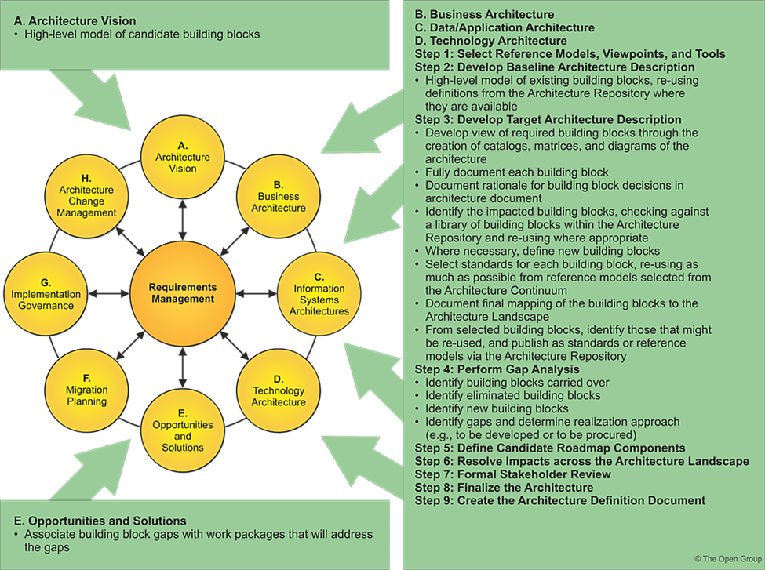

TOGAF^®^ Template -- Architecture Building Blocks\
\
Version 2.0\
\
July 2024

Project XXXX

Client YYYY

Note: This document provides a generic template. It may require
tailoring to suit a specific client and project situation.

Document Version History

  ------------------------------------------------------------------------------------
  **Version\   **Version\   **Revised   **Description**              **Filename**
  Number**     Date**       By**                                     
  ------------ ------------ ----------- ---------------------------- -----------------
                                                                     

                                                                     
  ------------------------------------------------------------------------------------

# Contents {#contents .Frontmatter-Heading}

[1. Purpose of this Document
[4](#purpose-of-this-document)](#purpose-of-this-document)

[1.1 Building Blocks Process
[4](#building-blocks-process)](#building-blocks-process)

[2. Building Blocks [5](#building-blocks)](#building-blocks)

[2.1 Fundamental Functionality
[5](#fundamental-functionality)](#fundamental-functionality)

[2.2 Attributes [5](#attributes)](#attributes)

[2.3 Semantic [5](#semantic)](#semantic)

[2.4 Security Capability
[5](#security-capability)](#security-capability)

[2.5 Manageability [5](#manageability)](#manageability)

[3. Interfaces [6](#interfaces)](#interfaces)

[3.1 Overview [6](#overview)](#overview)

[3.2 Interoperability [6](#interoperability)](#interoperability)

[3.3 Dependent Building Blocks
[6](#dependent-building-blocks)](#dependent-building-blocks)

[4. Mapping [7](#mapping)](#mapping)

[4.1 Mapping to Business/Organizational Entities
[7](#mapping-to-businessorganizational-entities)](#mapping-to-businessorganizational-entities)

[1.1 Mapping to Business/Organizational Policies
[7](#mapping-to-businessorganizational-policies)](#mapping-to-businessorganizational-policies)

Tracking Information

+------------+------------------------------+---------------------+---------------------+
| **Project  | Project XXX                                                              |
| Name**     |                                                                          |
+------------+------------------------------+---------------------+---------------------+
| **Prepared |                              | **Document Version  |                     |
| By**       |                              | No.**               |                     |
+------------+------------------------------+---------------------+---------------------+
| **Title**  | Architecture Building Blocks | **Document Version  |                     |
|            |                              | Date**              |                     |
+------------+------------------------------+---------------------+---------------------+
| **Reviewed |                              | **Review Date**     |                     |
| By**       |                              |                     |                     |
+------------+------------------------------+---------------------+---------------------+

Distribution List

  -----------------------------------------------------------------------
  **From**                       **Date**   **Phone/Email**
  ------------------------------ ---------- -----------------------------
                                            

                                            
  -----------------------------------------------------------------------

  ----------------------------------------------------------------------------
  **To**               **Action\***   **Due      **Phone/Email**
                                      Date**     
  -------------------- -------------- ---------- -----------------------------
                                                 

                                                 

                                                 

                                                 
  ----------------------------------------------------------------------------

\* Action Types: Approve, Review, Inform, File, Action Required, Attend
Meeting, Other (please specify)

# Purpose of this Document

Architecture Building Blocks (ABBs) relate to the Architecture Continuum
(see [Architecture
Continuum](https://pubs.opengroup.org/togaf-standard/architecture-content/chap06.html#tag_06_04_01)),
and are defined or selected as a result of the application of the
Architecture Development Method (ADM).

Characteristics are:

- Capture architecture requirements; e.g., Business, Data, Application,
  and Technology requirements

- Direct and guide the development of SBBs

## Building Blocks Process

The process of building block definition takes place gradually as the
ADM is followed, mainly in Phases A, B, C, and D. It is an evolutionary
and iterative process because as definition proceeds, detailed
information about the functionality required, the constraints imposed on
the architecture, and the availability of products may affect the choice
and the content of building blocks.

The key phases and steps of the ADM at which building blocks are evolved
and specified are summarized in the following figure. The major work in
these steps consists of identifying the ABBs required to meet the
business goals and objectives. The selected set of ABBs is then refined
in an iterative process to arrive at a set of SBBs which can either be
bought off-the-shelf or custom developed.

# Building Blocks

The purpose of this section is to outline fundamental functionality and
attributes: semantic, unambiguous, including security capability and
manageability.

## Fundamental Functionality

## Attributes

## Semantic

## Security Capability

## Manageability

# Interfaces

Interfaces: chosen set, supplied.

## Overview

## Interoperability

Interoperability and relationship with other building blocks.

## Dependent Building Blocks

Describe dependent building blocks with required functionality and named
user interfaces.

# Mapping

Map to business/organizational entities and policies.

## Mapping to Business/Organizational Entities

The purpose of this section is to cross-reference the building blocks to
the business/organizational entities.

Mandatory/optional: This section is mandatory.

## Mapping to Business/Organizational Policies

- The purpose of this section is to cross-reference the building blocks
  to the business/organizational policies

Mandatory/optional: This section is mandatory
