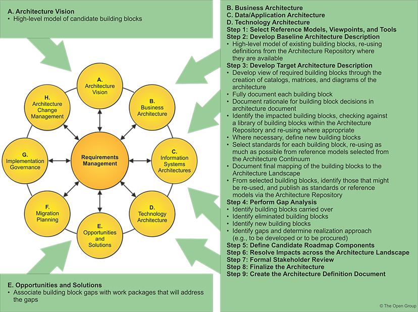

TOGAF^®^ Template -- Solution Building Blocks\
\
Version 2.0\
\
July 2024

Project XXXX

Client YYYY

Note: This document provides a generic template. It may require
tailoring to suit a specific client and project situation.

Document Version History

  ------------------------------------------------------------------------------------
  **Version\   **Version\   **Revised   **Description**              **Filename**
  Number**     Date**       By**                                     
  ------------ ------------ ----------- ---------------------------- -----------------
                                                                     

                                                                     
  ------------------------------------------------------------------------------------

# Contents {#contents .Frontmatter-Heading}

[1. Purpose of this Document
[4](#purpose-of-this-document)](#purpose-of-this-document)

[1.1 Building Blocks Process
[4](#building-blocks-process)](#building-blocks-process)

[2. Building Blocks [5](#building-blocks)](#building-blocks)

[2.1 Specific Functionality
[5](#specific-functionality)](#specific-functionality)

[2.2 Attributes [5](#attributes)](#attributes)

[2.3 Performance [5](#performance)](#performance)

[2.4 Configurability [5](#configurability)](#configurability)

[2.5 Drivers and Constraints
[5](#drivers-and-constraints)](#drivers-and-constraints)

[3. Interfaces [6](#interfaces)](#interfaces)

[3.1 Overview [6](#overview)](#overview)

[3.2 Interoperability [6](#interoperability)](#interoperability)

[3.3 Dependent Building Blocks
[6](#dependent-building-blocks)](#dependent-building-blocks)

[3.4 Required Solution Building Blocks
[6](#required-solution-building-blocks)](#required-solution-building-blocks)

[4. Mapping [7](#mapping)](#mapping)

[4.1 SBB Mapping [7](#sbb-mapping)](#sbb-mapping)

[4.2 Relationships Between SBBs and ABBs
[7](#relationships-between-sbbs-and-abbs)](#relationships-between-sbbs-and-abbs)

Tracking Information

+------------+-----------------------------+---------------------+---------------------+
| **Project  | Project XXX                                                             |
| Name**     |                                                                         |
+------------+-----------------------------+---------------------+---------------------+
| **Prepared |                             | **Document Version  |                     |
| By**       |                             | No.**               |                     |
+------------+-----------------------------+---------------------+---------------------+
| **Title**  | Requirements Impact         | **Document Version  |                     |
|            | Assessment                  | Date**              |                     |
+------------+-----------------------------+---------------------+---------------------+
| **Reviewed |                             | **Review Date**     |                     |
| By**       |                             |                     |                     |
+------------+-----------------------------+---------------------+---------------------+

Distribution List

  -----------------------------------------------------------------------
  **From**                       **Date**   **Phone/Email**
  ------------------------------ ---------- -----------------------------
                                            

                                            
  -----------------------------------------------------------------------

  ----------------------------------------------------------------------------
  **To**               **Action\***   **Due      **Phone//Email**
                                      Date**     
  -------------------- -------------- ---------- -----------------------------
                                                 

                                                 

                                                 

                                                 
  ----------------------------------------------------------------------------

\* Action Types: Approve, Review, Inform, File, Action Required, Attend
Meeting, Other (please specify)

# Purpose of this Document

Solution Building Blocks (SBBs) relate to the Solutions Continuum, and
may be either procured or developed.

SBB characteristics are:

- Define what products and components will implement the functionality

- Define the implementation

- Fulfill business requirements

- Be product or vendor-aware

## Building Blocks Process

The process of building block definition takes place gradually as the
TOGAF^®^ Architecture Development Method (ADM) is followed, mainly in
Phases A, B, C, and D. It is an evolutionary and iterative process
because as definition proceeds, detailed information about the
functionality required, the constraints imposed on the architecture, and
the availability of products may affect the choice and the content of
building blocks.

The key phases and steps of the ADM at which building blocks are evolved
and specified are summarized in the following figure. The major work in
these steps consists of identifying the ABBs required to meet the
business goals and objectives. The selected set of ABBs is then refined
in an iterative process to arrive at a set of SBBs which can either be
bought off-the-shelf or custom developed.

{width="5.013888888888889in"
height="3.7423611111111112in"}

# Building Blocks

The purpose of this section is to outline specific functionality and
attributes: semantic, unambiguous, including security capability and
manageability.

## Specific Functionality

## Attributes

Specifications of attributes shared across the environment (not to be
confused with functionality) such as security, manageability,
localizability, scalability.

## Performance

## Configurability

## Drivers and Constraints

Design drivers and constraints, including the physical architecture.

# Interfaces

Interfaces: chosen set, supplied.

## Overview

## Interoperability

Interoperability and relationship with other building blocks.

## Dependent Building Blocks

Describe dependent building blocks with required functionality and named
user interfaces.

## Required Solution Building Blocks

Required SBBs used with required functionality and names of the
interfaces used.

# Mapping

## SBB Mapping

The purpose of this section is to describe mapping from the SBBs to the
IT topology and operational policies.

Mandatory/optional: This section is mandatory.

## Relationships Between SBBs and ABBs

The purpose of this section is to describe relationships between SBBs
and ABBs.

Mandatory/optional: This section is mandatory.
